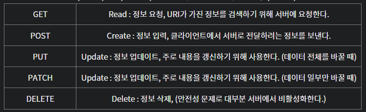
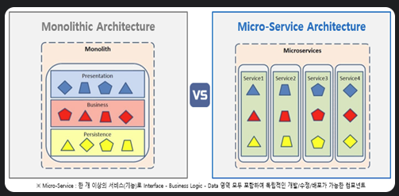
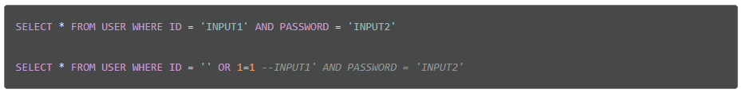

# 프로그래밍 일반

## Restful(REpresentational State Transfer) API

HTTP 통신에서 어떤 자원에 대한 CRUD 요청을 Resource(자원, URI)와 Method(요청 방식, GET or POST 등)로 표현하여 특정한 형태로 전달하는 방식임.

웹의 기존 기술과 HTTP 프로토콜을 그대로 활용하기 때문에, 웹의 장점을 최대한 활용할 수 있는 아키텍처 스타일임.

네트워크 상에서 Client와 Server 사이의 통신 방식 중 하나임.

* 자원(Resource) - URI
  * 모든 자원에는 고유한 ID가 존재하고, 이 자원은 Server에 존재함
  * 자원을 구별하는 ID는 HTTP URI임
  * Client는 URI를 이용해 자원을 저장하고, 해당 자원의 상태(정보)에 대한 조직을 Server에 요청함.
* 행위(Verb) - Method
  * HTTP 프로토콜의 Method를 사용함
  * HTTP 프로토콜은 다음의 Method를 제공함.



* 표현(Representation of Resource)
  * Client와 Server가 데이터를 주고받는 형태로 JSON, XML을 통해 데이터를 주고 받는 것이 일반적임.


### REST의 특징

* Server-Client (서버-클라이언트 구조)
  * 자원이 있는 쪽이 Server, 자원을 요청하는 쪽이 Client
    * REST SEver는 API를 제공하고 비즈니스 로직 처리 및 저장을 책임짐.
    * Client는 사용자 인증이나 context(세션, 로그인 정보) 등을 직접 관리하고 책임짐
    * 역활을 확실히 구분시킴으로써 서로 간의 의존성을 줄임.

* Stateless(무상태)

  * HTTP 프로토콜은 Stateless Protocol이므로 REST 역시 무상태성을 가짐.

  * Client의 context를 Server에 저장하지 않음
    * 즉, 세션과 쿠키 같은 context 정보를 신경쓰지 않아도 되므로 구현이 간단해짐.
  * Server는 각각의 요청을 완전히 별개의 것으로 인식하고 처리함.
    * 각 API 서버는 Client의 요청만을 단순 처리함
    * 즉, 이전 요청이 다음 요청의 처리에 연고나되어서는 안됨
    * Server의 처리 방식에 일관성을 부여하기 때문에 서비스의 자유도가 높아짐

* Cacheable (캐시 처리 가능)

  * 웹 표준 HTTP 프로토콜을 그대로 사용하므로 웹에서 사용하는 기존의 인프라를 그대로 사용 가능
    * 즉, HTTP가 가진 가장 강력한 특징 중 하나인 캐싱 기능 적용 가능
    * HTTP 프로토콜 표준에서 사용하는 Last-Modified Tag 또는 E-Tag를 이용해 캐싱 구현.
  * 대량의 요청을 효율적으로 처리할 수 있음

* Layered System(계층 구조)

  * Client는 REST API Server만 호출함
  * REST Server는 다중 계층으로 구성될 수 있음
    * 보안, 로드밸런싱, 암호화 등을 위한 계층을 추가해 구조를 변경할 수 있음
    * Proxy, Gateway와 같은 네트워크 기반의 중간매체 사용 가능
    * but, Client는 Server와 직접 통신하는지, 중간 서버와 통신하는지는 알 수 없음

* Uniform Interface (인터페이스 일관성)

  * URI로 지정한 Resource에 대한 요청을 통일되고, 한정적으로 수행하는 아키택처 스타일을 의미함.
  * HTTP 표준 프로토콜에 따르는 모든 플랫폼에서 사용 가능하고, Loosely Coupling(느슨한 결함) 형태를 가짐
    * 즉, 특정 언어나 기술에 종속되지 않음

* Self-Descriptiveness(자체 표현)

  * 요청 메시지만 보고도 쉽게 이해할 수 있는 자체 표현 구조로 되어 있음.


### REST API 란?

### 정의

* REST의 특징을 기반으로 서비스 API를 구현한 것
* 최근 OpenAPI, 마이크로 서비스 등을 제공하는 기업 대부분은 REST API를 제공함

### 특징

* 각 요청이 어떤 동작이나 정보를 위한 것인지를 그 요청의 모습 자체로 추론이 가능함.

### Rest 설계 규칙

URI는 정보의 자원만 표현해야 하며, 자원의 상태와 행위는 HTTP Method에 명시하는 것을 말함

### REST API 디자인 가이드

* URI는 정보의 자원을 표현해야 함
* 자원에 대한 행위는 HTTP Method(GET, POST, PUT, PATCH, DELETE)로 표현함
  * 행위(Method)는 URI에 포함되지 않음

### REST API vs RESTful API

RESTful은 REST의 설계 규칠을 잘 지켜서 설계된 API를 RESTful한 API라고 함.

즉, REST의 원리를 잘 따르는 시스템을 RESTful이란 용어로 지칭 됨.


[참고]

https://dev-coco.tistory.com/97


## 프레임워크와 라이브러리의 차이점

제어 흐름에 대한 주도권이 누구에게/어디에 있는가

프레임워크는 전체적인 흐름을 쥐고 있고, 개발자는 그 안에서 라이브러리에 대한 흐름을 쥐고 있음

여기서 개발자의 제어권을 프레임워크에 넘김으로써 신경써야할 것을 줄일 수 있는데 이를 제어의 역전(IoC, Inversion of Control)이라 함.

[참고]

https://www.youtube.com/watch?v=t9ccIykXTCM&t=248s (노마드 코더 영상)


## Call By Value와 Call By Reference

Call By Value

* 인자로 받은 값을 복사하여 처리하는 방식
* Call By Value에 의해 넘어온 값을 증가시켜도 원래의 값이 보존됨
* 값을 복사하여 넘기기 때문에 메모리 사용량이 늘어남

Call By Reference

* 인자로 받은 값의 주소를 참조하여 직접 값에 영향을 주는 방식
* 값을 복사하지 않고 직접 참조하기 때문에 속도가 빠름
* 원래의 값에 영향을 주는 리스크가 존재 함.


### Java에서의 Call by Value

Java는 기본적으로 모든 전달 방식이 Call by Value 임

참조형의 경우에도 정확히 말하면 '주소값'이 아니라, '주소를 가리키는 참조값'임.

또한, 주소값 자체를 '복사 없이' 인자로 전달하는게 아니라 자기 자신이 갖고 있는 값을 복사해서 전달함.

결국 기본형 변수나 참조형 변수 모두 자기 자신이 갖고 있는 값을 복사해서 전달하기 때문에 Call by Value임.


## 절차지향 프로그래밍 vs 객체지향 프로그래밍

* 절차지향 프로그래밍
  * 순차적인 처리를 중시하는 프로그래밍 기법
  * 대표적으로 C언어
  * 컴퓨터의 처리구조와 유사해 실행속도가 빠름
  * 코드의 순서가 바뀌면 동일한 결과를 보장하기 어려움
* 객체지향 프로그래밍
  * 실제 세계의 사물들을 객체로 모델링하여 개발을 진행하는 프로그래밍 기법
  * 대표적으로 Java
  * 캡슐화, 상속, 다형성 등과 같은 기법을 이용할 수 있음
  * 절차지향 언어보다 실행속도가 느림


### 캡슐화 (Capsulation)

객체의 내부 구조 및 정보를 캡슐처럼 하나로 감싸 외부에서 볼 수 없게 은닉하여 보호하는 것

* 자바에서는 이러한 캡슐 기능이 클래스를 통해 구현되고, 클래스는 내부에 멤버변수(메소드)로 구성되어 있음
* 캡슐화된 객체는 외부에서 직접적으로 접근하는 것을 막고, 외부접근이 허락된 멤버변수와 멤버함수(메소드)를 통해서만 다른 객체와 상호작용할 수 있도록 함

### 상속 (inhertiance)

부모 클래스로부터 자식 클래스가 부모 클래스의 속성을 물려받는 것

* 자식 클래스는 부모 클래스가 가지고 있는 속성에 자식 클래스만의 속성을 추가함으로써 기능을 확장할 수 있음.
* 이때 부모클래스를 슈퍼클래스, 자식클래스를 서브클래스라 함.

### 다형성 (Polymorphism)

하나의 객체나 메소드가 여러가지 다른 형태를 가질 수 있는 것

* 오버라이딩(overriding) : 부모클래스로부터 상속받은 메소드를 자식클래스에서 재정의하여 사용하는 것
* 오버로딩(overloading) : 메소드의 이름은 동일하나 매개변수의 타입이나 개수를 달리하여 중복 정의함으로써 매개변수에 따라 특정 메소드가 호출되는 것


## OOP(Object Oriented Programming, 객지)

현실 세계를 프로그래밍으로 옮겨와 현실 세계의 사물들을 객체로 보고, 그 객체로부터 개발하고자 하는 특성과 기능을 뽑아와 프로그래밍하는 기법임

OOP로 코드를 작성하면 재사용성과 변형가능성을 높일 수 있음

### OOP의 5가지 설계 원칙

* SRP(Single Responsibility Principle, 단일 책임 원칙) : 클래스는 단 하나의 목적을 가져야 하며, 클래스를 변경하는 이유는 단 하나의 이유여야 한다.
* OCP(Open-Closed Principle, 개방 폐쇠 원칙) : 클래스는 확장에는 열려 있고, 변경에는 닫혀 있어야 한다.
* LSP(Liskov Substitution Principle, 리스코프 치환 원칙): 상위 타입의 객체를 하위 타입으로 바꾸어도 프로그램은 일관되게 동작해야 한다.
* ISP(Interface Segregation Principle, 인터페이스 분리 원칙): 클라이언트는 이용하지 않는 메소드에 의존하지 않도록 인터페이스를 분리해야 한다.
* DIP(Dependency Inversion Principle, 의존 역전 법칙): 클라이언트는 추상화(인터페이스)에 의존해야 하며, 구체화(구현된 클래스)에 의존해선 안된다.

### 장점

* 코드 재사용성
* 간편한 유지 보수
* 큰 규모의 프로그래밍에 유리

### 단점

* 비교적 느린 속도
* 높은 설계역량 요구
* 코드의 잠재적인 복잡성


## OAuth 2.0

쉽지않음

[참고]

https://blog.naver.com/mds_datasecurity/222182943542


## 동적 쿼리

동적 쿼리란 실행시에 특정 조건이나 상황에 따라 쿼리 문자잉 변경되어 실행되는 쿼리문을 말함

컴파일시에 SQL문장을 확정 할 수 없는 경우에 사용함. 실행 시점에 따라 where절의 조건이 달라질 때 사용함.

쿼리문이 변하느냐 변하지 않느냐에 따라 정적쿼리/동적쿼리가 됨.


## CSRF(Cross-site request forgery)

사이트 간 요청 위조의 약자로 웹 어플리케이션 취약점 중 하나로 공격자가 의도대로 사용자가 행동하게 하여 특정 웹페이지를 보안에 취약하게 하거나 수정, 삭제 드으이 작업을 하게 만드는 공격 방법을 의미함.


### 방어 방법

사용자의 요청에 referrer를 확인하여 도메인이 일치하는지 확인하는 방법으로 공격을 방어

* 요청 헤더(request header)에서 referrer 정보를 확인할 수 있음
* 같은 도메인에서 들어오는 접속은 허용하나 다른 도메인에서 호출할 때는 차단하는 개념

상태를 변화 시키는 POST, PUT등의 요청에 대해 csrf토큰이 포함되어야만 요청을 처리하여 공격을 방어


### 실제 사례

**CSRF 공격과정**

\- 2008년도에 있었던 옥션 해킹 사고도 CSRF 공격을 했다고 한다.

(해커가 옥션 운영자에게 CSRF 코드가 포함된 이메일을 보내서 관리자 권한을 얻어냈다)

```routeros
...

...
```

1. 옥션 관리자 중 한 명이 권한을 가진 채 회사 내에서 작업을 하던 중 메일을 조회한다. (로그인이 되어있으니 관리자로서의 유효한 쿠키를 가지고 있음)
2. 해커는 위와 같이 태그가 들어간 코드가 담긴 이메일을 보낸다.
3. 관리자가 이메일을 열어볼 때, 이미지 파일을 받아오기 위해 위 URL이 열린다.
4. 해커가 의도한 대로 관리자 계정 id와 pw가 admin으로 변경된다.


## 대칭키, 비대칭키 암호화 방식

대칭키와 비대칭키는 양방향 암호화 방식임

### 대칭키

암호화와 복호화에 같은 암호 키를 쓰는 알고리즘.

이는 중간에 누군가 암호키를 가로채면 정보가 유출될 수 있다는 단점이 있는데 이런 문제를 보완한 방식이 비대칭키임

### 비대칭키

암호화와 복호화할 때 서로 다른 키를 쓰는 알고리즘.

타인에게 절대 노출되어서는 안되는 개인키와 공개적으로 개방되어 있는 공개키를 쌍으로 이룬 형태.


## TDD(Test-Driven-Development)

작은 단위의 테스트 케이스를 작성하고 그에 맞는 코드를 작성하여 테스트를 통과한 후에 상황에 맞게 리팩토링하는 테스트 주도 개발 방식

반복적인 단계가 진행되면서 자연스럽게 버그가 줄어들고, 코드는 간결해진다는 장점이 있음.


### 레드 그린 사이클

TDD는 레드 그린 사이클이라는 3가지 과정을 거침

* Red: 어떠한 기능을 검증하는 테스트가 실패하는 코드를 작성하고, 실제로 실패하는지 확인
* Green: 어떠한 기능을 검증하는 테스트가 통과하는 코드를 작성하고, 실제로 성공하는지 확인
* Refactor: 앞에 실패하는 테스트와 성공하는 테스트를 모두 검증했으면, 작성한 코드를 깨끗하고 가독성 좋게 고침
* Repeat: 이 세 가지 과정을 반복하여 프로그램을 완성함.


### 테스트 코드 작성 이유

1. 기능의 추가, 변경, 삭제로 인한 영향도를 쉽게 파악 가능
2. 예상하지 못한 오류에 대한 피드백
3. 좋은 설계로 작성되게끔 코드를 유도
4. 기능 정의의 문서의 역활
5. 실수를 줄여줌


## DDD(Domain-Driven-Design)

### 도메인이란

정보와 활동의 영역

프로그래머들에게는 어플리케이션 내의 로직들이 관여하는 정보와 활동의 영역으로 받아들여짐


### DDD란

개발을 함에 있어 위에 설명한 도메인이 중심이 되는 개발 방식을 말함

그 목적은 소프트웨어의 연관도니 부분들을 연결하여 계속 진화하는 새로운 모델을 만들어 나가 복잡한 어플리케이션을 만드는 것을 쉽게 해 주는 것에 있음

문맥에 따라 역활이 바뀔 수 있는 것

### 핵심 목표

Loose Coupling, High Cohesion

각 도메인이 연결성이 적고 높은 정도로 연관되어 보다 가벼운 설계를 위해 탄생함

### Strategic Design

개념 설계

### Tactical Design

구체적 설계

[참고]

https://happycloud-lee.tistory.com/94 (DDD)

https://happycloud-lee.tistory.com/261?category=8322466 (애자일, 마이크로서비스, 데브옵스, 클라우드)


## MSA(Microservice Architecture)

1개의 시스템을 독립적으로 배포 가능한 각각의 서비스로 분활.

각각의 서비스는 API를 통해 데이터를 주고 받으며 1개의 큰 서비스를 구성

모든 시스템의 구성요소가 한 프로젝트에 통합되어 있는 Monolithic Architecture의 한계점을 극복하고자 등장



* 장점
  * 일부 서비스에 장애가 발생해도 전체 서비스에 영향을 끼치지 않음
  * 각각의 서비스들은 서로 다른 언어와 프레임워크로 구성될 수 있음
  * 서비스의 확장이 용이함
* 단점
  * 서비스가 분리되어 있어 테스트나 트랜잭션 처리등이 어렵다.
  * 서비스 간에 API로 통신하기 때문에 그에 대한 비용이 발생함
  * 서비스 간의 호출이 연속적이기 때문에 디버깅 및 에러 트레이싱이 어려움

(트랜잭션 : 데이터베이스 연산들의 논리적 단위이며 트랜잭션 내 모든 연산들이 정상적으로 완료되지 않으면 아무 것도 수행되지 않은 원래 상태로 복원되어야 한다.)

[참고]

https://sunnyk.tistory.com/15 (트랜잭션)


## 함수형 프로그래밍

함수형 프로그래밍의 가장 큰 특징은 immutable data와 first class citizen으로서의 함수임


함수형 프로그래밍은 부수효과가 없는 순수 함수를 이용하여 프로그램을 만드는 것

부수효과가 없는 함수란 데이터의 값을 변경시키지 않으며 객체의 필드를 성장하는 등의 작업을 하지 않는 함수를 의미함.

### immutable

함수형 프로그래밍을 가능하게 하는 요소 중 하나

primitive type 뿐만 아니라 Java의 Collection에 해당하는 자료 구조들에도 똑같이 적용

처리할 데이터가 불변이기 때문에 수학적 의미의 순수 함수(pure function) 형태로 함수를 만듬

대표적인 String객체는 Java에서도 대표적인 불편 객체임, 문자열을 다루는 함수들 만큼은 좀 더 '함수형' 스타일에 맞게 짜야함

( 순수함수 : 같은 입력에 대해 항상 같은 출력을 반환하는 함수로 다음과 같은 조건을 만족하는 함수를 말한다. 멀티쓰레드에서도 안전하고(`Thread safe`) 병렬처리 및 계산도 가능하다.

* 동일한 입력에 대해 항상 같은 값 반환
* 부작용(다른 요인에 따른 결과변경) 이 없는 결과 생성 => 함수에서 인자를 변경하거나 프로그래밍의 상태를 변경하지 않음)

### first-class citizen

함수형 프로그래밍 패러다임을 따르고 있는 언어에서의 함수(fucntion)는 1급 객체로 간주됨

전제조건

* 변수나 데이터 구조안에 넣을 수 있다
* 파라미터로 전달할 수 있다
* 동적으로 프로퍼티 할당 가능
* 리턴값으로 사용 가능


### Reactive Programming


[참고]

https://soeunlee.medium.com/javascript%EC%97%90%EC%84%9C-%EC%99%9C-%ED%95%A8%EC%88%98%EA%B0%80-1%EA%B8%89-%EA%B0%9D%EC%B2%B4%EC%9D%BC%EA%B9%8C%EC%9A%94-cc6bd2a9ecac (first-class citizen)

## Parameter vs Argument

Parameter: 함수 선언 시 사용된 변수

Argument: 함수 호출 시 함수의 파라미터로 전달된 실제 값


## 병렬 처리 프레임워크

### Hadoop

* 대용량 데이터를 분산처리 할 수 있는 자바 기반의 오픈소스 병렬 처리 프레임워크
* 데이터가 여러 노드에 분산되어 저장되기 때문에 손실의 우려가 없음
* File I/O을 기반으로 작동하기 때문에 처리 속도가 느림

### Spark

* 메모리 내 처리(In-Memory)를 지원하여 빅 데이터를 분석하는 애플리케이션의 성능을 향상시키는 오픈 소스 병렬 처리 프레임 워크
* 메모리를 사용해 데이터를 처리하기 때문에 Hadoop보다 100배 빠름
* 하지만 메모리상에서 처리하기 때문에 장애가 발생한 경우 응용 프로그램을 처음부터 다시 시작해야 한다.


## 동기와 비동기

### 동기(Synchronous) 방식

* 요청을 보내고 실행이 끝나면 다음 동작을 처리
* 순서에 맞춰 진행되기 때문에 제어가 쉬움
* 여러가지 요청을 동시에 처리할 수 없어 효율 떨어짐

### 비동기(Asynchronous) 방식

* 요청을 보내고 해당 동작의 처리 여부와 상관없이 다음 요청이 동작
* 작업이 완료되는 시간을 기다릴 필요가 없기 때문에 자원을 효율적으로 사용
* 작업이 완료된 결과를 제어하기 어려움


## SQL Injection

공격자가 악의적인 의도를 갖는 구문을 삽입하여 공격자가 원하는 SQL을 실행하도록 하는 웹해킹기법



(ㄷㄷ 이게 됨?)

WHERE 문이 항상 참이 됨

이러한 공격 방지를 위해 특수문자 및 SQL 예약어들을 필터링하거나 SQL 오류 메세지를 노출하지 않는 등의 방법을 사용해야 함.


## 메세지 큐(Message Queue)

Queue 자료구조를 이용하여 데이터(메세지)를 관리하는 시스템

비동기 통신 프로토콜을 제공하여 메세지를 빠르게 주고 받을 수 있게 해줌

메세지 큐에서는 Producer(생산자)가 Message를 Queue에 넣어두면, Consumer가 Message를 가져와 처리함

ex) Kafka, Rabbit MQ, AMPQ


## Docker(도커), Kubernates(쿠버네티스)

### Docker

컨테이너 기반의 가상화 기술

기존에는 하드웨어를 가상화하였기 때문에 Host OS 위에 Guest OS를 설치해야 했음

=> 상당히 무겁고 느려 한계가 많았음

이를 극복하고자 프로세스를 격리시킨 컨테이너를 통해 가상화를 하는 Docker(도커)와 같은 기술들이 등장

도커를 통해 구동되는 컨테이너를 관리하기 위한 Kubernates(쿠버네티스)가 등장


### Docker의 장단점

장점

* 쉽고 빠른 실행 환경 구축
* 하드웨어 자원 절감
* Docker Hub와 같은 공유 환경 제공

단점

* 개발 초기의 오버헤드
* Linux 친화적


## Java의 직렬화(Serialize)

자바 시스템 내부에서 사용되는 Object 또는 Data를 외부의 자바 시스템에서도 사용할 수 있도록 byte 형태로 데이터를 변환하는 기술

JVM(Java Virtual Machine)의 메모리에 상주(힙 또는 스택)되어 있는 객체 데이터르 바이트 형태로 변환하는 기술


### 역직렬화(Deserialize)

byte => object, data

직렬화된 바이트 형태의 데이터를 객체로 변환해서 JVM으로 상주시키는 형태


### JVM

Java와 OS 사이에서 중개자 역활을 해 Java가 OS에 구애받지 않고 재사용을 가능하게 해줌

.class 파일을 OS에 맞는 기계어로 변환해줌

메모리 관리, Garbage collection 수행

https://dailyheumsi.tistory.com/196 (JDK 내부 구조)


## 명시적 형변환(Implicit Type Conversion)

데이터 앞에 변환할 타입으로 명시해주는 경우

큰 데이터 타입을 작은 데이터 타입으로 변환할 때, 데이터 손실의 가능성이 있어 명시적으로 형 변환 해줘야함

Explicit Type Conversion : 컴파일로에 의해 자동으로 변환


## 클래스와 인스턴스의 차이

클래스 : 객체를 만들어 내기 위한 설계도 혹은 틀

인스턴스 : 설계도를 바탕으로 소프트웨어 세계에 구현된 구체적인 실체


----

https://www.notion.so/CS-4490390984a94172a26a3404ec481a52 (자바 위주 면접 질문, 매우 많음)

### 16. 구글에 특정 사진을 요청하는 과정을 설명?

1.웹 브라우저가 https://www.google.com/images/google.png로 이미지를 요청 해야 한 다는 것을 인지 한다.

2.웹 브라우저는 url을 이용해 서버의 ip를 추출한다.

3.이미지를 요청하기 위한 HTTP 메세지를 만든다.

4.메세지는 get메서드이고 /google.png를 요청하는 메세지이다.

5.웹브라우저는 서버와 TCP 컨넥션을 맺는다.

6.웹브라우저는 서버에 HTTP 요청을 보낸다.

7.서버는 메세지를 받고 무슨 내용인지 해석한다. get이라는 메서드이고 /google.png라는 파일을 요청 했다는 것을 인지한다.

8.서버는 해당 리소스가 있는지 찾는다.

9.찾으면 상태코드가 200인 메세지와 함께 응답 메세지를 작성한다.

10.서버는 클라이언트와 TCP컨넥션을 맺는다.

11.서버는 클라이언트에 HTTP 응답을 보낸다.

12.커넥션이 닫히면 웹브라우저는 사용자에게 이미지를 보여준다.