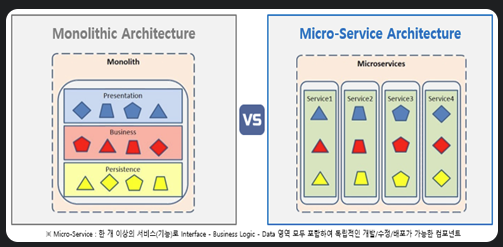
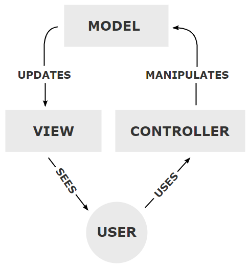
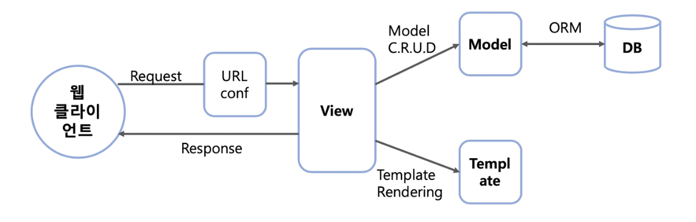
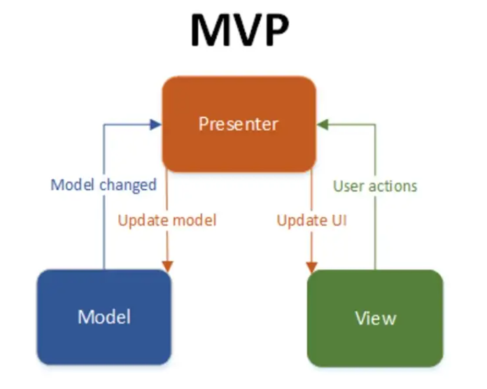
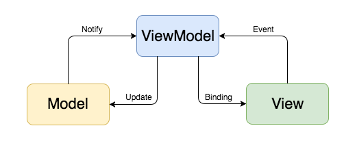

# 프로그래밍 일반

[1. 프로그래밍 패러다임](#1-프로그래밍-패러다임)

[2. 객체지향 프로그래밍(OOP)](#2-객체지향-프로그래밍oop)

[3. REST API](#3-rest-api)

[4. GIT \& GITHUB](#4-git--github)

[5. 개발 방법론](#5-개발-방법론)

[6. 디자인 패턴](#6-디자인-패턴)

[7. 비동기 처리](#7-비동기-처리)

[8. 프레임워크 vs 라이브러리](#8-프레임워크-vs-라이브러리)

## 1. 프로그래밍 패러다임

✔ 프로그래밍 패러다임: 프로그래밍 스타일, 관점

### 명령형 vs 선언형

✔ **명령형 프로그래밍**: **어떻게 (How)**
```python
numbers = [1, 2, 3, 4, 5, 6, 7, 8, 9, 10]
result = []

for number in numbers:
    if number % 2 == 0:
        if number % 3 == 0:
            result.append(number**2)

print(result)
```
- 컴퓨터가 수행할 명령들 순서대로 작성하는 형태의 프로그래밍
- 제어문 활용
- 장점
  - 연산의 순서에 대한 제어와 명확성 제공
  - 디버깅 용이 및 유연성 제공
- 단점
  - 프로그램이 복잡해지면 코드 관리가 어려워짐

✔ **선언형 프로그래밍**: **무엇을 (What)**
```python
numbers = [1, 2, 3, 4, 5, 6, 7, 8, 9, 10]

result = list(map(lambda x: x**2, filter(lambda x: x % 2 == 0 and x % 3 == 0, numbers)))

print(result)
```
- 컴퓨터가 수행할 명령을 작성하는 게 아니라 달성해야할 목적 선언
- 장점
  - 추상화와 모듈화를 통한 코드의 간결함과 가독성
  - 경우에 따라 연산을 줄여서 복잡도를 낮출 수 있음
- 단점
  - 디버깅 난해


### 절차지향 프로그래밍

- **작업을 절차 또는 서브루틴으로 분할해서 단계적으로 접근하는 방식의 프로그래밍**
- 순차적인 처리 중요시
- 컴퓨터의 처리구조와 유사 -> 속도 ↑
- ex: C언어

### 객체지향 프로그래밍

- **데이터, 그리고 그 데이터를 조작하는 코드를 포함한 '객체' 개념에 기반한 프로그래밍**
- 문제 해결을 위해 객체들 간 상호작용
- 현실세계의 엔티티(사물)을 컴퓨터 프로그램의 객체로 모델링
- 캡슐화, 상속, 다형성, 추상화 등의 기능 제공
- ex: java, python, c++

### 함수형 프로그래밍

- **자료의 처리를 수학적 함수의 계산으로 취급하는 방식의 프로그래밍**
- 불변성, 순수함수
- 상태 및 데이터의 가변성 지양
- 함수를 일급 객체로 취급
- ex: haskell, java, python, javascript

## 2. 객체지향 프로그래밍(OOP)

### OOP의 5가지 원칙

1. **SRP(Single Responsibility Principle) : 단일 책임 원칙**
   - 클래스는 단 하나의 책임을 가져야 하며 클래스를 변경하는 이유는 단 하나의 이유이어야 한다.
  
2. **OCP(Open-Closed Principle) : 개방-폐쇄 원칙**
   - 확장에는 열려 있어야 하고 변경에는 닫혀 있어야 한다.
  
3. **LSP(Liskov Substitution Principle) : 리스코프 치환 원칙**
   - 상위 타입의 객체를 하위 타입의 객체로 치환해도 상위 타입을 사용하는 프로그램은 정상적으로 동작해야 한다.
  
4. **ISP(Interface Segregation Principle) : 인터페이스 분리 원칙**
   - 인터페이스는 그 인터페이스를 사용하는 클라이언트를 기준으로 분리해야 한다.

5. **DIP(Dependency Inversion Principle) : 의존 역전 원칙**
   - 구체화(저수준 모듈)가 아닌 추상화(고수준 모듈)에 의존해야 한다.

### 객체지향 vs 절차지향


✔ 객체지향 프로그래밍

- **데이터, 그리고 그 데이터를 조작하는 코드를 포함한 '객체' 개념에 기반한 프로그래밍**
- 문제 해결을 위해 객체들 간 상호작용
- 현실세계의 엔티티(사물)을 컴퓨터 프로그램의 객체로 모델링
- 캡슐화, 상속, 다형성, 추상화 등의 기능 제공
- ex: java, python, c++

✔ 절차지향 프로그래밍

- **작업을 절차 또는 서브루틴으로 분할해서 단계적으로 접근하는 방식의 프로그래밍**
- 순차적인 처리 중요시
- 컴퓨터의 처리구조와 유사 -> 속도 ↑
- ex: C언어

## 3. REST API

### REST

✔ REST (Representational State Transfer): 소프트웨어 아키텍처 스타일의 하나로, 웹 서비스를 생성하는 데 사용할 제약 조건을 정의한 것

#### REST의 구성요소

1. 자원(Resources): URI
   - HTTP URI(Uniform Resource Identifier)를 통해 자원(Resource)을 명시한다.
    
2. 행위(Method): HTTP Method
   - HTTP Method(POST, GET, PUT, DELETE)를 통해 해당 자원에 대한 행위(Method)를 표현한다.

3. 표현(Representation)
   - Server는 Client의 요청에 대한 응답(Representation)을 보낸다(JSON, XML...)


### REST API

✔ REST 설계 규칙을 기반으로 개발한 API

## 4. GIT & GITHUB

### GIT

✔ 파일의 변경사항을 기록하고 해당 파일에 대한 여러 사용자 간의 작업을 조율하기 위한 분산형 버전 관리 시스템(VCS : Version Control System)

✔ 소스코드의 수정 내역에 따른 버전을 관리

### GITHUB

✔ Git Repository를 저장하기 위한 웹 클라우드 기반 호스팅 서비스

✔ 개인의 로컬 서버 밖에서 Git 버전 프로젝트를 공유하고 기록하는 온라인 데이터베이스


## 5. 개발 방법론

### 애자일 방법론

✔ 신속한 반복 작업을 통해 실제 작동 가능한 소프트웨어를 개발하여 지속적으로 제공하기 위한 소프트웨어 개발 방식

#### 애자일의 4가지 주요 특징 (선언문)

1. 개인과 개인 간의 상호작용이 프로세스 및 툴보다 우선
2. 작동하는 소프트웨어가 포괄적인 문서보다 우선
3. 고객과의 협업이 계약 협상보다 우선
4. 변화에 대응하는 것이 계획을 따르는 것보다 우선

#### Scrum

✔ 매일 정해진 시간, 장소에서 짧은 시간의 개발을 하는 팀을 위한 프로젝트 관리 중심 방법론

✔ 스크럼에서 속도(velocity)는 1번의 스프린트에서 한 팀이 어느 정도의 제품 백로그를 감당할 수 있는지에 대한 추정치

### TDD

✔ Test-Driven Development

✔ 요구되는 기능에 대한 테스트 케이스를 작성하고 그에 맞는 코드를 작성하여 테스트를 통과한 후에 상황에 맞게 리팩토링하는 테스트 주도 개발 방식

✔ 매우 짧은 개발 사이클의 반복에 의존

### BDD

✔ Behavior-Driven Development

✔ TDD의 확장, 상호보완적 관계

✔ 비즈니스의 요구 사항에 초점을 맞추어 사용자의 행위를 고려한 테스트 진행

✔ Given When Then

### DDD


✔ Domain-Driven Design(Development)

✔ 도메인 패턴을 중심에 놓고 설계하는 개발 방식

✔ 도메인: 소프트웨어의 요구사항

✔ 데이터 중심 디자인으로부터의 탈피

### MSA



✔ Microservice Architecture

✔ 1개의 시스템을 독립적으로 배포 가능한 각각의 서비스로 분할.

✔ 각각의 서비스는 API를 통해 데이터를 주고 받으며 1개의 큰 서비스를 구성

✔ 모든 시스템의 구성요소가 한 프로젝트에 통합되어 있는 Monolithic Architecture의 한계점을 극복하고자 등장


## 6. 디자인 패턴

### 싱글톤 패턴

✔ 애플리케이션이 시작될 때, 어떤 클래스가 최초 한 번만 메모리를 할당(static)하고 해당 메모리에 인스턴스를 만들어 사용하는 패턴

✔ 하나의 인스턴스만을 생성, 이후 해당 인스턴스가 필요할 때 인스턴스를 새로 만드는 것이 아니라 기존에 생성된 인스턴스 활용

✔ 인스턴스 생성 비용, 시간 절감

✔ 클래스 간의 데이터 공유 용이

### MVC Pattern



✔ Model - View - Controller로 애플리케이션의 역할 구분

✔ Model
- 어플리케이션의 데이터 (데이터베이스)

✔ View
- 모델을 기반으로 사용자가 볼 수 있는 화면

✔ Controller
- 모델과 뷰를 잇는 다리 역할
- 이벤트 등 메인 로직 담당
- View로부터 사용자의 action을 전달받아 model에 반영
- model의 변화를 view에게 전달하여 업데이트

✔ 장점: 재사용성, 확장성 용이  
✔ 단점: 어플리케이션이 커지고 복잡해지면 컨트롤러가 과하게 복잡해진다

### MTV Pattern



✔ MVC pattern의 변형으로 Django에서 사용된다
- Model - Model
- View - Template
- Controller - View

✔ MVC pattern과의 차이점
- View(Controller)와 Template(View)의 연관관계가 MVC보다 느슨하다
- 비즈니스 로직을 부분적으로 django 프레임워크 자체에서 처리해주거나 template에서 자체적으로 처리하기도 한다
- URL pattern을 따로 정의해서 매칭해주는 URL config가 존재한다

### MVP Pattern



✔ MVC pattern에서 C에 해당하는 컨트롤러가 Presenter로 바뀐 패턴
- Model - Model
- View - View
- Controller - Presenter

✔ View와 Presenter는 1:1 관계이다
- 결합 ↑

✔ View는 Presenter를 통해서만 데이터를 전달받는다
- View - Model 의존성 x


### MVVM Pattern



✔ MVC pattern에서 C에 해당하는 컨트롤러가 View Model로 바뀐 패턴
- Model - Model
- View - View
- Controller - View Model

✔ Vue.js 프레임워크에서 사용

✔ View와 View Model 사이의 양방향 바인딩 지원
- View와 View Model 사이의 의존성 x
- 모듈화, 단위 테스트 용이

## 7. 비동기 처리

### 동기(Synchronous) vs 비동기(ASynchronous)

✔ 동기: 요청을 보내고 응답이 올 때까지 기다렸다가 다음 로직을 처리

✔ 비동기: 요청을 보내고 응답을 기다리지 않고 다음 요청을 처리(병렬적 수행)

✔ 비동기 방식이 사용자 경험 향상에 훨씬 유리하다

### Python에서의 비동기

```python
# 동기

import requests

def send_sync_request(url):
    response = requests.get(url)
    print(f"Response from {url}: {response.text}")

def main():
    urls = ["https://api.example.com/1", "https://api.example.com/2", "https://api.example.com/3"]
    # 요청을 보내고 응답을 받으면 다음 요청을 보낸다.
    for url in urls:
        send_sync_request(url)

main()
```

```python
import asyncio
import aiohttp

# 요청이 비동기로 보내진다.
async def send_async_request(url):
    async with aiohttp.ClientSession() as session:
        async with session.get(url) as response:
            print(f"Response from {url}: {await response.text()}")

async def main():
    urls = ["https://api.example.com/1", "https://api.example.com/2", "https://api.example.com/3"]
    tasks = [send_async_request(url) for url in urls]
    # 응답을 다 받으면 모은다.
    await asyncio.gather(*tasks)

# 비동기로 실행
asyncio.run(main())

```

### Java에서의 비동기

✔ `CompletableFuture`와 `@Async`를 이용해 비동기 처리 구현

```java
// 동기 처리

import java.util.concurrent.CompletableFuture;
import java.util.concurrent.ExecutionException;
import org.springframework.stereotype.Service;

@Service
public class SyncTaskService {

    public String task1() throws InterruptedException {
        System.out.println("Task 1 started");
        Thread.sleep(1000);
        System.out.println("Task 1 completed");
        return "Task 1 Result";
    }

    public String task2() throws InterruptedException {
        System.out.println("Task 2 started");
        Thread.sleep(2000);
        System.out.println("Task 2 completed");
        return "Task 2 Result";
    }

    public void runTasks() throws InterruptedException, ExecutionException {
        String task1Result = task1();
        String task2Result = task2();

        System.out.println("Task 1 result: " + task1Result);
        System.out.println("Task 2 result: " + task2Result);
    }
}


// Task 1 started
// Task 1 completed
// Task 2 started
// Task 2 completed
// Task 1 result: Task 1 Result
// Task 2 result: Task 2 Result
```

```java
import java.util.concurrent.CompletableFuture;
import java.util.concurrent.ExecutionException;
import org.springframework.scheduling.annotation.Async;
import org.springframework.stereotype.Service;

@Service
public class AsyncTaskService {

    @Async
    public CompletableFuture<String> task1() throws InterruptedException {
        System.out.println("Task 1 started");
        Thread.sleep(1000);
        System.out.println("Task 1 completed");
        return CompletableFuture.completedFuture("Task 1 Result");
    }

    @Async
    public CompletableFuture<String> task2() throws InterruptedException {
        System.out.println("Task 2 started");
        Thread.sleep(2000);
        System.out.println("Task 2 completed");
        return CompletableFuture.completedFuture("Task 2 Result");
    }

    public void runTasks() throws InterruptedException, ExecutionException {
        CompletableFuture<String> task1Result = task1();
        CompletableFuture<String> task2Result = task2();

        System.out.println("Task 1 result: " + task1Result.get());
        System.out.println("Task 2 result: " + task2Result.get());
    }
}

// Task 1 started
// Task 2 started
// Task 1 completed
// Task 2 completed
// Task 1 result: Task 1 Result
// Task 2 result: Task 2 Result

```

### JavaScript에서의 비동기

✔ 자바스크립트는 기본적으로 runtime을 통해 비동기처리를 지원해준다.

✔ `Async/Await`, `Promise` 객체를 통해 실행순서를 보장받을 수 있다.

```javascript
// 비동기 처리

const axios = require("axios");

async function getDataAsync() {
    const response1 = axios.get("https://jsonplaceholder.typicode.com/posts/1");
    const response2 = axios.get("https://jsonplaceholder.typicode.com/posts/2");
    const response3 = axios.get("https://jsonplaceholder.typicode.com/posts/3");

    console.log("Response 1: ", (await response1).data);
    console.log("Response 2: ", (await response2).data);
    console.log("Response 3: ", (await response3).data);
}

getDataAsync();

// Started requesting API 1
// Started requesting API 2
// API 1 response: {...}
// Processing API 1 response...
// API 2 response: {...}
// Processing API 2 response...
```

```javascript
// 동기 처리

const axios = require("axios");

async function getDataSync() {
    const response1 = await axios.get("https://jsonplaceholder.typicode.com/posts/1");
    const response2 = await axios.get("https://jsonplaceholder.typicode.com/posts/2");
    const response3 = await axios.get("https://jsonplaceholder.typicode.com/posts/3");

    console.log("Response 1: ", response1.data);
    console.log("Response 2: ", response2.data);
    console.log("Response 3: ", response3.data);
}

getDataSync();

// Started requesting API 1
// API 1 response: {...}
// Started requesting API 2
// API 2 response: {...}
// Processing API 1 response...
// Processing API 2 response...
```

### 블럭/논블럭

✔ Sync/Async가 '처리 순서(흐름)'의 관점이면 Block/Nonblock은 '제어'의 관점

✔ Block: 프로그램이 어떤 작업을 수행하는 동안 다른 작업을 수행할 수 없다. 

✔ Non-blocking: 프로그램이 어떤 작업을 수행하는 동안 다른 작업도 동시에 수행할 수 있다.

✔ 일반적으로는 Async(비동기) + Non-blocking(논블록)으로 사용

## 8. 프레임워크 vs 라이브러리

### 프레임워크

✔ 추상 클래스나 인터페이스를 정의하고 인스턴스 사이의 상화작용을 통해 시스템 전체 혹은 일부를 구현해 놓은 재사용 가능한 설계

✔ 애플리케이션 개발자가 현재의 요구사항에 맞게 커스터마이징 할 수 있는 어플리케이션의 관리

✔ 프레임워크는 프레임워크가 프로그램의 제어권을 가져간다 -> 제어의 역전

✔ ex) Angular, Vue, JWT, Spring, Spring Boot, Node.js의 Express.js, NestJS, ....

### 라이브러리

✔ 소프트웨어를 개발할 때 컴퓨터 프로그램이 사용하는 비휘발성 자원의 모임 → 기능 모음

✔ 라이브러리는 사용자(개발자)가 프로그램의 제어권을 가진다

✔ ex) React, jQuery, Pandas, NumPy, PyTorch, Tenserflow...
