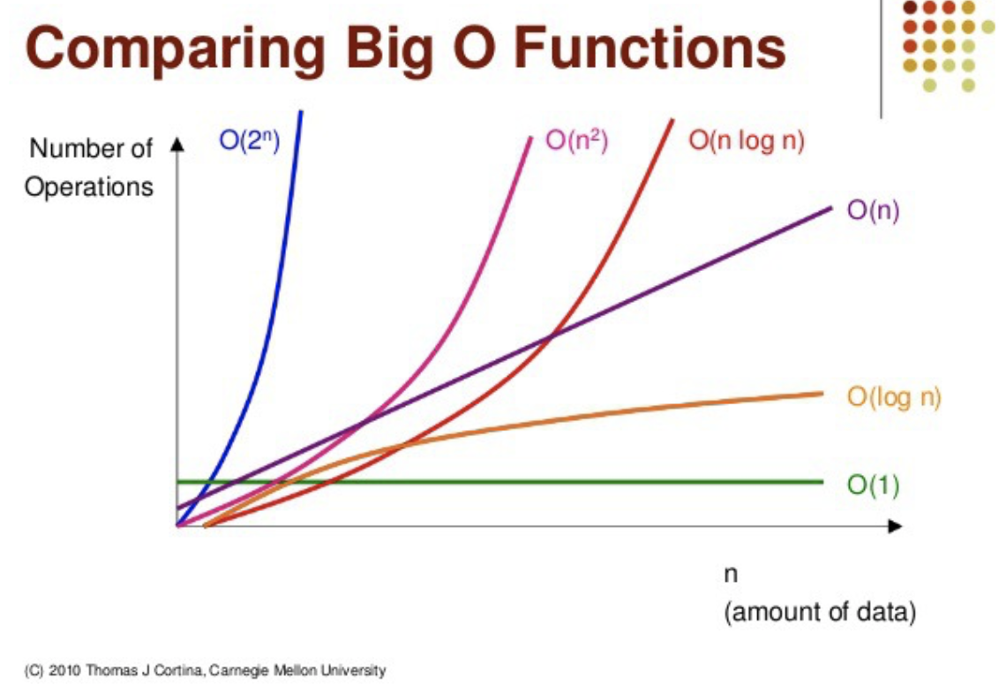
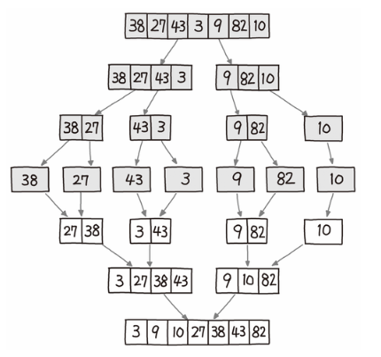
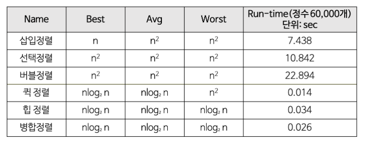
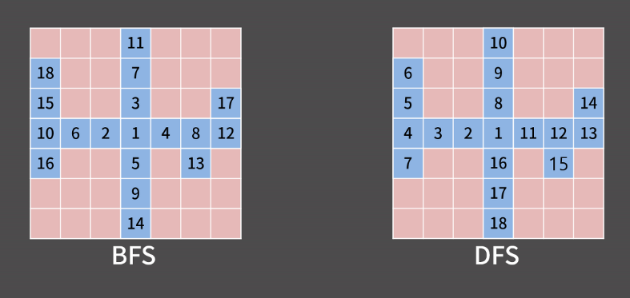
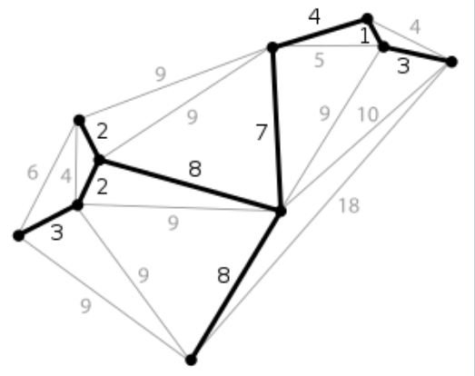

# 알고리즘

> ### 목차
> - [1. 시간 복잡도](#1-시간-복잡도)
>   - [시간 복잡도(Time Compexity)](#시간-복잡도time-compexity)
>   - [시간 복잡도의 종류](#시간-복잡도의-종류)
>     - [O(1): 상수 시간 복잡도](#o1-상수-시간-복잡도)
>     - [O(N): 선형 시간 복잡도](#on-선형-시간-복잡도)
>     - [O(logN): 로그 시간 복잡도](#ologn-로그-시간-복잡도)
>     - [O(NlogN): 선형 로그 시간 복잡도](#onlogn-선형-로그-시간-복잡도)
>     - [O(N^2)](#on2)
>     - [O(2^N): 지수 시간 복잡도](#o2n-지수-시간-복잡도)
> - [2. 정렬](#2-정렬)
>   - [버블 정렬 (Bubble Sort)](#버블-정렬-bubble-sort)
>   - [선택 정렬 (Selection Sort)](#선택-정렬-selection-sort)
>   - [삽입 정렬 (Insertion Sort)](#삽입-정렬-insertion-sort)
>   - [퀵 정렬 (Quick Sort)](#퀵-정렬-quick-sort)
>   - [병합 정렬 (Merge Sort)](#병합-정렬-merge-sort)
>   - [각 정렬의 시간 복잡도](#각-정렬의-시간-복잡도)
> - [3. 재귀](#3-재귀)
> - [4. Dynamic Programming](#4-dynamic-programming)
> - [5. 그래프 탐색 / 백트래킹](#5-그래프-탐색--백트래킹)
>   - [BFS (Breadth-First Search)](#bfs-breadth-first-search)
>   - [DFS (Depth-First Search)](#dfs-depth-first-search)
>   - [BFS vs DFS](#bfs-vs-dfs)
> - [6. 그래프 심화](#6-그래프-심화)
>   - [벨만포드 알고리즘](#벨만포드-알고리즘)
>   - [다익스트라 알고리즘](#다익스트라-알고리즘)
> - [7. 최소 신장 트리 (Minimum Spanning Tree)](#7-최소-신장-트리-minimum-spanning-tree)
>   - [구현: 크루스칼 알고리즘](#구현-크루스칼-알고리즘)
> - [8. 분할정복 / 이분탐색](#8-분할정복--이분탐색)
>   - [분할정복](#분할정복)
>     - [분할정복 vs DP](#분할정복-vs-dp)
>   - [이분탐색 (Binary Search)](#이분탐색-binary-search)
> - [9. 그리디](#9-그리디)


## 1. 시간 복잡도

### 시간 복잡도(Time Compexity)

- 컴퓨터 프로그램의 **입력값과 연산 수행 시간의 상관관계**
- 효율적 알고리즘이란?
    - 입력값이 커짐에 따라 증가하는 시간의 비율을 최소화한 알고리즘

### 시간 복잡도의 종류



#### O(1): 상수 시간 복잡도

✔ ex: 인덱스를 통한 접근

<details>

<summary> 예시 코드 </summary>

```java
int[] arr = {1, 2, 3, 4, 5};
int x = arr[2]; // retrieves the element at index 2
```
</details>

#### O(N): 선형 시간 복잡도

✔ ex: 일반적인 순회 및 탐색

<details>

<summary> 예시 코드 </summary>

```java
int[] arr = {5, 3, 8, 1, 7, 2};

int max = Integer.MIN_VALUE;

for (int i = 0; i < arr.length; i++) {
    if (arr[i] > max) {
        max = arr[i];
    }
}

System.out.println("Maximum value: " + max);

```
</details>

#### O(logN): 로그 시간 복잡도

✔ ex: 이분탐색

<details>

<summary> 예시 코드 </summary>


```java
int[] arr = {1, 2, 3, 4, 5, 6, 7, 8, 9};
int target = 5;

int left = 0;
int right = arr.length - 1;

while (left <= right) {
    int mid = (left + right) / 2;
    if (arr[mid] == target) {
        System.out.println("Found at index " + mid);
        break;
    } else if (arr[mid] < target) {
        left = mid + 1;
    } else {
        right = mid - 1;
    }
}
```
</details>

#### O(NlogN): 선형 로그 시간 복잡도

✔ ex: 정렬 (퀵 소트, 머지 소트 등)

<details>

<summary> 예시 코드 </summary>


```java
void quicksort(int[] arr, int left, int right) {
    if (left < right) {
        int pivotIndex = partition(arr, left, right);
        quicksort(arr, left, pivotIndex - 1);
        quicksort(arr, pivotIndex + 1, right);
    }
}

int partition(int[] arr, int left, int right) {
    int pivotValue = arr[right];
    int i = left - 1;

    for (int j = left; j < right; j++) {
        if (arr[j] < pivotValue) {
            i++;
            swap(arr, i, j);
        }
    }

    swap(arr, i + 1, right);

    return i + 1;
}

void swap(int[] arr, int i, int j) {
    int temp = arr[i];
    arr[i] = arr[j];
    arr[j] = temp;
}

int[] arr = {5, 3, 8, 1, 7, 2};
quicksort(arr, 0, arr.length - 1);
System.out.println(Arrays.toString(arr));
```
</details>

#### O(N^2)

✔ ex: 버블 소트, 이차원 배열 탐색 등등

<details>

<summary> 예시 코드 </summary>


```java
public static void bubbleSort(int[] arr) {
    int n = arr.length;
    for (int i = 0; i < n - 1; i++) {
        boolean swapped = false;
        for (int j = 0; j < n - i - 1; j++) {
            if (arr[j] > arr[j + 1]) {
                int temp = arr[j];
                arr[j] = arr[j + 1];
                arr[j + 1] = temp;
                swapped = true;
            }
        }
        if (!swapped) {
            break;
        }
    }
}
```
</details>

#### O(2^N): 지수 시간 복잡도

✔ ex: 부분집합 구하기

<details>

<summary> 예시 코드 </summary>


```java
void generateSubsets(int[] arr) {
    int n = arr.length;
    int totalSubsets = (int) Math.pow(2, n);
    for (int i = 0; i < totalSubsets; i++) {
        for (int j = 0; j < n; j++) {
            if ((i & (1 << j)) != 0) {
                System.out.print(arr[j] + " ");
            }
        }
        System.out.println();
    }
}

int[] arr = {1, 2, 3};
generateSubsets(arr);
```
</details>

## 2. 정렬

✔ 실제 cs 질문에는 각 정렬 방식의 개념에 대한 비교와 수도 코드 작성이 나올 수 있으니 잘 알아두자!

### 버블 정렬 (Bubble Sort)

✔ 인접한 두 원소를 비교하여 정렬하는 알고리즘

✔ 가장 단순하고 직관적이지만 시간 복잡도가 O(N^2)

<details>

<summary> 예시 코드 </summary>

```java
public static void bubbleSort(int[] arr) {
    int n = arr.length;
    for (int i = 0; i < n - 1; i++) {
        for (int j = 0; j < n - i - 1; j++) {
            if (arr[j] > arr[j + 1]) {
                int temp = arr[j];
                arr[j] = arr[j + 1];
                arr[j + 1] = temp;
            }
        }
    }
}

```
</details>


### 선택 정렬 (Selection Sort)

✔ 주어진 배열에서 가장 작은 값을 찾아서 앞으로 가지고 오는 것을 반복하여 정렬하는 알고리즘

✔ 시간 복잡도: O(N^2)

<details>

<summary> 예시 코드 </summary>

```java
public static void selectionSort(int[] arr) {
    int n = arr.length;

    for (int i = 0; i < n - 1; i++) {
        int minIndex = i;

        // 주어진 배열에서 최솟값 찾기
        for (int j = i + 1; j < n; j++) {
            if (arr[j] < arr[minIndex]) {
                minIndex = j;
            }
        }

        // 최솟값과 위치 바꿔주기
        int temp = arr[minIndex];
        arr[minIndex] = arr[i];
        arr[i] = temp;
    }
}
```
</details>

### 삽입 정렬 (Insertion Sort)

✔ 배열의 모든 요소를 앞에 원소들과 비교 하여, 자신의 위치를 찾아 삽입함으로써 정렬을 완성하는 알고리즘

✔ 시간 복잡도: O(N^2)


<details>

<summary> 예시 코드 </summary>

```java
public static void insertionSort(int[] arr) {
    int n = arr.length;

    for (int i = 1; i < n; i++) {
        int key = target[i];
        int j = i - 1;

        // 타겟이 이전 원소보다 작으면 이전 원소를 뒤로 한 칸씩 민다
        while (j >= 0 && arr[j] > key) {
            arr[j + 1] = arr[j];
            j--;
        }

        // 타겟을 위치에 맞게 삽입해준다
        arr[j + 1] = target;
    }
}
```
</details>

### 퀵 정렬 (Quick Sort)

✔ 특정한 값(피벗)을 기준으로 큰 숫자와 작은 숫자를 서로 교환한 뒤에 배열을 반으로 분할하여 정렬하는 알고리즘

✔ 분할 정복

✔ 불안정 정렬

✔ O(nlogn) / O(N^2) (최악)

✔ 최악인 경우: 이미 정렬되어있는 배열, 피벗이 최댓값이나 최솟값일 때
- [1, 2, 3, 4, 5, 6, 7, 8, 9, 10]        
    → 1을 피벗으로 잡고 진행하면 모든 수마다 피벗을 잡고 탐색을 하게 되기 때문에 시간 복잡도가 O(n^2)가 된다!

<details>

<summary> 예시 코드 </summary>

```java

// 분할 정복 퀵 정렬
public static void quickSort(int[] arr, int low, int high) {
    if (low < high) {
        int pivotIndex = partition(arr, low, high);
        quickSort(arr, low, pivotIndex - 1);
        quickSort(arr, pivotIndex + 1, high);
    }
}


// 피벗 기준으로 정렬
private static int partition(int[] arr, int low, int high) {

    // 중앙 피벗 
    int mid = low + (high - low) / 2;
    int pivot = arr[mid];
    int i = low - 1;
    int j = high + 1;
    
    while (true) {

        // 피벗보다 작은 값
        do {
            i++;
        } while (arr[i] < pivot); 

        // 피벗 보다 큰 값
        do {
            j--;
        } while (arr[j] > pivot);

        if (i >= j) {
            // 엇갈린 경우 피벗 교체 후 반환
            return j;
        }

        // 피벗 왼쪽에는 작은 값이, 오른쪽에는 큰 값이 위치하게 된다
        int temp = arr[i];
        arr[i] = arr[j];
        arr[j] = temp;
    }
}
```
</details>


### 병합 정렬 (Merge Sort)

  
출처: 파이썬 알고리즘 인터뷰

✔ 원소 개수가 0이나 1이 될 때까지 값을 쪼갠 뒤 병합하면서 정렬하는 방법

✔ 시간복잡도: O(logN)

✔ 안정 정렬

✔ 임시 배열을 위한 추가 공간 복잡도

<details>

<summary> 예시 코드 </summary>

```java

// 분할 정복으로 병합정렬 수행
public static void mergeSort(int[] arr, int low, int high) {
    if (low < high) {
        int mid = low + (high - low) / 2;
        mergeSort(arr, low, mid);
        mergeSort(arr, mid + 1, high);
        merge(arr, low, mid, high);
    }
}

private static void merge(int[] arr, int low, int mid, int high) {

    // 배열 분할
    int n1 = mid - low + 1;
    int n2 = high - mid;

    int[] leftArr = new int[n1];
    int[] rightArr = new int[n2];

    for (int i = 0; i < n1; i++) {
        leftArr[i] = arr[low + i];
    }

    for (int j = 0; j < n2; j++) {
        rightArr[j] = arr[mid + j + 1];
    }

    int i = 0;
    int j = 0;
    int k = low;

    // 분할한 배열 정렬
    while (i < n1 && j < n2) {
        if (leftArr[i] <= rightArr[j]) {
            arr[k] = leftArr[i];
            i++;
        } else {
            arr[k] = rightArr[j];
            j++;
        }
        k++;
    }

    while (i < n1) {
        arr[k] = leftArr[i];
        i++;
        k++;
    }

    while (j < n2) {
        arr[k] = rightArr[j];
        j++;
        k++;
    }
}

```
</details>


### 각 정렬의 시간 복잡도




## 3. 재귀

✔ **함수 내부에서 함수가 자기 자신을 또 다시 호출하여 문제를 해결하는 알고리즘**

✔ 반환 / 중단 조건을 잘 설정하는 것이 중요하다!

<details>

<summary> 예시 코드 (팩토리얼 / 피보나치) </summary>

```java
// 팩토리얼
public static int factorial(int n) {
    if (n == 0) {
        return 1;
    } else {
        return n * factorial(n - 1);
    }
}
```

```java
// 피보나치
public static int fibonacci(int n) {
    if (n <= 1) {
        return n;
    } else {
        return fibonacci(n - 1) + fibonacci(n - 2);
    }
}
```
</details>


## 4. Dynamic Programming

✔ **작은 부분 문제들의 해를 구하고 이를 이용하여 보다 큰 크기의 부분 문제를 해결해 나가며 최종적으로 원래 주어진 문제를 해결하는 알고리즘**

✔ DP의 두 가지 조건
1. **최적 부분 구조 (Optimal Substructure)**
   -  큰 문제를 작은 문제로 나눌 수 있으며 작은 문제의 답을 모아서 큰 문제를 해결할 수 있음
    
2. **중복되는 부분 문제 (Overlapping Subproblem)**
   - 동일한 작은 문제를 반복적으로 해결해야함

✔ **메모이제이션 (Memoization)**
- 한 번 계산한 결과를 메모리 공간에 메모하는 기법

- 다이나믹 프로그래밍을 구현하는 방법 중 하나
  - 같은 문제를 다시 호출하면 메모했던 결과를 그대로 가져옴
  - 값을 기록해 놓는다는 점에서 캐싱(Caching)이라고도 함


<details>

<summary> 예시 코드 (피보나치) </summary>

```java
public static int dpFibonacci(int n) {
    if (n <= 1) {
        return n;
    }

    int[] fib = new int[n+1];
    fib[0] = 0;
    fib[1] = 1;

    for (int i = 2; i <= n; i++) {
        fib[i] = fib[i-1] + fib[i-2];
    }

    return fib[n];
}
```
</details>

<details>

<summary> 예시 코드 (0/1 knapsack) </summary>

```java
// N: 가방 크기, K: 무게
static int knapsack(int N, int K, int[] volume, int[] price){

    dp = new int[N + 1][K + 1];

    for (int i = 0; i <= N; i++) {
        for (int j = 0; j <= K; j++) {
            if (i == 0 || j == 0) {
                dp[i][j] = 0;
            } else if (volume[i - 1] <= j) {
                dp[i][j] = Math.max(price[i - 1] + dp[i - 1][j - volume[i - 1]], dp[i - 1][j]);
            } else {
                dp[i][j] = dp[i - 1][j];
            }
        }
    }

    return dp[N][K];
}
```
</details>

## 5. 그래프 탐색 / 백트래킹

### BFS (Breadth-First Search)

✔ 그래프에서 가까운 노드부터 우선적으로 탐색

✔ 큐(선입선출) 자료 구조 사용

✔ 탐색 과정

  1. 탐색 시작 노드를 큐에 삽입하고 방문 처리를 한다.
  2. 큐에서 노드를 꺼낸 뒤에 해당 노드의 인접 노드 중에서 방문하지 않은 노드를 모두 큐에 삽입하고 방문 처리한다.
  3. 더 이상 2번의 과정을 수행할 수 없을 때까지 반복한다.

✔ (모든 간선의 비용이 동일할 떄) 최단 거리를 구하는 데 사용

### DFS (Depth-First Search)

✔ 그래프에서 깊은 부분을 우선적으로 탐색

✔ 재귀 / 스택(후입선출) 자료 구조 사용

✔ 탐색 과정

  1. 탐색 시작 노드를 스택에 삽입하고 방문 처리를 한다.
  2. 스택의 최상단 노드에 방문하지 않은 인접 노드가 있으면 그 인접 노드를 스택에 넣고 방문 처리를 한다. 방문하지 않은 인접 노드가 없으면 스택에서 최상단 노드를 꺼낸다.
  3. 2번 과정을 더 이상 수행할 수 없을 때까지 반복한다.

✔ 백트래킹 / 모든 경우를 하나하나 다 탐색하는 경우 주로 사용

### BFS vs DFS

✔ 시간 복잡도는 둘다 O(V + E)로 동일

  
출처: [바킹독 블로그](https://blog.encrypted.gg/941)

<details>

<summary> 예시 코드 </summary>

```java
import java.util.*;

public class Graph {
    private int V;
    private LinkedList<Integer>[] adj;

    // 그래프 구현
    public Graph(int v) {
        V = v;
        adj = new LinkedList[v];
        for (int i = 0; i < v; i++) {
            adj[i] = new LinkedList<>();
        }
    }

    public void addEdge(int v, int w) {
        adj[v].add(w);
    }


    // BFS (큐 사용)
    public void bfs(int s) {
        boolean[] visited = new boolean[V];
        LinkedList<Integer> queue = new LinkedList<>();
        visited[s] = true;
        queue.add(s);

        while (!queue.isEmpty()) {
            s = queue.poll();
            System.out.print(s + " ");

            Iterator<Integer> i = adj[s].listIterator();
            while (i.hasNext()) {
                int n = i.next();
                if (!visited[n]) {
                    visited[n] = true;
                    queue.add(n);
                }
            }
        }
    }


    // DFS (재귀 사용)
    public void dfs(int v) {
        boolean[] visited = new boolean[V];
        dfsUtil(v, visited);
    }

    private void dfsUtil(int v, boolean[] visited) {
        visited[v] = true;
        System.out.print(v + " ");

        Iterator<Integer> i = adj[v].listIterator();
        while (i.hasNext()) {
            int n = i.next();
            if (!visited[n]) {
                dfsUtil(n, visited);
            }
        }
    }

    public static void main(String[] args) {
        Graph g = new Graph(4);

        g.addEdge(0, 1);
        g.addEdge(0, 2);
        g.addEdge(1, 2);
        g.addEdge(2, 0);
        g.addEdge(2, 3);
        g.addEdge(3, 3);

        System.out.print("BFS traversal starting from vertex 2: ");
        g.bfs(2); // "BFS traversal starting from vertex 2: 2 0 3 1"

        System.out.print("\nDFS traversal starting from vertex 2: ");
        g.dfs(2); // "DFS traversal starting from vertex 2: 2 0 1 3"
    }
}

```
</details>

## 6. 그래프 심화

### 벨만포드 알고리즘

✔ (가중치가 있는 그래프에서) 한 노드에서 다른 노드까지의 최단 거리를 구하는 알고리즘

✔ (다익스트라와는 다르게) 간선의 가중치가 음수일 때도 사용 가능

✔ 모든 간선을 탐색하면서 인접한 정점에 대한 최단 거리 갱신 (Edge relaxation)

✔ 시간 복잡도: O(VE)

✔ 탐색 과정
  1. 출발점에서 모든 정점까지의 거리를 저장하는 dist[] 배열을 초기화한다. (dist[start] = 0, dist[v] = 무한대)

  2. 그래프의 모든 정점 u에 대해, 다음 과정을 V-1번 반복해 수행한다:
     - 그래프의 모든 간선(u, v)에 대해, dist[u] + weight(u, v) < dist[v]이면, dist[v]를 새로운, 더 짧은 거리로 갱신한다.

  3. 그래프에서 음의 가중치 사이클이 있는지 확인한다.(음의 가중치 사이클이 존재할 시 제대로 탐색하지 못한다)

  4. 출발점에서 모든 정점까지의 최단 거리를 담고 있는 dist[] 배열을 반환합니다.

<details>

<summary> 예시 코드 </summary>

```java
import java.util.Arrays;

public class BellmanFord {
    private int V, E;
    private Edge[] edges;

    // 그래프 생성자
    public BellmanFord(int v, int e) {
        V = v;
        E = e;
        edges = new Edge[e];
    }

    public void addEdge(int src, int dest, int weight, int i) {
        edges[i] = new Edge(src, dest, weight);
    }

    
    // 벨만포드 알고리즘
    public void bellmanFord(int src) {

        // 최소 거리 배열 초기화
        int[] dist = new int[V];
        Arrays.fill(dist, Integer.MAX_VALUE);
        dist[src] = 0;

        // 모든 엣지에 대해 최솟값 갱신
        for (int i = 1; i < V; i++) {
            for (int j = 0; j < E; j++) {
                int u = edges[j].src;
                int v = edges[j].dest;
                int weight = edges[j].weight;
                if (dist[u] != Integer.MAX_VALUE && dist[u] + weight < dist[v]) {
                    dist[v] = dist[u] + weight;
                }
            }
        }

        // 음의 가중치 사이클 확인      
        for (int i = 0; i < E; i++) {
            int u = edges[i].src;
            int v = edges[i].dest;
            int weight = edges[i].weight;
            if (dist[u] != Integer.MAX_VALUE && dist[u] + weight < dist[v]) {
                System.out.println("Negative weight cycle detected");
                return;
            }
        }

        printDistances(src, dist);
    }

    // 결과값 출력

    private void printDistances(int src, int[] dist) {
        System.out.println("Shortest distances from source vertex " + src + " to all vertices:");
        for (int i = 0; i < V; i++) {
            System.out.println("Vertex " + i + ": " + dist[i]);
        }
    }

    public static void main(String[] args) {
        int V = 5;
        int E = 8;
        BellmanFord graph = new BellmanFord(V, E);
        graph.addEdge(0, 1, -1, 0);
        graph.addEdge(0, 2, 4, 1);
        graph.addEdge(1, 2, 3, 2);
        graph.addEdge(1, 3, 2, 3);
        graph.addEdge(1, 4, 2, 4);
        graph.addEdge(3, 2, 5, 5);
        graph.addEdge(3, 1, 1, 6);
        graph.addEdge(4, 3, -3, 7);

        int source = 0;
        graph.bellmanFord(source); 

        // Shortest distances from source vertex 0 to all vertices:
        // Vertex 0: 0
        // Vertex 1: -1
        // Vertex 2: 2
        // Vertex 3: -2
        // Vertex 4: 1
    }
}


// 간선 클래스
class Edge {
    int src, dest, weight;

    public Edge(int src, int dest, int weight) {
        this.src = src;
        this.dest = dest;
        this.weight = weight;
    }
}
```
</details>

### 다익스트라 알고리즘

✔ 음의 가중치가 없는 그래프의 한 정점에서 모든 정점까지의 최단거리를 각각 구하는 알고리즘

✔ 탐색과정

  1. 출발점으로부터 최단거리를 저장할 배열 distance[v]을 만들고 출발 노드는 0, 나머지 노드들은 충분히 큰 값으로 초기화 한다.
  2. 현재 노드 Current를 출발 노드의 번호로 설정한다.
  3. Current로부터 갈 수 있는 임의의 노드 Next에 대해 distance[Current] + P[Current][Next](A를 거쳐서 B로 가는 최단거리)와 distance[Next](현재까지 알려진 B의 최단 거리)의 값을 비교해서 짧은 값(짧은 경로)로 갱신한다.
  4. Current의 모든 이웃노드 Next에 대해 3 을 수행한다.
  5. Current의 상태를 ‘visited=True’로 바꿔준다. (Current는 더 이상 사용하지 않는다.)
  6. visited == False인 노드 중 출발점으로부터 거리가 가장 짧은 노드를 Current로 설정한다.
  7. 도착 노드가 'visited == True’가 되거나, 더 이상 미방문 노드를 선택할 수 없을 때까지 3 ~ 6의 과정을 반복한다

✔ 시간 복잡도: O(V^2)

✔ 우선순위큐를 이용해 바로 다음 노드에 대한 정보를 추출해내서 최적화 할 수 있다 -> 시간 복잡도 O(ElogE)

<details>

<summary> 예시 코드 </summary>

```java
import java.util.*;

public class Dijkstra {
    private int V;
    private List<Edge>[] adj;

    // 그래프(인접리스트) 클래스 선언 및 초기화
    public Dijkstra(int v) {
        V = v;
        adj = new ArrayList[v];
        for (int i = 0; i < v; i++) {
            adj[i] = new ArrayList<>();
        }
    }

    public void addEdge(int src, int dest, int weight) {
        adj[src].add(new Edge(dest, weight));
        adj[dest].add(new Edge(src, weight));
    }


    // 다익스트라 알고리즘 (우선순위큐)
    public void dijkstra(int src) {

        PriorityQueue<Node> pq = new PriorityQueue<>();

        // 최단거리 테이블 초기화
        int[] dist = new int[V];
        Arrays.fill(dist, Integer.MAX_VALUE);
        dist[src] = 0;
        pq.add(new Node(src, 0));


        while (!pq.isEmpty()) {
            int u = pq.poll().vertex;

            // 우선순위큐 이용해 최단 거리 갱신
            for (Edge e : adj[u]) {
                int v = e.dest;
                int weight = e.weight;
                if (dist[u] != Integer.MAX_VALUE && dist[u] + weight < dist[v]) {
                    dist[v] = dist[u] + weight;
                    pq.add(new Node(v, dist[v]));
                }
            }
        }

        printDistances(src, dist);
    }

    // 결과값 출력
    private void printDistances(int src, int[] dist) {
        System.out.println("Shortest distances from source vertex " + src + " to all vertices:");
        for (int i = 0; i < V; i++) {
            System.out.println("Vertex " + i + ": " + dist[i]);
        }
    }

    public static void main(String[] args) {
        int V = 5;
        Dijkstra graph = new Dijkstra(V);
        graph.addEdge(0, 1, 9);
        graph.addEdge(0, 2, 6);
        graph.addEdge(0, 3, 5);
        graph.addEdge(0, 4, 3);
        graph.addEdge(2, 1, 2);
        graph.addEdge(2, 3, 4);

        int source = 0;
        graph.dijkstra(source);

        // Shortest distances from source vertex 0 to all vertices:
        // Vertex 0: 0
        // Vertex 1: 7
        // Vertex 2: 6
        // Vertex 3: 5
        // Vertex 4: 3
    }
}


// 엣지랑 노드 클래스 정의
class Edge {
    int dest, weight;

    public Edge(int dest, int weight) {
        this.dest = dest;
        this.weight = weight;
    }
}

class Node implements Comparable<Node> {
    int vertex, dist;

    public Node(int vertex, int dist) {
        this.vertex = vertex;
        this.dist = dist;
    }

    public int compareTo(Node other) {
        return Integer.compare(dist, other.dist);
    }
}
```
</details>

## 7. 최소 신장 트리 (Minimum Spanning Tree)



✔ 신장트리: 그래프 내의 모든 정점을 포함하는 트리

✔ 최소 신장트리 Spanning Tree 중에서 간선의 가중치 합이 최소(Minimun)인 트리

### 구현: 크루스칼 알고리즘

✔ Greedy를 이용해 각 단계에서 사이클을 이루지 않는 최소 비용 간선을 선택한다.

✔ 탐색 과정

  1. 간선을 오름차순으로 정렬한다. (최소 비용)
  2. 정렬된 간선 리스트에서 순서대로 사이클을 형성하지 않는 간선을 선택한다. (유니온 파인드)
  3. 선택한 간선을 현재 MST집합에 추가한다

<details>

<summary> 예시 코드 </summary>

```java
import java.util.*;

public class KruskalMST {
    private int V, E;
    private List<Edge> edges;

    // 그래프 선언 및 초기화
    public KruskalMST(int v, int e) {
        V = v;
        E = e;
        edges = new ArrayList<>();
    }

    public void addEdge(int src, int dest, int weight) {
        edges.add(new Edge(src, dest, weight));
    }

    public int kruskalMST() {
        // parent 배열 초기화
        int cost = 0;
        int[] parent = new int[V];
        Arrays.fill(parent, -1);

        // 최소 신장 트리 갱신
        for (Edge e : edges) {
            // 사이클 판별
            int root1 = find(parent, e.src);
            int root2 = find(parent, e.dest);

            if (root1 != root2) {
                // 비용 계산
                cost += e.weight;
                // 유니온
                parent[root1] = root2;
            }
        }

        return cost;
    }


    // 파인드 함수(사이클 판별)
    private int find(int[] parent, int v) {
        if (parent[v] < 0) {
            return v;
        }
        parent[v] = find(parent, parent[v]);
        return parent[v];
    }

    public static void main(String[] args) {
        int V = 5;
        int E = 7;
        KruskalMST graph = new KruskalMST(V, E);
        graph.addEdge(0, 1, 2);
        graph.addEdge(0, 3, 6);
        graph.addEdge(1, 2, 3);
        graph.addEdge(1, 3, 8);
        graph.addEdge(1, 4, 5);
        graph.addEdge(2, 4, 7);
        graph.addEdge(3, 4, 9);

        int cost = graph.kruskalMST();
        System.out.println("Total cost of the Minimum Spanning Tree: " + cost);
        // Total cost of the Minimum Spanning Tree: 16
    }
}

// 간선 클래스 정의
class Edge implements Comparable<Edge> {
    int src, dest, weight;

    public Edge(int src, int dest, int weight) {
        this.src = src;
        this.dest = dest;
        this.weight = weight;
    }

    public int compareTo(Edge other) {
        return Integer.compare(weight, other.weight);
    }
}

```
</details>


## 8. 분할정복 / 이분탐색

### 분할정복

✔ 문제를 나눌 수 없을 때까지 나누어서 각각을 풀면서 다시 합병하여 문제의 답을 얻는 알고리즘

✔ 주로 재귀 활용

✔ 예시: 병합정렬, 퀵정렬, 이분탐색...

#### 분할정복 vs DP

✔ 분할 정복은 분할된 하위 문제가 동일하게 중복이 일어나지 않는 경우에 쓰며, 동일한 중복이 일어나면 동적 프로그래밍을 활용(메모이제이션)

### 이분탐색 (Binary Search)

✔ (주로 정렬된 데이터에서) 검색 범위를 반으로 줄여 나가면서 검색 값을 찾는 알고리즘

✔ 매개변수 탐색(Parametric search)에서 활용 가능!

✔ 시간 복잡도: O(logN)

<details>

<summary> 예시 코드 </summary>

```java
public class BinarySearch {

    public static int binarySearch(int[] arr, int target) {
        int left = 0;
        int right = arr.length - 1;
        while (left <= right) {
            int mid = left + (right - left) / 2;
            if (arr[mid] == target) {
                return mid;
            } else if (arr[mid] < target) {
                left = mid + 1;
            } else {
                right = mid - 1;
            }
        }
        return -1;
    }

    public static void main(String[] args) {
        int[] arr = {1, 3, 5, 7, 9};
        int target = 7;
        int index = binarySearch(arr, target);
        if (index == -1) {
            System.out.println("Target not found in array");
        } else {
            System.out.println("Target found at index " + index);
        }
    }
}
```
</details>


## 9. 그리디

✔ 여러 경우 중 하나를 결정해야 할 때마다 그 순간에 최적이라고 생각되는 것을 선택해 나가는 방식으로 진행하여 최종적인 해답에 도달하는 알고리즘

✔ 그리디의 두 가지 조건
1. 탐욕스런 선택 조건(greedy choice property)과 
   - 앞의 선택이 이후의 선택에 영향을 주지 않는다

2. 최적 부분 구조 조건(optimal substructure)
   - 문제에 대한 최적해가 부분문제에 대해서도 역시 최적해이다.

<details>

<summary> 예시 코드 (냅색) </summary>

```java
import java.util.Arrays;

public class FractionalKnapsack {

    // 그리디로 배낭 채워넣기
    public static double getMaximumValue(int[] weights, int[] values, int capacity) {
        int n = weights.length;
        double[] ratios = new double[n]; // 가치/무게 비율

        // 비율 구하기
        for (int i = 0; i < n; i++) {
            ratios[i] = (double) values[i] / weights[i];
        }

        // 물건 정보
        Item[] items = new Item[n];

        for (int i = 0; i < n; i++) {
            items[i] = new Item(weights[i], values[i], ratios[i]);
        }

        // 정렬
        Arrays.sort(items);

        double maximumValue = 0;

        // 그리디하게 물건 채워 넣기
        for (int i = n - 1; i >= 0; i--) {
            if (capacity == 0) {
                break;
            }

            double weightToAdd = Math.min(items[i].getWeight(), capacity);
            maximumValue += weightToAdd * items[i].getRatio();
            capacity -= weightToAdd;
        }

        return maximumValue;
    }

    public static void main(String[] args) {
        int[] weights = {10, 20, 30};
        int[] values = {60, 100, 120};
        int capacity = 50;

        double maximumValue = getMaximumValue(weights, values, capacity);
        System.out.println("Maximum value we can obtain = " + maximumValue); // prints "Maximum value we can obtain = 240.0"
    }
}

// 클래스 정의
class Item implements Comparable<Item> {
    private int weight;
    private int value;
    private double ratio;

    public Item(int weight, int value, double ratio) {
        this.weight = weight;
        this.value = value;
        this.ratio = ratio;
    }

    public int getWeight() {
        return weight;
    }

    public int getValue() {
        return value;
    }

    public double getRatio() {
        return ratio;
    }

    @Override
    public int compareTo(Item item) {
        return Double.compare(this.ratio, item.ratio);
    }
}

```
</details>