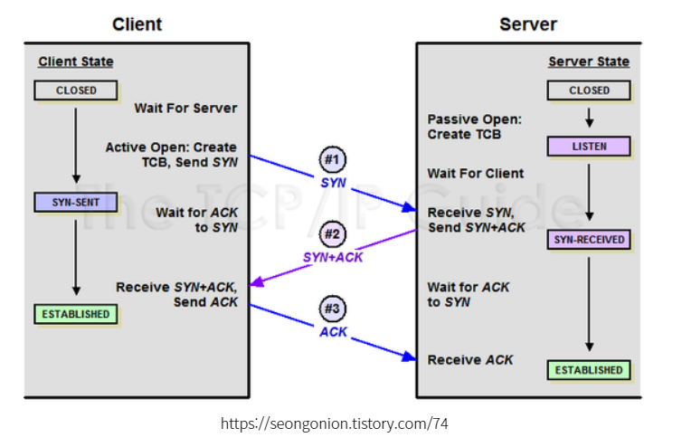
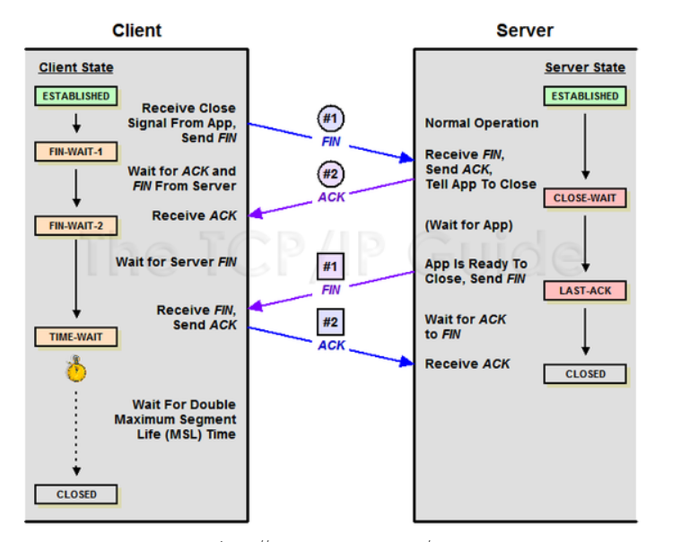
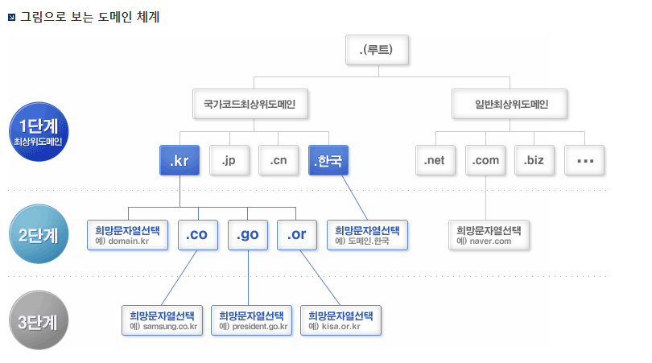

# 네트워크

## HTTP(Hyper Text Transfer Protocal) 프로토콜

서버/클라이언트 모델을 따라 **데이터를 주고 받기 위한 프로토콜**

**애플리케이션 레벨**의 프로토콜로 TCP/IP 위에서 작동

상태 정보를 저장하지 않는 **Stateless**의 특징과 클라이언트의 요처에 맞는 응답을 보낸 후 연결을 끊는 **Connectionless**의 특징을 가짐

* 장점
  * 통신간의 연결 상태 처리나 상태 정보를 관리할 필요 없어 서버 디자인이 간단함.
  * 각각의 HTTP 요청에 독립적으로 응답만 보내주면 됨
* 단점
  * 이전 통신의 정보를 모르기 때문에 매번 인증을 해줘야 함
  * 이를 해결하기 위해 쿠키(cookie)나 세션(session)을 사용해 데이터를 처리함

> ### 프로토콜
>
> 컴퓨터 네트워크에서 통신을 수행하는 데 사용되는 규칙의 모음
>
> 통신에 사용되는 데이터의 형식, 메시지의 전송 방법, 오류 검사 및 복구 방법 등을 결정함

> ### stateful과 stateless
>
> 클라이언트와 서버간의 네트워크 통신이 어떻게 이루어지는지에 대한 개념
>
> * 세션상태
>
>   * 클라이언트와 서버간 통신 인증이 된 상태
>
>   * 인증된 상태에서 데이터 송수신이 가능
>
> * 세션 정보
>
>   * 한 세션 내에서, 클라이언트가 서버에 정송할 데이터 정보를 의미
>
>   * 서버는 세션 유지 시간이 지나거나, 클라이언트가 전송하려했던 데이터를 모두 수신할 때까지 클라이언트와의 세션 상태를 유지함
>
> **Stateful**
>
> 세션이 종료될 때까지, 클라이언트의 세션 정보를 저장하는 네트워크 프로토콜
>
> * 장점
>   * 서버는 클라이언트의 세션 정보를 저장하므로, 갑자기 통신이 중단되더라도 중단된 곳부터 다시 시작할 수 있음
> * 단점
>   * 확장성이 좋지 않음
>     * 클라이언트의 세션 정보가 새로 scale out된 서버에 저장 되어 있지 않음
>     * 따라서, scale out 시, 클라이언트의 세션 정보를 새로운 서버에 옮겨주는 등의 부수적인 관리가 요구됨
>
> 예시)
>
> * TCP 프로토콜
>   * TCP는 클라이언트와 서버간 3-way-handshaking(연결 확정, 데이터 전송, 연결 종료)로 이루어져있음.
>   * 클라이언트와 서버간의 연결 확정 후, 데이터를 전송하고, 데이터 전송이 끝나면 연결이 종료됨
> * 온라인 뱅킹
>   * 은행(서버)은 고객(클라이언트)의 인증 정보(세션 상태)와 경제 내역(세션 정보)을 가지고 있음
>
> **Stateless**
>
> * 서버가 클라이언트의 세션 상태 및 세션 정보를 저장하지 않는 네트워크 프로토콜임
>   * 요청에 대한 응답만 처리하는 방식
>   * 각 통신은 선행되거나 후속으로 따라오는 통신과 관련이 없음
>   * 클라이언트가 송신하려 했던 모든 데이터가 서버쪽에 수신 되었는지 확인하지 않음
>
> **EX)**
>
> * UDP 프로토콜
>   * UDP는 서버가 클라이언트의 세션 상태 및 세션 정보 없이, 요청에 대한 응답만을 수행하는 네트워크 프로토콜임
> * 온라인 검색(검색창에 질문을 입력하고 엔터키를 누르는 형식)
>   * 검색창에 질문을 입력하다가 요청이 중단되어도, 다시 검색하면 됨
> * 장점
>   * 확장성이 좋음
>     * 서버가 클라이언트의 세션 상태 및 세션 정보를 저장하지 않기 때문에, 확장성이 좋음
> * 단점
>   * 서버가 세션 상태 및 세션 정보를 저장하지 않기 때문에, 클라이언트 측에서 송신할 데이터의 양이 많아짐

## HTTP vs HTTPS

HTTP는 평문 데이터를 전송하는 프로토콜이기 때문에, HTTP로 중요한 정보를 주고 받으면 제 3자에 의해 조회될 수 있음

이러한 문제를 해결하기 위해 HTTP에 암화화가 추가된 프로토콜이 HTTPS임

HTTPS는 SSL의 껍질을 덮어쓴 HTTP (SSL(Secure Socket Layer) : 인터넷을 통해 전달되는 정보를 보호하기 위해 개발한 통신 규약)

HTTPS에는 대칭키와 비대칭키 암호화가 모두 사용됨.

비대칭키 암/복호화는 비용이 매우 크기 때문에 서버와 클라이언트가 주고받는 모든 메세지를 비대칭키로 암호화하면 오버헤드가 발생할 수 있음.

그래서 서버와 클라이언트가 최초 1회로 서로 대칭키를 공유하기 위한 과정에서 비대칭키 암호화를 사용하고, 이후에 메세지를 주고 받을 때에는 대칭키 암호화를 사용함.

1. 클라이언트(브라우저)가 서버로 최초 연결 시도를 함
2. 서버는 공개키(인증서)를 브라우저에게 넘겨줌
3. 브라우저는 인증서의 유효성을 검사하고 세션키를 발급함
4. 브라우저는 세션키를 보관하며 추가로 서버의 공개키로 세션키를 암호화하여 서버로 전송함
5. 서버는 개인키로 암호화된 세션키를 복호화여 세션키를 얻음
6. 클라이언트와 서버는 동일한 세션키를 고융하므로 데이터를 전달할 때 세션키로 암호화/복호화를 진행함

https://developer.mozilla.org/ko/docs/Web/HTTP/Overview

https://shlee0882.tistory.com/107

## TCP / UDP

TCP와 UDP는 OSI 표준모델과 TCP/IP 모델의 **전송계층**에서 사용되는 프로토콜임

전송계층은 **송신자와 수신자를 연결하는 통신 서비스**를 제공하고 IP에 의해 전달되는 패킷의 **오류를 검사**하며 **재전송 요구 제어**등을 담당하는 계층임

TCP와 UDP는 포트 번호를 이용하여 주소를 지정하는것과 데이터 오류검사를 위해 체크섬이 존재하는 두가지 공통점을 갖고 있지만 정확성(TCP)을 추구할지 신속성(UDP)를 추구할지를 구분하여 나뉨

> **체크섬(checksum)**
>
> 중복검사의 한 형태. 송신된 자료의 무결성을 보호하는 단순한 방법
>
> https://hojak99.tistory.com/246

데이터를 중요하게 생각하여 확실히 주고받고 싶을 때는 'TCP(Transmission Control PRotocol)'를 사용함

TCPSMS  통신할 컴퓨터끼리 서로 **확인 메세지**를 보내면서 데이터를 주고 받음으로써 **통신의 신뢰성**을 높임

웹이나 메일, 파일 공유 등과 같이 데이터를 누락시키고 싶지 않은 서비스는 TCP를 사용함

신뢰성을 제쳐두고 빠른 전송을 위해선 'UDP(User Datagram Protocol)'를 사용함

UDP는 데이터를 보내면 끝이라 신뢰성은 없지만 **확인 응답과 같은 절차를 생략**할 수 있으므로 **통신의 신속성**을 높임

VoIP(Voice over IP)와 같은 시간 동기가 필요한, 특히 속도를 필요로 하는 서비스들이 UDP를 사용함

> **포트 번호**
>
> * TCP와 UDP는 '포트 번호'라는 숫자를 이용하여 컴퓨터 안의 어떤 서비스(애플리케이션)에게 데이터를 전달하면 좋은지를 식별함
>
> * 포트 번호는 '0~65535'(16비트 분)까지의 숫자로 되어 있으며, 범위에 따라 용도가 정해져 있음
>
> * '0~ 1023'은 '잘 알려진 포트(well-known prot)'라고 해서 웹 서버나 메일 서버 등과 같이 일반적인 서버 소프트웨어가 클라이언트의 서비스 요청을 대기할 때 사용함
>
> * '1024~49151'은 '등록된 포트(registered prot)'로, 제조업체의 독자적인 서버 소프트웨어가 클라이언트의 서비스 요청을 대기할 때 사용함
>
> * '49152~65535'는 '동적포트(dynamic prot)'로, 서버가 클라이언트를 식별하기 위해 사용

### TCP (Transmission Control Protocol)

* 신뢰성 있는 데이터 전송을 지원하는 **연결 지향형 프로토콜**
  * 연결지향 프로토콜 : 서버가 연결된 상태에서 데이터를 주고받는 프로토콜
  * 클라이언트가 연결 요청(SYN 데이터 전송)을 하고, 서버가 연결을 수락하면 통신 선로가 고정되고, 모든 데이터는 고정된 통신 선로를 통해서 순차적으로 전달됨 그렇기 때문에 TCP는 **데이터를 정확하고 안정적**으로 전달할 수 있음
  * TCP는 프로토콜은 신뢰성 있는 데이터의 전송을 위해 확인작업을 거치는데 TCP는 패킷을 성공적으로 전송하면 ACK 신호를 날리고 만약에 ACK 신호가 제 시간에 도차갛지 않으면 Timeout이 발생하여 패킷 손실이 발생한 패킷을 다시 전송해줌
  * 데이터를 송신할때마다 확인 응답을 주고받는 절차가 있으므로 **통신의 신뢰성**이 올라감

* 일반적으로 TCP와 IP가 함께 사용되는데, **IP가 데이터의 전송**을 처리한다면 **TCP는 패킷 추적 및 관리**를 하게 됨

* **3-way handshaking** 과정을 통해 연결 후 통신을 시작

* **흐름 제어**와 **혼잡 제어**를 지원하며 데이터의 순서를 보장함
* 흐름 제어: 보내는 측과 받는 측의 데이터 처리속도 차이를 조절해주는 것
  
* 혼잡 제어: 네트워크 내의 패킷 수가 넘치게 증가하지 않도록 방지하는 것

### 단점

* 데이터로 보내기 전에 반드시 **연결**이 형성되어야함.
* **1 : 1** 통신만 가능함
* 고정된 통신 선로가 최단선(네트워크 길이)이 아닐경우 상대적으로 UDP보다 데이터 전송속도가 느림

### 특징

* **연결형**(connection-oriented) 서비스로 가상 회선 방식 제공
* 데이터의 **전송 순서 보장** (데이터의 순서 유지를 위해 각 바이트마다 번호 부여)
* 데이터의 **경계를 구분하지 않음** (바이트 스트림 서비스)
* **신뢰성** 있는 데이터 전송 (Sequence Number, Ack Number를 통한 신뢰성 보장)
* **데이터 흐름 제어**(수신자 버퍼 오버플로우 방지) 및 **혼잡 제어**(패킷 수가 과도하게 증가하는 현상 방지)
* 연결의 **설정**(3-way handshaking) 과 해제(4-way handshaking)
* 전이중(Full-Duplex), 점대점(Point to Point) 서비스
  * 전이중 : 전송이 양방향으로 동시에 일어날 수 있음
  * 점대점: 각연결이 정확하게 2개의 종단점을 가지고 있음
* UDP보다 전송속도가 느림

### UDP (User Datagram Protocol)

UDP는 전송 계층의 **비연결 지향**적 프로토콜임

비연결 지향적이란 데이터를 주고받을 때 연결 절차를 거치지 않고 발시자가 일방적으로 데이터를 발신하는 방식을 의미

연결 과정이 없기 때문에 TCP보다는 **빠른 전송**을 할 수 있지만 데이터 전달의 신뢰성은 떨어짐

UDP는 발신자가 데이터 패킷을 순차적으로 보내더라도 이 패킷들은 서로 다른 통신 선로를 통해 전달 될 수 있음

먼저 보낸 패킷이 느린 선로를 통해 전송될 경우 나중에 보낸 패킷보다 늦게 도착할 수 있으며 최악의 경우 잘못된 선로로 전송되어 유실될 수 있음

이럴 경우 TCP와는 다르게 UDP는 중간에 패킷이 **유실이나 변조가 되어도 재전송을 하지 않음**

### 단점

* 데이터의 **신뢰성이 없음**
* 의미있는 서버를 구축하기 위해서는 일일이 **패킷을 관리**해주어야 함

### 특징

* **비연결형** 서비스로 연결 없이 통신이 가능하며 데이터그래 방식을 제공함
* **데이터 경계를 구분**함(데이터그램(datagram) 서비스)
  * 데이터 그램 : 패킷 교환망에서 모든 패킷의 경로를 미리 저장하여 두지 않고, 전송할 때에 패킷의 경로를 결정하는 통신 서비스
* 정보를 주고 받을 때 정보를 보내거나 받는다는 **신호절차를 거치지 않음**
* **신뢰성 없는** 데이터 전송 (데이터 재전송과 데이터 순서 유지를 위한 작업을 하지 않음)
* **패킷관리**가 필요함
* 패킷 **오버헤드가 적어 네트워크 부하가 감소**되는 장점
* 상대적으로 TCP보다 **전송 속도가 빠름**

https://coding-factory.tistory.com/614

https://dev-mb.tistory.com/133

## 3-Way HandShaking

TCP 통신을 위한 네트워크 연결은 3 way handshake 이라는 방식으로 연결됨

서로의 통신을 위한 관문(prot)을 확인하고 연결하기 위하여 3번의 요청/응답 후에 연결이 되는 것을 의미

양쪽 모두 데이터를 전송할 준비가 되었다는 것을 보장하고 실제로 데이터 전달을 시작하기 전에 한쪽이 다른 쪽이 준비되었다는 것을 알 수 있도록 함

STEP 1

A 클라이언트는 B 서버에 접속을 요청하는 SYN 패킷을 보냄

이때 A 클라이언트는 SYN을 보내고 SYN/ACK 응답을 기다리는 SYN_SENT 상태, B서버는 Wait for Client 상태

STEP 2

B 서버는 SYN 요청을 받고 A 클라이언트에게 요청을 수락한다는 ACK 와 SYN flag가 설정된 패킷을 발송하고

A가 다시 ACK으로 응답하기를 기다림

이때 B 서버는 SYN_RECEIVED 상태가 됨

STEP 3

A클라이언트는 B서버에게 ACK을 보내고 이후로부터는 연결이 이루어지고 데이터가 오가게 됨

이때의 B 서저 상태가 ESTABLISHED 임

## 4-Way HandShaking

3-Way Hand Shaking은 TCP의 연결을 초기화 할 떄 사용한다면 4-Way HandShaking은 **세션을 종료**하기 위해 수행되는 절차임

STEP 1

클라이언트가 연결을 종료하겠다는 FIN 플래그를 전송함 이때 A 클라이언트는 FIN-WAIT 상태가 됨

STEP 2

B 서버는 FIN플래그를 받고, 일단 확인메시지 ACK를 보내고 자신의 통신이 끝날때 까지 기다리는데 이 상태가 B서버의 CLOSE_WAIT 상태

STEP 3

연결을 종료할 준비가 되면, 연결해지를 위한 준비가 되었음을 알리기 위해 클라이언트에게 FIN플래그를 전송함

이떄 B 서버의 상태는 LAST-ACK임

STEP 4

클라이언트는 해지준비가 되었다는 ACK를 확인했다는 메시지를 보냄

A클라이언트의 사앹가 FIN-WAIT -> TIME-WAIT 으로 변경됨

그런데 만약 Server에서 FIN을 전송하기 전에 전송한 패킷이 Routing 지연이나 패킷 유실로 이낳ㄴ 재전송 등으로 인해 FIN 패킷보다 늦게 도착하는 상황이 발생하면

Client에서 세션을 종료시킨 후 뒤늦게 도차갛는 패킷이 있다면 이 패킷은 Drop되고 데이터는 유실될 것임

A클라이언트는 이러한 현상에 대비하여 Clinet는 Server로부터 FIN을 수신하더라도 일정시간(디폴트 240초) 동안 세션을 남겨놓고 잉여 패킷을 기다리는 과정을 거치게 되는데 이 과정을 "TIME_WAIT"이라고 함.

일정시간이 지나면, 세션을 만료하고 연결을 종료시키며, "CLOSE"상태로 변화함

https://bangu4.tistory.com/74

## 주소창에 www.naver.com을 쳤을 때 생기는 일

1. www.naver.com은 도메인 네임으로 되어있기 때문에 DNS에 도메인을 검색하기 위한 요청을 보냄
2. DNS는 일련의 과정을 거친 후 www.naver.com에 대응하는 ip주소를 응답으로 돌려줌
3. 받은 ip주소를 사용하여 TCP 통신을 통해 해당 ip서버에 요청을 보냄
4. 요청을 받은 서버(www.naver.com)는 요청 내용에 대한 일련의 처리 과정을 거쳐 응답 메시지를 만듬
5. 응답메시지를 TCP통신을 통해 다시 클라이언트에게 전송함
6. 브라우저는 받은 응답메시지를 HTTP 프로토콜을 사용하여 웹페이지를 구성하며 사용자에게 Naver 화면을 보여줌

**Step 1. 주소창에 입력한 텍스트 정보 확인**

대부분의 인터넷 브라우저는 자사의 주소창을 검색창과 동일하게 사용함 (ex Chrome)

이럴 경우 브라우저는 사용자가 주소창에 어떤 텍스트를 입력했을 때, 이 텍스트가 검색어인지 URL인지 우선적으로 확인함

* 만일 입력한 텍스트가 검색어이면, 브라우저는 검색 엔진의 URL에 검색어를 포함한 주소로 페이지를 이동시킴
* 만일 입력한 텍스트가 URL이면, 브라우저 엔진에서 (네트워크 스레드를 통해) 네트워크 호출을 수행함.

**Step 2. 네트워크 호출**

브라우저가 사용자에게 '네이버'라는 사이트를 화면에 보여주려면

네이버의 HTML 문서, CSS 문서, 스크립트, 이미지 등의 데이터를 미리 가지고 있어야 함

하지만 현재 브라우저엔 이러한 정보가 없고 이러한 데이터들은 네이버 서버 컴퓨터에 존재함

그렇기 때문에 브라우저는 네이버 서버와의 네트워크 통신을 통해 이러한 데이터들을 가져와야 함

이 작업을 수행하기 위해선, 브라우저는 우선 네이버 서버가 있는 컴퓨터의 IP 주소부터 파악할 필요가 있음

따라서 네트워크 호출 과정은 아래의 두가지 과정으로 나뉨

1. 네이버 서버의 주소를 알기 위해 네임 서버(Name Server)와 통신하기
2. 알아낸 주소를 바탕으로 네이버 서버와 통신하여 필요한 데이터 응답받기

>1. 네이버 서버의 주소를 찾는 과정
>   * 네이버 서버의 주소를 알아내기 위해, 클라이언트(사용자의 컴퓨터)는 다음의 과정을 수행
>     1. 자신의 host 파일에서 도메인 네임(naver.com)에 대응하는 IP 주소(125.209.222.142)가 있는지 우선적으로 확인함
>     2. 만일 없다면, 네임 서버(Name Server)에 네이버 주소를 알려달라는 요청을 보냄
>   * 여기서 도메인 네임이란 URL www.naver.com 중 naver.com에 해당하는 부분임
>   * 인터넷은 컴퓨터의 주소인 IP주소를 기반으로 동작
>   * 따라서 도메인 네임을 IP 주소로 변환해 주는 환경인 DNS (Domain Name Server)가 반드시 필요함
>   * 이 DNS를 운영하는 장치를 네임 서버(Name Server) 혹은 DNS 서버라 함
>   * 즉, 네임 서버는 도메인 주소에 대응하는 IP 주소를 찾아주는 역할을 수행하는 것임
>   * 클라이언트는 일반적으로 네임 서버의 IP 주소를 이미 가지고 있음
>   * 따라서 클라이언트는 네임 서버와 통신이 가능하고, naver.com에 해당하는 Ip 주소를 요청 및 응답 받을 수 있음
>2. 네이버 서버와 통신하여 필요한 데이터를 받는 과정
>   * 이제 클라이언트는 네이버 서버의 IP 주소를 알게 되어 네이버 서버와 통신할 수 있게 되었음
>   * 클라이언트의 브라우저는(TCP 소켓을 ㅇ려고 이를 통해) 네이버 서버에 데이터를 요청하는 HTTP Request를 보냄
>   * HTTP Request를 받은 네이버 서버는 클라이언트가 요청한 문서를 찾아 읽고 이를 바이트 형태로 변환한 후, 크라링언트 HTTP Reply(HTTP Resposne)를 보냄

**Step 3. 렌더링 작업**

브라우저 엔진(의 네트워크 스레드)은 네이버 서버로부터 응답받은 데이터에 악성 바이러스가 있는지 우선 검사

이 데이터는 바이트 형태의 텍스트 문서이므로, 브라우저 엔진이 읽을 수 없음

따라서 브라우저 엔진(의 UI 스레드)은 렌더링 엔진에게 해당 데이터를 해석하고, 웹 페이지를 화면에 띄울 것을 요청함

요청을 받은 렌더링 엔진은 받은 데이터를 바탕으로 렌더링 프로세스를 수행, 이 과정이 끝나면 브라우저 엔진에게 작업 완료를 알림

이 후 화면에 네이버 페이지가 보이게 됨

> **렌더링 과정**
>
> 1. HTMl을 파싱하여 DOM 트리 구축, CSS를 파싱하여 CSSOM 트리 구축 ( + JS 파싱)
> 2. DOM 트리와 CSSOM 트리를 통해 랜더 트리 구축 (Attachment / 형상 구축)
> 3. 랜더 트리 배치(Layout / Reflow)
> 4. 랜더 트리 그리기 (Paint)
>

https://velog.io/@sylagape1231/%EC%A3%BC%EC%86%8C%EC%B0%BD%EC%97%90-naver.com%EC%9D%84-%EC%B9%98%EB%A9%B4-%EC%9D%BC%EC%96%B4%EB%82%98%EB%8A%94-%EC%9D%BC%EC%9D%84-%EC%89%BD%EA%B2%8C-%EC%9D%B4%ED%95%B4%ED%95%B4%EB%B3%B4%EC%9E%90

## 쿠키(Cookie)와 세션(Session)의 차이점

### 쿠키

사용자의 컴퓨터에 저장하는 작은 기록 정보 파일

HTTP에서 클라이언트의 상태 정보를 PC에 저장했다가 필요시 정보를 참조하거나 재사용할 수 있음

### 세션

일정 시간동안 같은 사용자로부터 들어오는 일련의 요구를 하나의 상태로 보고, 그 상태를 유지시키는 기술

방문자가 웹 서버에 접속해 있는 상태를 하나의 단위로 보고 그것을 세션이라 함.

## OSI7 계층

### 개념

* 개방형 시스템 상호 연결 모델의 표준
* 실제 인터넷에서 사용되는 TCP/IP는 OSI 참조 모델을 기반으로 상업적이고 실무적으로 이용될 수 이도록 단순화 한 것임

### 탄생 배경

* 초기 여러 정보 통신 업체 장비들은 자신의 업체 장비들끼리만 연결이 되어 호환성이 없었음
* 모든 시스템들의 상호 연결에 있어 문제없도록 표준을 정한것이 OSI 7계층
* 표준(호환성)과 학습도구의 의미로 제작

### 작동 원리

1. OSI 7계층은 응용, 표현, 세션, 전송, 네트워크, 데이터링크, 물리계층으로 나뉨
2. 전송 시 7계층에서 1계층으로 각각의 층마다 인식할 수 있어야 하는 헤더를 붙임(캡슐화)
3. 수신 시 1계층에서 7계층으로 헤더를 떼어냄(디캡슐화)
4. 출발지에서 데이터가 전송될 때 헤더가 추가되는데 2계층에서만 오류제어를 위해 꼬리 부분에 추가됨
5. 물리계층에서 1, 0의 신호가 되어 전송매체(동축케이블, 광섬유 등)을 통해 전송

### 물리계층(Physical Layer)

* 최하위 계층
* 주로 전기적, 기계적, 기능적인 특성을 이용해 데이터를 전송
* 데이터는 0과 1의 비트열, 즉 On, Off의 전기적 신호 상태로 이루어져 해당 계층은 단지 데이터를 전달
* 단지 데이터 전달의 역할을 할 뿐이라 알고리즘, 오류제어 기능이 없음
* 장비로는 케이블, 리피터, 허브가 있음

### 데이터링크 계층(Data-Link Layer)

* 물리적인 연결을 통해 인접한 두 장치 간의 신뢰성 있는 정보 전송을 담당(Point-To-Point 전송)
* 프레임에 Mac 주소를 부여하고 에러검출, 재전송, 흐름제어 진행
* MAC 주소를 통해 통신
* 데이터 링크 계층에서 데이터 단위는 프레임(Frame)
* 브리지, 스위치

### 네트워크 계층(Network Layer)

* 중계 노드를 통해 전송하는 경우 어떻게 중계할 것인가를 규정
* 라우팅 기능을 맡고 있는 계층으로 목적지까지 가장 안전하고 빠르게 데이터를 보내는 기능을 가지고 있음(최적의 경로 설정 가능)
* 라우팅, 흐름 제어, 오류 제어, 세그멘테이션 등을 수행
* 데이터 단위는 패킷(Packet)

### 전송 계층(Transport Layer)

* 종단 간 신뢰성이 있고 정확한 데이터 전송 담당
* 송신자와 수신자 간의 신뢰성있고 효율적인 데이터를 전송하기 위해 오류검출 및 복구, 흐름제어와 중복검사 등을 수행
* 데이터 전송을 위해서 Port 번호를 사용 (TCP, UDP)
* 데이터 단위는 세그먼트(Segment)

### 세션 계층(Session Layer)

* 통신 장치 간 상호작용 및 동기화 제공

* 연결 세션에서 데이터 교환과 에러 발생 시의 복구 관리

### 표현 계층(Presentation Layer)

* 데이터를 어떻게 표현할지 정하는 역할을 하는 계층
* 표현 계층은 세가지의 기능을 갖고 있음
  1. 송신자에서 온 데이터를 해석하기 위한 응용계층 데이터 부호화, 변화
  2. 수신자에서 데이터의 압축을 풀수 있는 방식으로 된 데이터 압축
  3. 데이터의 암호화와 복호화

### 응용 계층(Application Layer)

* 사용자와 가장 밀접한 계층으로 인터페이스 역할
* 응용 프로세스 간의 정보 교환 담당
* ex) 전자메일, 인터넷, 동영상 플레이어 등

https://onecoin-life.com/19

https://velog.io/@cgotjh/%EB%84%A4%ED%8A%B8%EC%9B%8C%ED%81%AC-OSI-7-%EA%B3%84%EC%B8%B5-OSI-7-LAYER-%EA%B8%B0%EB%B3%B8-%EA%B0%9C%EB%85%90-%EA%B0%81-%EA%B3%84%EC%B8%B5-%EC%84%A4%EB%AA%85

## DNS

네트워크 상에서 컴퓨터들은 IP주소를 이용하여 서로를 구별하고 통신함

사람들이 네트워크를 통해 원격의 컴퓨터에 접속하기 위해서는 IP주소를 이용하여야 하지만, 숫자의 연속인 IP주소를 일일이 외울 수 없기 때문에 쉽게 기억할 수 있는 도메인 주소 체계가 만들어짐

DNS(Domain Name System)은 도메인 이름의 수직적인 체계를 말함

https://www.cloudflare.com/ko-kr/learning/dns/what-is-dns/  - detail

## 라우터/ 라우팅 알고리즘

### 라우팅

라우팅은 네트워크에서 경로를 선택하는 프로세스임

컴퓨터 네트워크는 노드라고 하는 여러 시스템과 이러한 노드를 연결하는 경로 또는 링크로 구성됨

상호 연결된 네트워크에서 두 노드 간의 통신은 여러 경로를 통해 이루어질 수 있음

라우팅은 미리 정해진 규칙을 사용하여 최상의 경로를 선택하는 프로세스임

### 라우터

라우터는 컴퓨팅 디바이스와 네트워크를 다른 네트워크에 연결하는 네트워킹 디바이스임

주로 3가지 기본 기능을 수행함

1. 경로 설정

   라우터는 소스에서 대상으로 이동하는 데이터의 경로를 결정함. 지연, 용량 및 속도와 같은 네트워크 지표를 분석하여 최상의 경로를 찾으려 함

2. 데이터 전달

   라우터는 선택한 경로의 다음 디바이스로 데이터를 전달하여 최종적으로 대상에 도달하도록 함

   디바이스와 라우터는 동일한 네트워크에 있거나 서로 다른 네트워크에 있을 수 있음

3. 로드 밸런싱

   경우에 따라 라우터가 여러 경로를 사용하여 동일한 데이터 패킷의 여러 사본을 전송할 수도 있음

   이 방법을 통해 데이터 손실로 인한 오류를 줄이고 이중화를 구현하고 트래픽 볼륨을 관리함

### 라우팅 알고리즘

라우팅 알고리즘은 다양한 라우팅 프로토콜을 구현하는 스포트웨어 프로그램임

각 링크에 비용 수치를 할당하는 방식으로 작동함

비용 수치는 다양한 네트워크 지표를 사용해 계산됨

모든 라우터는 데이터 패킷을 최저 비용으로 차선의 링크에 전달하려 시도함

* 거리 벡터 라우팅 
  * 모든 라우터가 각각 찾은 최상의 경로 정보를 주기적으로 서로 업데이트해 주어야 함
  * 각 라우터는 총 비용의 현재 평가 결과에 대한 정보를 알려진 모든 대상으로 보냄
  * 결국 네트워크의 모든 라우터는 가능한 모든 대상에 대한 최상의 경로에 대한 정보를 찾게 됨
* 링크 상태 라우팅
  * 모든 라우터가 네트워크의 다른 모든 라우터를 검색함
  * 라우터는 이 정보를 사용8하여 전체 네트워크의 맵을 만든 다음 데이터 패킷의 최단 경로를 계산함

https://aws.amazon.com/ko/what-is/routing/ - detail

## 웹소켓

웹소켓은 HTTP와 같이 약속임

Transport protocol의 일종으로 서버와 클라이언트 간의 효율적인 양방향 통신을 실현하기 위한 구조임

웹소켓은 단순한 API로 구성되어 있으며, 웹소켓을 이용하면 하나의 HTTP 접속으로 양방향 메시지를 자유롭게 주고받을 수 있음

### 작동원리

서버와 클라이어냐트간의 웹소켓 연결을 HTTP프로토콜을 통해 이루어짐

연결이 정상적으로 이루어진다면 서버와 클라이언트 간에 웹소켓 연결(TCP/IP기반)이 이루어지고 일정 시간이 지나면

HTTP연결은 자동으로 끊어짐

기본적으로 웹소켓 API는 아주 간단한 기능들만을 제공하기 때문에 대부분의 경우 SockJS나 Socket.IO같은 오픈 소스 라이브러리를 많이 사용하고 있으며 메시지 포맷 또한 STOMP같은 프로토콜을 같이 이용함

### 문제점

1. 프로그램 구현에 보다 많은 복잡성을 초래함
   * 웹 소켓은 HTTP와 달리 Stateful protocol이기 때문에 서버와 클라이언트 간의 연결을 항상 유지해야 하며 만약 비정상적으로 연결이 끊어졌을 때 적절하게 대응해야 함.
2. 서버와 클라이언트 간의 Socket 연결을 유지하는 것 자체의 비용이 듬
3. 오래된 버전의 웹 브라우저에서는 지원하지 않음.
