# 네트워크

 목차 

[1. HTTP, HTTP Method, HTTPS](#1-http-http-method-https)
  - [HTTP](#http)
  - [HTTP Method](#http-method)
    - [GET vs POST](#get-vs-post)
  - [HTTP 상태 코드](#http-상태-코드)
  - [HTTPS](#https)
  
[2. 쿠키와 세션](#2-쿠키와-세션)
  - [쿠키(Cookie)](#쿠키cookie)
  - [세션(Session)](#세션session)
  
[3. DNS (Domain Name Server)](#3-dns-domain-name-server)
  
[4. 웹 동작 과정](#4-웹-동작-과정)
  
[5. OSI 7계층 / TCP/IP 5계층](#5-osi-7계층--tcpip-5계층)
  
[6. TCP와 UDP](#6-tcp와-udp)
  - [UDP(User Datagram Protocol)](#udpuser-datagram-protocol)
  - [TCP(Transmission Control Protocol)](#tcptransmission-control-protocol)
  - [UDP \& TCP 비교](#udp--tcp-비교)
  
[7. TCP 3way / 4way handshake](#7-tcp-3way--4way-handshake)
  - [TCP 3-way Handshake](#tcp-3-way-handshake)
  - [TCP 4-way Handshake](#tcp-4-way-handshake)
  
[8. 라우터 / 라우팅 알고리즘](#8-라우터--라우팅-알고리즘)
  - [라우터](#라우터)
  - [라우팅 알고리즘](#라우팅-알고리즘)
    - [Link State Algorithm](#link-state-algorithm)
    - [Distance Vector Algorithm](#distance-vector-algorithm)

[9. DHCP (Dynamic Host Configuration Protocol)](#9-dhcp-dynamic-host-configuration-protocol)
  - [동작 과정](#동작-과정)
  
[10. NAT(Network Address Translation)](#10-natnetwork-address-translation)

[11. MAC Protocol](#11-mac-protocol)
  - [CSMA \& CSMA/CD](#csma--csmacd)
    - [CSMA](#csma)
    - [CSMA/CD](#csmacd)
  
[12. WebSocket \& Web RTC](#9-websocket--web-rtc)
  - [WebSocket](#websocket)
  - [STOMP](#stomp)
  - [Web RTC](#web-rtc)

## 1. HTTP, HTTP Method, HTTPS

### HTTP

✔ Hyper Text Transfer Protocol: 링크를 통해 텍스트와 파일을 전송하는 프로토콜

✔ HTTP의 특징
- Stateless: 상태를 가지거나 기억하지 않고 들어온 request만 처리한다
  - 쿠키나 세션 이용해 보완!
- TCP: 하위 계층인 transport layer에서 TCP를 사용해서 해당 프로토콜의 기능들을 가져온다

✔ HTTP connections
- non-persistent HTTP: 데이터 전달 시 TCP 연결 생성, 데이터 전달 완료 시 TCP 연결 종료
- persistent HTTP: 데이터 전달 시 TCP 연결 생성, 해당 TCP의 연결을 끊지 않고 계속 사용
  - 대부분의 웹사이트에서 해당 방식 사용

### HTTP Method

✔ GET: 서버에 리소스를 요청

✔ POST: 서버에 데이터를 전송 (리소스의 생성 / 변경)

✔ PUT: 서버의 리소스를 갱신 

✔ DELETE: 서버의 리소스를 삭제

✔ PATCH: 서버의 리소스를 부분적으로 갱신

✔ OPTIONS: 리소스의 통신 옵션(메서드) 질의

✔ HEAD: 리소스의 헤더 정보만 요청

#### GET vs POST

✔ GET
- 데이터 조회
- 데이터 위치: Header(헤더)
- URL에 데이터 노출
- 캐싱을 통한 속도 향상
- 보안 ↓

✔ POST
- 데이터 생성 / 수정
- 데이터 위치: Body(바디)
- URL에 데이터 노출 x
- GET 방식보다 안전

### HTTP 상태 코드

✔ 2xx (Successful): 요청을 성공적으로 받았으며 인식했고 수용하였다
- 200(OK): 요청이 성공적으로 수행됨 (주로 GET 요청에 대한 응답)
- 201(Created): 요청이 성공적으로 수행되어 새로운 리소스가 생성됨 (주로 POST)
- 204(No Content): 요청이 성공적으로 수행되어 리소스가 없음(주로 DELETE)

✔ 3xx (Redirection): 요청 완료를 위해 추가 작업 조치가 필요하다
- 301(Moved Permanently): 요청된 리소스의 URI가 변경됨
- 302(Found): 요청된 리소스의 URI가 일시적으로 변경됨 (ex: pc -> 모바일)

✔ 4xx (Client Error): 요청의 문법이 잘못되었거나 요청을 처리할 수 없다
- 400(Bad Request): 클라이언트가 잘못된 요청(ex: 문법)을 보냄
- 401(Unauthorized): 인증되지 않은 클라이언트 
- 403(Forbidden): 권한이 없는 클라이언트 (서버는 클라이언트가 누구인지 알고 있다)
- 404(Not Found): 요청한 리소스가 존재하지 않음
- 405(Method Not Allowed): 현재 리소스에 맞지 않은 메서드 사용
- 406(No Acceptable): 알맞은 컨텐츠 타입이 없음
- 408(Request Time Out): 요청에 응답하는 시간이 너무 오래걸림

✔ 5xx (Server Error): 서버가 명백히 유효한 요청에 대해 충족을 실패했다
- 500(Internal Server Error): 서버에 오류 발생
- 502(Bad Gateway): 서버의 부모 서버에서 오류 발생 (ex: 트래픽 과부하)
- 503(Service Unavailable): 서버가 요청을 처리할 준비가 되지 않음(ex: 유지보수)

### HTTPS

✔ HTTPS: HTTP + SSL(Secure Socket Layer)

✔ 기존의 HTTP는 별도의 보안 장치 없이 plain text message를 전송하기 때문에 탈취의 위험이 있음!

✔ SSL(Secure Socket Layer) = TLS(Transport Layer Security)
- **plain text message가 SSL library를 거쳐 암호화된 이후 TCP로 내려간다**
- 비대칭키 암호화(초기 연결)과 대칭키 암호화(메세지 전송) 방식 사용

## 2. 쿠키와 세션

✔ 둘 다 웹 어플리케이션에서 사용자의 state를 저장/유지 하기 위해서 사용 (HTTP는 stateless!)

✔ 가장 큰 차이점은 **데이터의 저장 위치!**

### 쿠키(Cookie)

✔ **쿠키: 클라이언트 측에 저장되는 키와 값이 들어있는 작은 데이터 파일**

✔ 유효기간 설정 가능(브라우저 종료 이후에도 유지)

✔ 300개 제한(도메인당 20개, 쿠키 당 4KB)

- 클라이언트가 따로 요청하지 않아도 브라우저가 Request시에 Request Header를 넣어서 자동으로 서버에 전송

### 세션(Session)

✔ **세션: 서버 측에 데이터를 저장하는 방식**

✔ 서버에서는 클라이언트를 구분하기 위해 고유한 세션 ID 부여

✔ 주로 브라우저 종료 시 종료(별도 유효기간도 설정 가능)

✔ 쿠키보다 보안은 좋지만, 사용자가 많아질수록 서버 메모리 과부하↑

✔ 서버로부터 데이터를 받아오기 위한 추가 처리 속도

## 3. DNS (Domain Name Server)

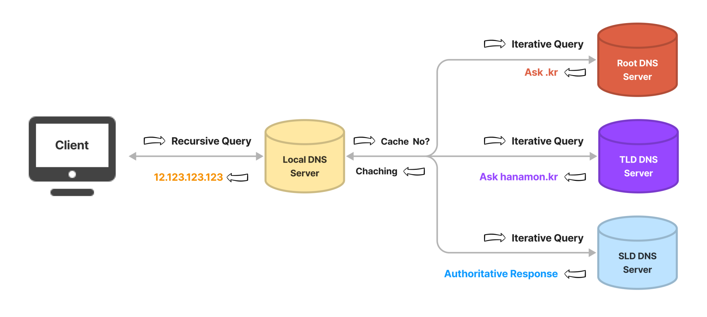

✔ DNS: **Domain Name을 IP 주소로 바꿔주는 시스템**

✔ DNS 서버는 계층 구조로 이루어져있다

- Recursive(Local) Name Server: 사용자가 가장 먼저 접근하는 서버 (캐시 형태로 ip정보 저장, ex: ISP(통신사))
- Root Name Server: 최상위 dns 서버 (전세계 13개), DNS 쿼리를 적절한 TLD 서버로 내려준다
- TLD(Top-Level Domain) Name Server: .com, .co.kr 등 뒤에 오는 도메인 확장자에 대한 정보 유지
- SLD(Second-Level Domain)/Authoratice Name Server: 실제 도메인의 IP 주소에 대한 정보를 유지하는 서버

## 4. 웹 동작 과정

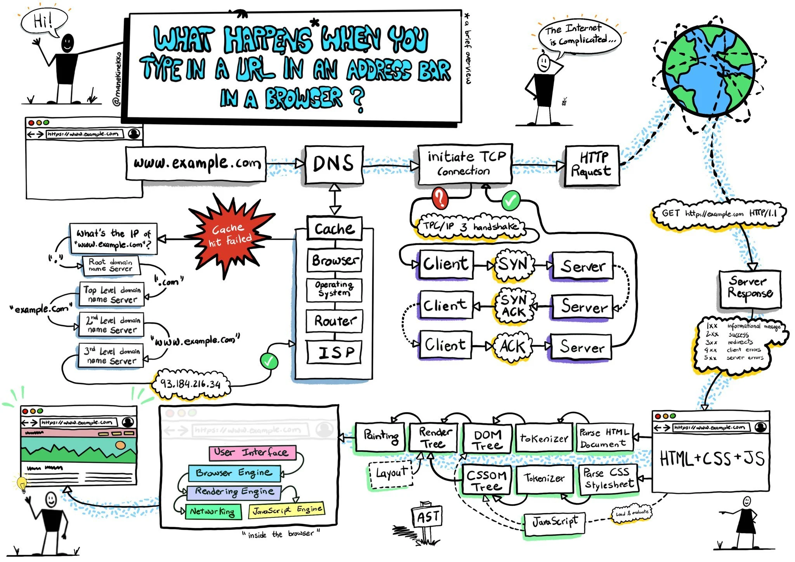

1. 클라이언트가 브라우저에 URL(www.google.com)을 입력
2. DNS 서버에 도메인 네임으로 서버의 진짜 주소(IP 주소)를 찾음
3. 브라우저는 IP 주소로 된 웹서버와 3 Way Handshake를 통한 TCP 연결 수립
4. 클라이언트가 웹서버에 HTTP 요청 송신
5. 요청을 수신한 웹 서버는 HTTP 응답을 송신
6. 브라우저는 수신한 HTTP 응답을 기반으로 HTML 페이지 렌더링 후 사용자에게 요청한 웹페이지 반환

## 5. OSI 7계층 / TCP/IP 5계층

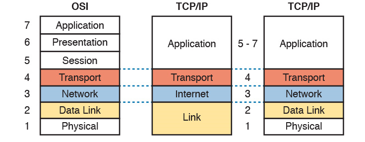

✔ 7계층: 응용 계층 (Application Layer) - Data
- 사용자와 직접 상호작용하는 응용프로그램이 포함된 계층
- 인터페이스 역할
- protocol: HTTP, SMTP, DNS
- ex: 크롬, 이메일...

✔ 6계층: 표현 계층 (Presentation Layer) - Data
- 주고받는 데이터의 표현방식(Foramt) 결정
- protocol: ASCII
- ex: 인코딩, 디코딩

✔ 5계층: 세션 계층 (Session Layer) - Data
- 프로세스끼리 통신하기 위한 세션 관리(Port 연결)
- protocol: SSL, TLS

✔ 4계층: 전송 계층 (Transport Layer) - Segment
- 각 endpoint의 사용자들이 신뢰성 있는 데이터를 주고 받게 헤주는 역할
- port번호, 전송 방식 결정
- protocol: TCP, UDP
- ex: 방화벽, 프록시 서버

✔ 3계층: 네트워크 계층 (Network Layer) - Packet
- 실제 네트워크 간 데이터 전달(포워딩/라우팅)
- protocol: IP
- ex: 라우터

✔ 2계층: 링크 계층 (Data Link Layer) - Frame
- 데이터의 물리적 전송 (1홉 통신)
- 흐름 제어
- protocol: Ethernet, MAC
- ex: 스위치

✔ 1계층: 물리 계층 (Physical Layer) - Bit
- 데이터를 전기 신호로 바꾸어 전달
- ex: 허브, 케이블

## 6. TCP와 UDP

✔ 둘 다 transport layer의 protocol -> **데이터 전송**을 담당!

✔ 가장 큰 차이점은 **연결/비연결** 여부

### UDP(User Datagram Protocol)

✔ 데이터 전송을 위한 **비연결형** 프로토콜

✔ **비연결성(Connectionless), 비신뢰성(Unreliable)**

✔ 데이터 전송(다중화/비다중화), 에러 확인(checksum)이라는 2가지 기본적인 기능만 제공

✔ dest port# / dest ip#만 확인

✔ 성능/속도 > 신뢰/안정성

✔ ex: DNS, 스트리밍 서비스, 멀티플레잉 게임...

### TCP(Transmission Control Protocol)

✔ 데이터 전송을 위한 **연결형** 프로토콜

✔ **연결성(Connection oriented), 신뢰성(Reliability)**

✔ **3-way handshake를 통한 연결 수립, 4-way handshake를 통한 연결 종료**

✔ point-to-point, inorder stream

✔ send & receive buffer

✔ flow control, congestion control

### UDP & TCP 비교

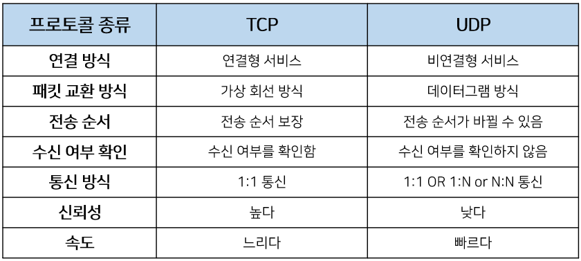

## 7. TCP 3way / 4way handshake

### TCP 3-way Handshake

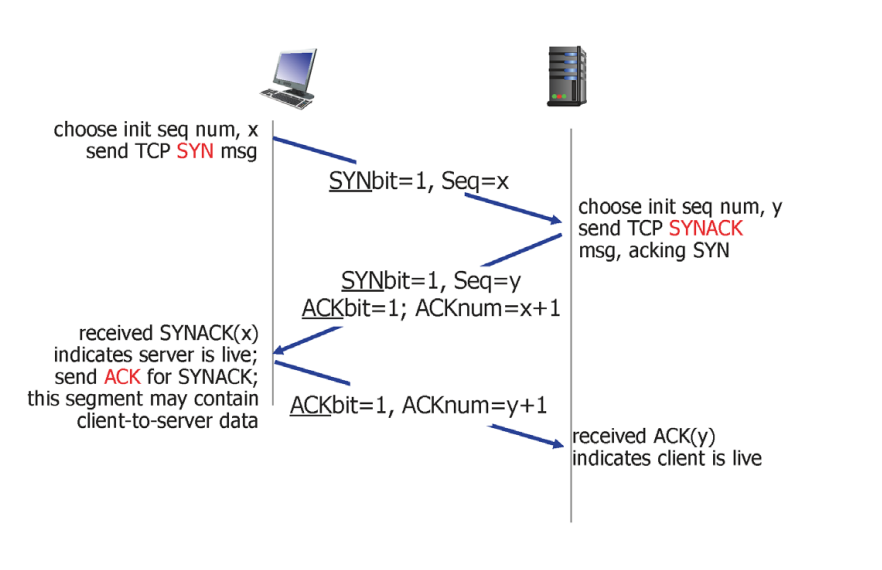

✔ TCP에서 **연결을 수립**하는 과정

1. client가 server한테 tcp connection 연결 요청을 보낸다.
   - tcp segment를 SYNbit = 1로 해서 보낸다.(평소에는 0)
   - client의 첫 seq#를 보낸다.
  
2. server는 client한테 SYNACK를 보낸다.
   - client가 보내온 seq#+1을 ACKnum으로 한다.
   - server의 첫 seq#를 보낸다.
  
3. client는 SYNACK에 대한 ACK를 보낸다.
   - SYNbit는 다시 0이 된다.
   - 여기서부터는 패킷에 데이터 포함 가능

### TCP 4-way Handshake

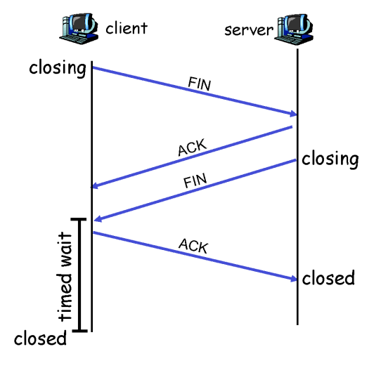

✔ TCP에서 **연결을 종료**하는 과정

1. client가 sever에 FIN control segment를 보낸다.

2. sever가 FIN을 받으면 ACK를 보내고 server도 FIN을 보낸다.

3. client가 FIN을 받고 ACK를 보낸다.
   - ACK가 확실히 전달되도록 'timed wait'

4. server가 ACK을 받으면 연결이 종료된다.

## 8. 라우터 / 라우팅 알고리즘

### 라우터

✔ 네트워크 레이어에서 데이터 패킷의 전송을 담당하는 장치

✔ **Forwarding**: forwarding table을 확인해 패킷을 목적지에 맞게 전달하는 작업

✔ **Routing**: Routing Algorithm을 활용해 forwarding table을 만드는 작업

✔ Gateway Router: NAS, DHCP, DNS, firewall...

### 라우팅 알고리즘

✔ 최단 경로 구하기

#### Link State Algorithm

✔ **전체 네트워크의 연결 상태를 아는 경우**

✔ Dijkstra algorithm

✔ 전체 범위에 적용은 불가능, 하나의 네트워크 내부 범위 내에서만!

#### Distance Vector Algorithm

✔ **연결된 인접 라우터만 아는 경우**

✔ Bellman-Ford Algorithm

✔ Route Poisoning 발생 가능성
- bad news 전파로 방지!

## 9. DHCP (Dynamic Host Configuration Protocol)

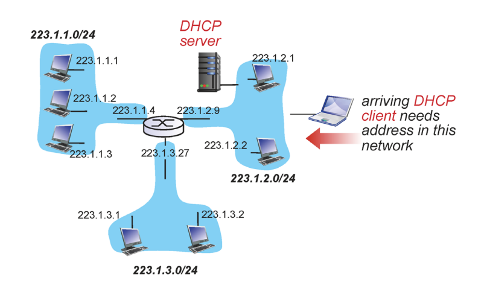

✔ **서버로부터 동적으로 주소(IP, mask, router, DNS)를 받아오는 프로토콜**

✔ host가 서버에 ip주소를 요청(DHCP request)하면 dhcp가 host에게 일정시간 동안 ip주소를 대여(DHCP ack) 해주는 개념

### 동작 과정

1. **DHCP discover**
   - 초기에 DHCP 서버를 찾아내는 과정
   - src ip: 아직 없음!
   - dest 255.255.255.255: subnet내의 모든 멤버애게 메세지를 보냄 (broadcast)

2. **DHCP offer**
   - 67번 포트를 열어두고 있는 DHCP서버만 응답
   - dest: 255.255.255.255: 아직 요청 host가 ip가 없는 상태이므로 broadcast로 보냄
   - host는 포트 번호(68)이랑 transaction id로 해당 응답을 받음

3. **DHCP request**
   - offer를 받아들인다는 의미로 request 보냄
   - 아직 ip주소를 받은 건 아니므로 src ip가 없다.
   - transaction ID: offer를 받아들인다는 의미로 +1

4. **DHCP ACK**

## 10. NAT(Network Address Translation)

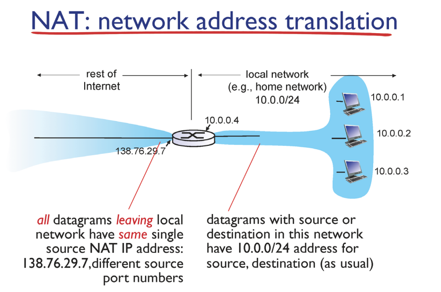

✔ IP 패킷의 TCP/UDP 포트 숫자와 소스 및 목적지의 IP 주소 등을 재기록하면서 라우터를 통해 네트워크 트래픽을 주고 받는 기술

✔ 로컬 네트워크의 호스트가 데이터를 보낼 때 라우터의 ip/포트# 로 변환해서 내보낸다.

✔ IPv4의 기술적 한계 (32bit 주소 공간의 한계) 극복 위해 등장

## 11. MAC Protocol

✔ Link layer: 한 Hop을 넘어갈 때(한 node에서 다음 인접 node로 데이터를 전송할 때) 어떻게 충돌 (collision) 없이 넘어갈 수 있을 것인가

✔ **MAC(Medium Access Control): 매체에 대한 접근을 조절해서 충돌을 최소화 하는 기술**

1. Channel partitioning

2. Random access

3. Taking turns

### CSMA & CSMA/CD

#### CSMA 

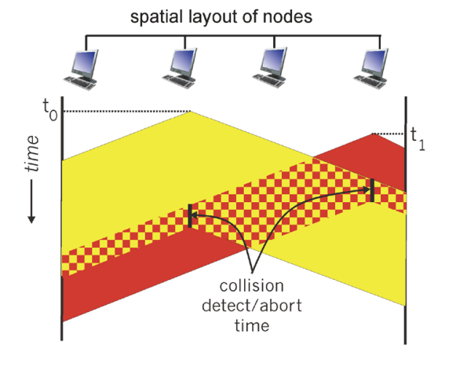

✔ Carrier Sense Multiple Access

✔ **listen before transmit**: 데이터가 전송 중이면 대기, 전송 중인 데이터가 없으면 데이터 전송

#### CSMA/CD

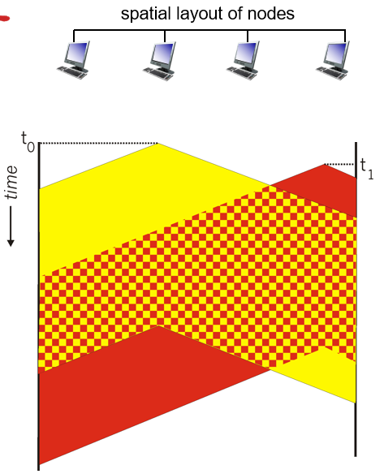

✔ Collision Detection

✔ CSMA 방식에서 **충돌이 발생했을 경우 즉시 전송을 멈춤**!

✔ 중단 이후 재전송 방식: NIC enters binary
- M번의 충돌이 있었으면 (0 ~ M - 1) 중 하나의 수를 random하게 선택해서 대기
- 충돌이 많아질 수록(사람이 많아질 수록) 선택하는 random 숫자의 범위도 증가 -> 오래 기다릴 가능성도 증가

## 12. WebSocket & Web RTC

### WebSocket

✔ TCP통신 방식으로 **서버와 클라이언트 사이**에 실시간으로 데이터를 주고 받을 수 있는 프로토콜

✔ sock.io: 웹소켓 미지원 브라우저에서 양방향 통신을 가능하게 하는 라이브러리
- 주로 javscript(node.js)에서 사용

✔ sock.js: 웹소켓 미지원 브라우저에서 양방향 통신을 가능하게 하는 라이브러리
- spring 지원

### STOMP

✔ Simple Text Oriented Messaging Protocol

✔ **클라이언트와 서버가 전송할 메시지의 유형, 형식, 내용들을 정의하는 프로토콜**

✔ pub/sub(발행/구독)으로 메세지 및 클라이언트 관리

✔ 주로 Spring에서 웹소켓을 구현할 때 함께 사용

### Web RTC

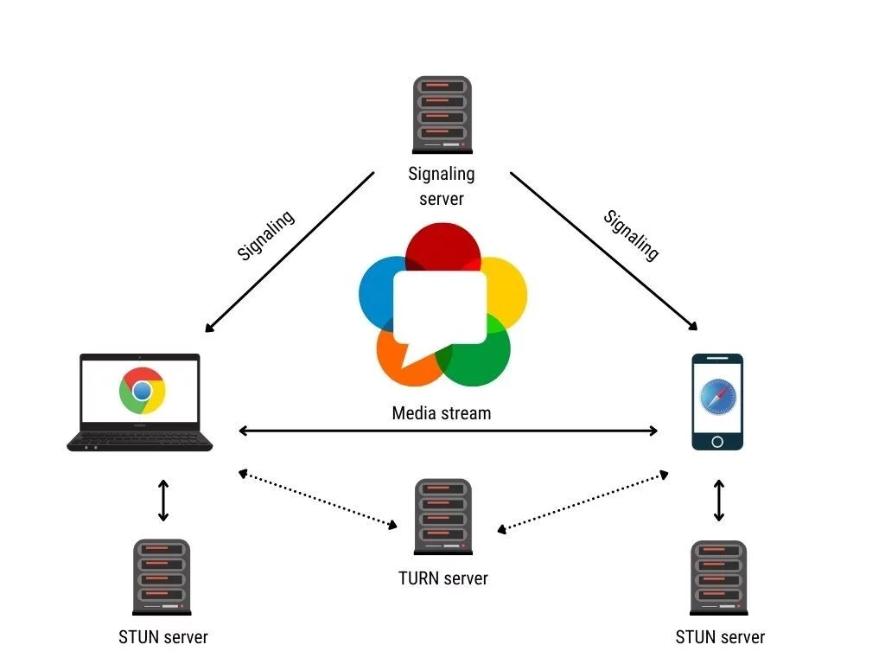

✔ Web Real-Time Communication

✔ p2p 방식을 이용해 플러그인이나 **서버 등 중재자 없이 브라우저(클라이언트) 간** 데이터를 주고 받을 수 있도록 하는 API

✔ **Low latency** (서버를 거치지 않음!)

✔ **Signaling server**(세션 제어, 연결 구성)을 위해 웹소켓 사용

✔ **STUN**, **TURN** Server: NAT 식별, 방화벽 우회

