# 운영체제

## 프로세스와 스레드의 차이

### 프로세스

컴퓨터에서 연속적으로 실행하고 있는 컴퓨터 프로그램

메모리에 올라와 실행되고 있는 프로그램의 인스턴스

운영체제로부터 시스템 자원을 할당받는 자원의 단위

### 특징

* 각각 독립된 영역을 할당 받음
  * 코드 영역 : 프로그래머가 작성한 프로그램이 저장되는 영역
  * 데이터 영역 : 코드가 실행되면서 사용한 환경이나 파일들의 각종 데이터들이 모여 있음
  * 스택 영역 : 호출한 함수가 종료되면 되돌아올 메모리의 주소나 지역 변수 등이 저장됨
  * 힙 영역 : 동적으로 할당되는 데이터를 위해 존재

* 최소 1개 이상의 스레드(메인 스레드)를 갖고 있음
* 각 프로세스는 별도의 주소 공간에서 실행되며 기본적으로 다른 프로세스의 자원에 접근할 수 없음
* 한 프로세스가 다른 프로세스의 자원에 접근하려면 프로세스 간 통신(IPC)를 사용해야 함

### 스레드

프로세스 내에서 실행되는 여러 흐름의 단위

프로세스의 특정한 수행 경로

프로세스가 할당받은 자원을 이용하는 최소 실행의 단위

### 특징

* 프로세스 내에서 각 필요한 Stack만 할당 받고 Code, Data, Heap 영역은 공유해서 각 스레드가 공유함
* 같은 프로세스 내 스레드끼리 자원을 공유하며 실행 됨

* 스레드는 공유하는 자원인 Heap 영역에 있는 변수를 수정할 수 있음

### Process vs Thread

프로세스는 자원을 공유하지 않지만 스레드는 자원을 공유함

프로세스는 메모리 상에서 실행중인 프로그램을 말하며, 스레드는 이 프로세스 안에서 실행되는 흐름 단위임

프로세스는 최소 하나의 스레드를 보유하고 있으며, 각각 별도의 주소공간을 독립적으로 할당 받음(code, heap, stack)

스레드는 이중에 stack만 따로 할당받고 나머지 영역은 스레드끼리 서로 공유함

---

## 데드락(Dead Lock, 교착 상태)

두 개 이상의 프로세스나 스레드가 서로 자원을 얻지 못해서 다음 처리를 하지 못하는 상태

무한히 다음 자원을 기다리게 되는 상태

시스템적으로 한정된 자원을 여러 곳에서 사용하려고 할 때 발생

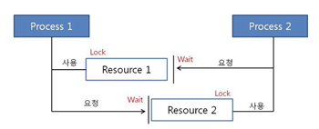

프로세스1과 2가 자원1, 2를 모두 얻어야 한다고 가정

t1 : 프로세스1이 자원1을 얻음 / 프로세스2가 자원2를 얻음

t2 : 프로세스1은 자원2를 기다림 / 프로세스2는 자원1을 기다림

=> 현재 서로 원하는 자원이 상대방에 할당되어 있어서 두 프로세스는 무한정 wait 상태에 빠짐 == Dead Lock

### Dead Lock 발생 조건

1. ##### 상호 배제(Mutual exclusion)

   자원은 한번에 한 프로세스만 사용할 수 있음

2. ##### 점유 대기(Hold and wait)

   최소한 하나의 자원을 점유하고 있으면서 다른 프로세스에 할당되어 사용하고 있는 자원을 추가로 점유하기 위해 대기하는 프로세스가 존재해야 함

3. ##### 비선점(No preemption)

   다른 프로세스에 할당된 자원은 사용이 끝날 때까지 강제로 빼앗을 수 없음

4. ##### 순환 대기(Circular wait)

   프로세스의 집합에서 순환 형태로 자원을 대기하고 있어야 함

   

=> 상기 4가지 모두 성립해야 데드락 발생, 하나라도 성립하지 않으면 해결 가능

### Dead Lock 처리

1. 예방(prevention)
   * 교착 상태 발생 조건 중 하나를 제거하면서 해결
2. 회피(avoidance)
    * 교착 상태 발생시 피해 나감
    * Banker's Algorithm
      * 프로세스가 자원을 요구할 때, 시스템은 자원을 할당한 후에도 안정 상태로 남아있게 되는지 사전에 검사하여 교착 상태 회피
      * 안정 상태면 자원 할당, 아니면 다른 프로세스들이 자원 해지까지 대기

3. 탐지(Dectection)
   * 자원 할당 그래프를 통해 교착 상태를 탐지
   * 자원 요청 시, 탐지 알고리즘을 실행시켜 그에 대한 오버헤드 발생
4. 회복(Recovery)
   * 교착 상태를 일으킨 프로세스를 종료하거나, 할당된 자원을 해제시켜 회복

**Bancker's Algorithm**

https://m.blog.naver.com/PostView.naver?isHttpsRedirect=true&blogId=eludien&logNo=221556189796

---

## 뮤텍스(Mutex)와 세마포어(Semaphore)

### 임계구역

여러 프로세스가 데이터를 공유하며 수행될 때, **각 프로세스에서 공유 데이터를 접근하는 프로그램 코드 부분**

공유 데이터를 여러 프로세스가 동시에 접근할 때 잘못된 결과를 만들 수 있기 때문에, 한 프로세스가 임계 구역을 수행할 때는 다른 프로세스가 접근하지 못하도록 해야 한다.

### 뮤텍스

상호 배제(Mutual Exclusion)의 약자

Key에 해당하는 어떤 오브젝트가 있으며 이 오브젝트를 소유한 (쓰레드, 프로세스) 만이 공유자원에 접근할 수 있음

해당 접근을 조율하기 위해 lock과 unlock을 사용한다.

- lock : 현재 임계 구역에 들어갈 권한을 얻어옴 ( 만약 다른 프로세스/스레드가 임계 구역 수행 중이면 종료할 때까지 대기 )
- unlock : 현재 임계 구역을 모두 사용했음을 알림. ( 대기 중인 다른 프로세스/스레드가 임계 구역에 진입할 수 있음 )

### 뮤텍스 알고리즘

1. 데커(Decker) 알고리즘
   * flag와 turn 변수를 통해 임계 구역에 들어갈 프로세스/스레드를 결정
     * flag : 프로세스 중 누가 임계영역에 진입할 것인지 나타내는 변수
     * turn : 누가 임계구역에 들어갈 차례인지 나타내는 변수

2. 피터슨(Peterson) 알고리즘
   * 데커와 유사하지만, 상대방 프로세스/스레드에게 진입 기회를 양보하는 것에 차이가 있음

3. 제과점(Baker) 알고리즘

   * 여러 프로세스/스레드에 대한 처리가 가능한 알고리즘

   * 가장 작은 수의 번호표를 가지고 있는 프로세스가 임계구역에 진

### 세마포어

공통으로 관리하는 하나의 값을 이용해 상호배제 달성

**세마포어 P, V 연산**

P : 임계 구역 들어가기 전에 수행 ( 프로세스 진입 여부를 자원의 개수(S)를 통해 결정)

V : 임계 구역에서 나올 때 수행 ( 자원 반납 알림, 대기 중인 프로세스를 깨우는 신호 )

https://worthpreading.tistory.com/90 - 차이 설명
https://gyoogle.dev/blog/computer-science/operating-system/Semaphore%20&%20Mutex.html - detail 예시

---

## 컨텍스트 스위칭(Context Switching)

멀티프로세스 환경에서 CPU가 어떤 하나의 프로세스를 실행하고 있는 상태에서 인터럽트 요청에 의해 다음 우선 순위의 프로세스가 실행되어야 할 때 기존의 프로세스의 상태 또는 레지스터 값(Context)을 저장하고 CPU가 다음 프로세스를 수행하도록 새로운 프로세스의 상태 또는 레지스터 값(Context)를 교체하는 작업

### 컨텍스트

 CPU가 해당 프로세스를 실행하기 위한 해당 프로세스의 정보들

Context는 프로세스의 PCB(Process Control Block)에 저장

Context Switching때 PCB의 정보를 읽어(적재) CPU가 전에 프로스세가 일을 하던 것에 이어서 수행이 가능함

 

PCB의 저장정보 :

-프로세스 상태 : 생성, 준비, 수행, 대기, 중지

\- 프로스램 카운터

\- 레시스터

\- 프로세스 번호

 

CPU가 어떤 프로세스를 실행하고 있는 상태에서 인터럽트에 의해 다음 우선 순위를 가진 프로세스가 실행되어야 할 때 기존의 프로세스 정보들은 PCB에 저장하고 다음 프로세스의 정보를 PCB에서 가져와 교체하는 작업이 컨텍스트 스위칭

이러한 컨텍스트 스위칭을 통해 우리는 멀티 프로세싱, 멀티 스레딩 운영이 가능

### 발생 상황

* I/O Interrupt
* CPU 사용시간 만료
* 자식 프로세스 Fork
* 인터럽트 처리 기다릴 때

컨텍스트 스위칭 시 해당 스레드만을 위한 스택 영역이 생성되고, 나머지 영역 Code, Data, Heap은 부모 프로세스 영역에서 공유

스레드 마다 스택을 독립적으로 할당함

프로세스는 레지스터 수, 프로세스에서 관리되어야 할 데이터 종류가 많을 수록 부담이 됨

컨텍스트 스위칭에 소요되는 시간을 줄이려면 저장하고 복원되는 컨텍스트 정보를 줄여야함

**스레드**는 공유 영역이 많기 때문에 컨텍스트 스위칭이 빠름

**프로세스**는 컨텍스트 스위칭이 일어났을 때 공유 데이터가 없으므로 새로 캐시 정보를 쌓아야 함(부담되는 요소)

## 선점형 스케줄링 / 비선점형 스케줄링

### CPU Scheduling

- CPU를 사용하려고 하는 프로세스들 사이의 우선순위를 관리하는 작업 
  - 자원을 어떤 프로세스에 얼마나 할당하는지 정책을 만드는 것
- 프로세스들에게 자원을 최대한 공평하게 배분하며 처리율과 CPU 이용률을 증가시키고, 오버헤드, 응답시간(Response time / Turnaround time), 대기시간을 최소화하기 위한 기법
- 메모리에 여러 개의 프로세스를 올려놓고(다중 프로그래밍), CPU의 가동시간을 적절히 나누어(시분할) 각각의 프로세스에게 분배하여 실행

### CPU 스케줄링이 발생하는 상황

1. 실행 상태에 있던 프로세스가 I/O 요청 등에 의해 Block 상태가 되는 경우
2. 실행 상태에 있던 프로세스가 타이머 인터럽트 발생에 의해 준비 상태로 되는 경우
3. I/O 요청으로 Block 상태에 있던 프로세스의 I/O 작업이 완료되어 인터럽트가 발생하고, 그 결과 이 프로세스의 상태가 준비 상태로 바뀌는 경우
4. CPU에서 실행 상태에 있는 프로세스가 종료되는 경우

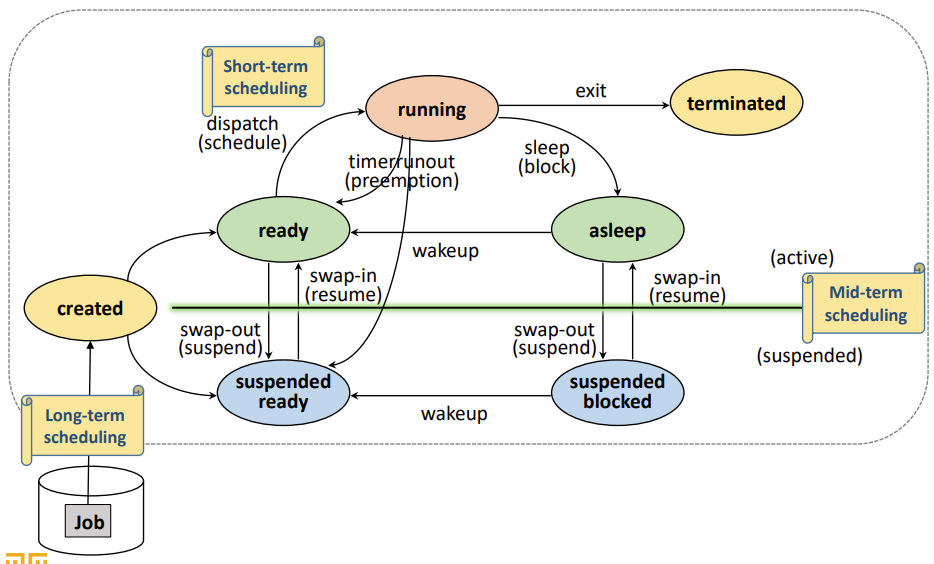

### 선점형 스케줄링

* 하나의 프로세스가  CPU를 차지하고 있을 때, 우선순위가 높은 다른 프로세스가 현재 프로세스를 중단시키고  CPU를 점유하는 스케줄링 방식
* 비교적 응답이 빠르다는 장점이 있지만, 처리 시간을 예측하기 힘들고 높은 우선순위 프로세스들이 계속 들어오는 경우 오버헤드
* 실시간 응답환경, Deadline 응답환경 등 우선순위가 높은 프로세스를 빠르게 처리해야 할 경우 유용

### 비선점형 스케줄링

* 한 프로세스가 CPU를 할당받으면 작업 종료 후 CPU 반환 시까지 다른 프로세스는 PCU 점유가 불가능한 스케줄링 방식
* 모든 프로세스에 대한 요구를 공정하게 처리할 수 있지만, 짧은 작업을 수행하는 프로세스가 긴 작업 종료 시까지 대기해야할 수 있음 (콘베이 현상)
* 처리시간 편차가 적은 특정 프로세스 환경에 용이

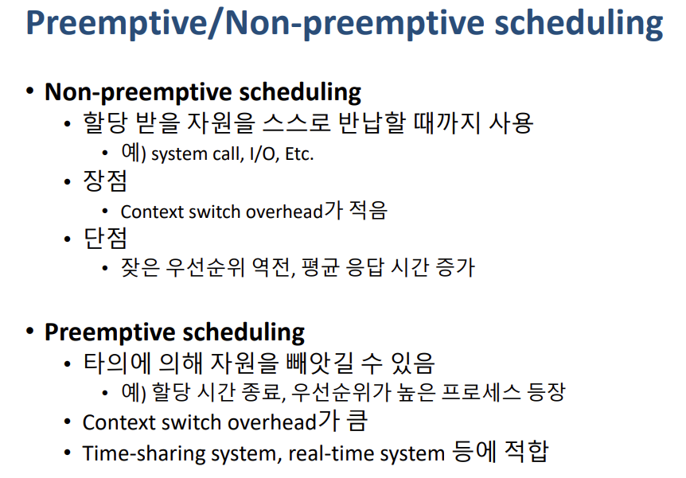

---

[detail] https://eun-jeong.tistory.com/17

### Preemptive

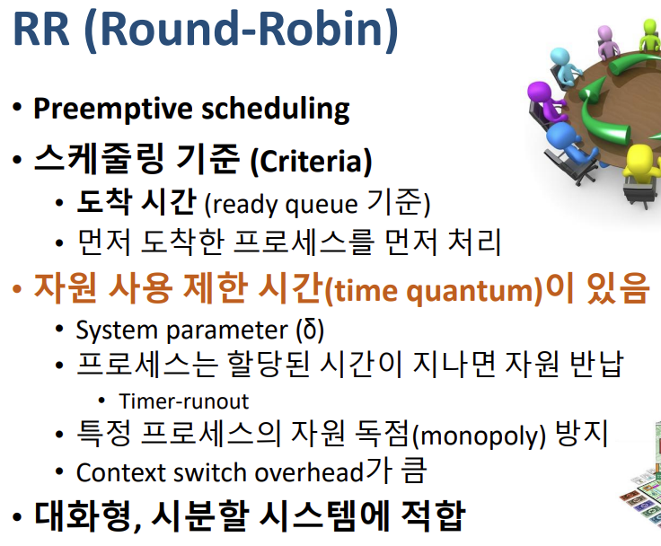

### Non-preemptive

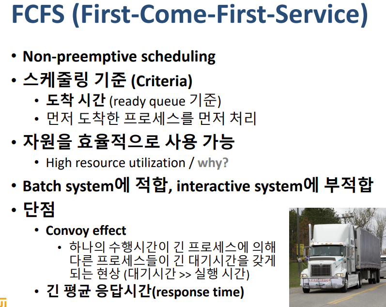

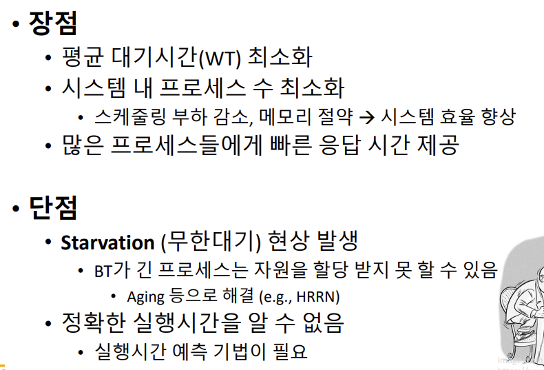

## Paging System / Segmentaion System

프로세스 실행에 필요한 메모리는 크게 두 가지로 나눌 수 있습니다. 하나는 코드와 데이터, 또 다른 하나는 스택과 힙입니다. 이러한 메모리 공간을 할당하는 방법은 두 가지가 있습니다. 바로 페이징(Paging) 시스템과 세그먼트(Segmentation) 시스템입니다.

### Paging System

> 페이징 시스템은 메모리를 일정한 크기로 나누어 페이지(Page) 단위로 관리하는 방식입니다.
>
> 프로세스가 실행될 때 페이지 테이블(Page Table)을 사용하여 가상 주소(Virtual Address)를 실제 물리 주소(Physical Address)로 변환합니다.
>
> 이러한 방식으로 메모리를 관리함으로써 가상 메모리(Virtual Memory)를 지원하고, 프로세스 간 메모리 보호를 위한 페이지 교체 알고리즘 등 다양한 기능을 제공합니다.

### Segmentation System

> 세그먼트 시스템은 메모리를 논리적인 단위인 세그먼트(Segment) 단위로 나누어 관리하는 방식입니다.
>
> 각 세그먼트는 크기가 서로 다르고 논리적으로 연속된 주소 공간을 가지며, 프로그램의 데이터, 스택, 코드 등을 각각 분리하여 관리합니다.
>
> 세그먼트는 세그먼트 테이블(Segment Table)을 사용하여 가상 주소를 물리 주소로 변환합니다.
>
> 페이징 시스템과 달리 세그먼트 시스템은 메모리 낭비를 줄이고, 프로그램 구조를 보다 쉽게 이해할 수 있게 합니다.
>
> 하지만, 페이징 시스템과는 달리 메모리 내부에서 프로세스가 사용하는 주소가 연속되지 않기 때문에 외부 단편화(External Fragmentation) 문제가 발생할 수 있습니다.

페이징 시스템과 세그먼트 시스템은 각각의 장단점이 있으며, 사용하는 운영체제나 하드웨어에 따라 적절한 시스템을 선택하여 사용합니다.

---

## 페이징 알고리즘

Page Fault가 발생했을 때, 주기억장치의 모든 페이지 프레임이 사용 중이라면 어떤 페이지 프레임을 선택하여 교체할 것인지를 결정하는 것

1) OPT(Optimal Replacement, 최적 교체)

   - 앞으로 가장 오랫동안 사용하지 않을 페이지를 교체하는 기법

   - 각 페이지의 호출순서와 참조상황을 미리 예측해야하므로 실현 가능성이 희박

2) FIFO(First In First Out)

   - 각 페이지가 주기억장치에 적재될 때마다 시간을 기억시켜 가장 먼저 들어와서 가장 오래 있었던 페이지를 교체하는 기법

   - 이해하기 쉽고, 프로그래밍 및 설계가 간단하며, 벨레이디의 모순현상이 발생함

​			(**Belady's Anomaly** : FIFO 알고리즘에서 기존 페이지 프레임의 개수를 늘리면 Page Fault 발생이 감소해야하나, 오히려 늘어나는 현상)

3) LRU(Least Recently Used)

   - 최근에 가장 오랫동안 사용하지 않은 페이지를 교체하는 기법

   - 각 페이지마다 계수기나 스택을 두어 현시점에서 가장 오랫동안 사용하지 않은(가장 오래전에 사용된 페이지) 페이지를 교체함

   

4) LFU(Least Frequently Used)

   - 사용빈도가 가장 적은 페이지를 교체하는 기법

   - 프로그램 실행 초기에 많이 사용된 페이지가 그 후로 사용되지 않을 경우에도 프레임을 계속 차지하는 단점이 존재

   

5) NUR(Not Used Recently)

   - 최근에 사용하지 않은 페이지를 교체하는 기법

   - 사용 여부를 확인하기 위하여 각 페이지마다 참조비트와 변형비트가 사용됨

   

6) SCR(Second Chance Replacement)

   - 가장 오랫동안 주기억장치에 있던 페이지 중 자주 사용되는 페이지의 교체를 방지하기 위한 기법

   - FIFO 알고리즘 기법의 단점을 보완하는 기법

https://www.crocus.co.kr/1385

---

## 캐싱(Caching)

- 동일한 데이터에 반복해서 접근해야 하거나 많은 연산이 필요한 일일때, 결과를 빠르게 이용하고자 성능이 좋은 혹은 가까운 곳에 저장하는 것
- 컴퓨터의 성능을 향상 시키기 위해 사용되는 메모리
- 주기억장치와 CPU 사이에 위치하고, 자주 사용하는 데이터를 기억

### 캐시 메모리

CPU에서 가장 빠른 Register와 메인 메모리 사이에 캐시 메모리가 존재

디스크 혹은 읽어온 데이터를 빠르게 저장하는 용도

### 캐시의 동작

* 일반적으로 HW적으로 관리 됨
* 캐시 히트 (Cache hit)
  * 필요한 데이터 블록이 캐시 존재
* 캐시 미스(Cache miss)
  * 필요한 데이터 블록이 없는 경우

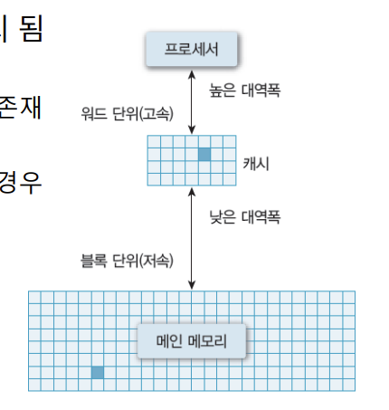

### 지역성(Locality)

* 공간적 지역성(Spatial locality)
  * 참조한 주소와 인접한 주소를 참조하는 특성
    * 예) 순차적 프로그램 수행
* 시간적 지역성(Temporal locality)
  * 한 번 참조한 주소를 곧 다시 참조하는 특성
    * 예) For 문 등의 순환 문
* 지역성은 캐시 적중률(cache hit ratio)과 밀접
  * 알고리즘 성능 향상 위한 중요한 요소 중 하나

---

## 단편화(Fragmentation)

* 주기억장치에 프로그램을 할당하고 반납하는 과정에서 바생하는 사용되지 않는 작은 조각 공간
* 주기억장치 상에서 빈번하게 기억장소가 할당되고 반납됨에 따라 기억장소들이 조각들로 나누어지는 현상

### 내부 단편화

- 주기억장치 내 사용자 영역이 실행 프로그램보다 커서 프로그램의 사용 공간을 할당 후 사용되지 않고 남아있는 공간
- **주기억장치 내 사용자 영역 > 실행 프로그램**

내부 단편화

 

### 외부 단편화

- 주기억장치 내 사용자 영역보다 실행 프로그램이 커서 프로그램이 할당될 수 없어 사용되지 않고 남아있는 공간
- **주기억장치 내 사용자 영역 < 실행 프로그램**

https://chelseashin.tistory.com/41

page fault : 프로세스의 모든 페이지가 물리 메모리에 로드되어 있지 않기 때문에 프로그램의 페이지가 물리 메모리에 부재하는 경우

=> context switching으로 인해 overhead가 크므로 가상메모리의 성능을 올리기 위해선 page fault를 줄여야함

https://preamtree.tistory.com/21

---

## 메모리 구조

프로그램이 실행되기 위해선 먼저 프로그램이 메모리에 로드(load)되어야 함

또한, 프로그램에서 사용되는 변수들을 저장할 메모리도 필요함

컴퓨터의 운영체제는 프로그램의 실행을 위해 다양한 메모리 공간 제공

1. 코드(code)  영역
2. 데이터(data) 영역
3. 스택(stack) 영역
4. 힙(heap) 영역

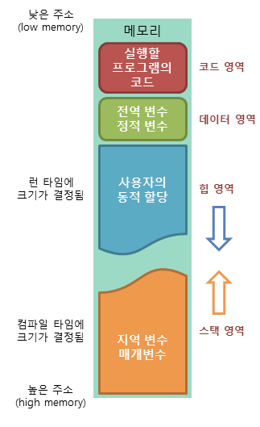

### 코드(code) 영역

메모리의 코드(code) 영역은 실행할 프로그램의 코드가 저장되는 영역으로 텍스트(code) 영역이라고도 부릅니다.

CPU는 코드 영역에 저장된 명령어를 하나씩 가져가서 처리하게 됩니다.

### 데이터(data) 영역

메모리의 데이터(data) 영역은 프로그램의 전역 변수와 정적(static) 변수가 저장되는 영역입니다.

데이터 영역은 프로그램의 시작과 함께 할당되며, 프로그램이 종료되면 소멸합니다.

### 스택(stack) 영역

메모리의 스택(stack) 영역은 함수의 호출과 관계되는 지역 변수와 매개변수가 저장되는 영역입니다.

스택 영역은 함수의 호출과 함께 할당되며, 함수의 호출이 완료되면 소멸합니다.

이렇게 스택 영역에 저장되는 함수의 호출 정보를 스택 프레임(stack frame)이라고 합니다.

 

스택 영역은 푸시(push) 동작으로 데이터를 저장하고, 팝(pop) 동작으로 데이터를 인출합니다.

이러한 스택은 후입선출(LIFO, Last-In First-Out) 방식에 따라 동작하므로, 가장 늦게 저장된 데이터가 가장 먼저 인출됩니다.

스택 영역은 메모리의 높은 주소에서 낮은 주소의 방향으로 할당됩니다.

### 힙(heap) 영역

메모리의 힙(heap) 영역은 사용자가 직접 관리할 수 있는 '그리고 해야만 하는' 메모리 영역입니다.

힙 영역은 사용자에 의해 메모리 공간이 동적으로 할당되고 해제됩니다.

힙 영역은 메모리의 낮은 주소에서 높은 주소의 방향으로 할당됩니다.

https://jinshine.github.io/2018/05/17/%EC%BB%B4%ED%93%A8%ED%84%B0%20%EA%B8%B0%EC%B4%88/%EB%A9%94%EB%AA%A8%EB%A6%AC%EA%B5%AC%EC%A1%B0/

---

## 디스크 스케줄링(Disk Scheduling)

어떻게 효율적으로 산재된 데이터를 액세스 할 것인가

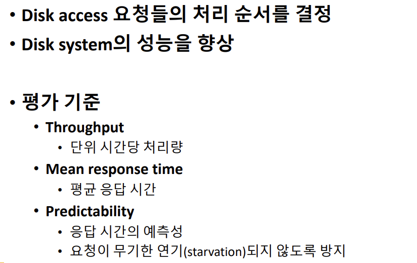

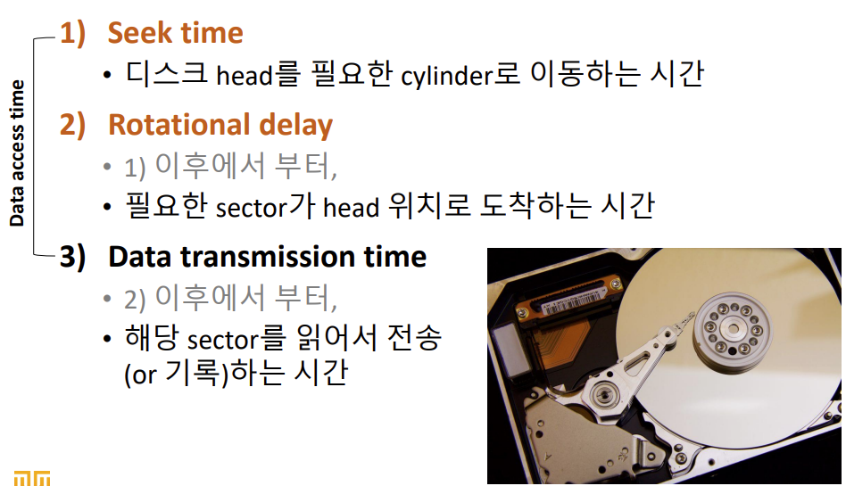

### FCFS(First Come First Service)

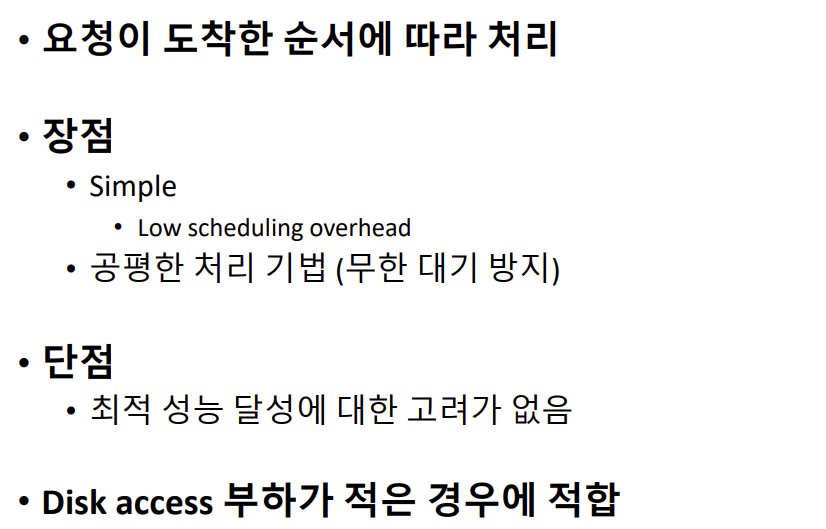

### Shortest Seek Time First(SSTF)

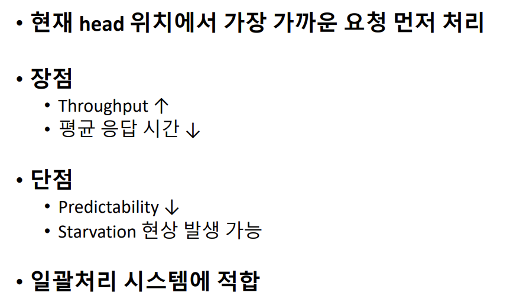

### Scan Scheduling

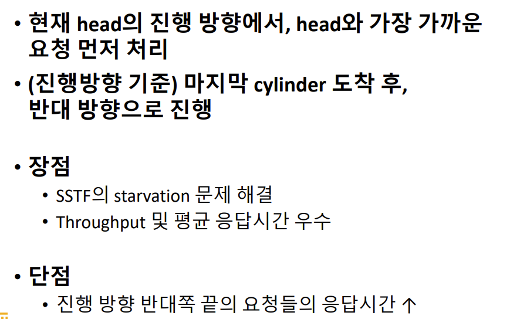

### C-Scan Scheduling

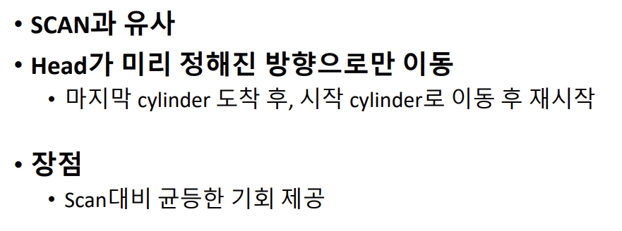

### Look Scheduling

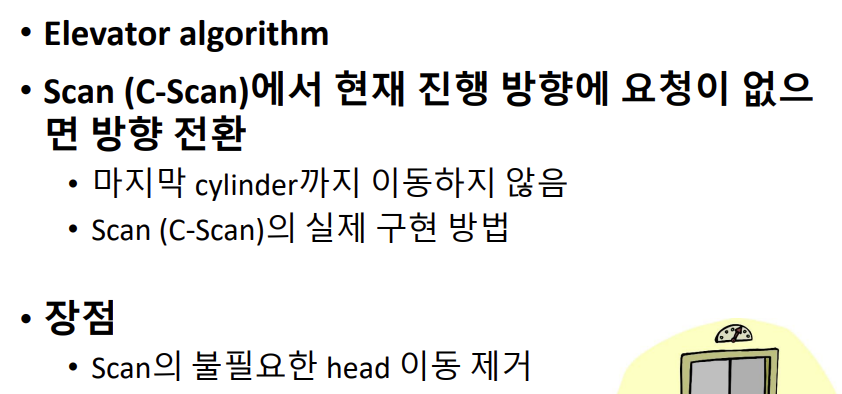

### SLTF(Shortest latency Time First)

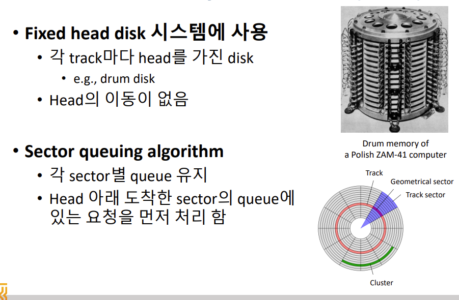

### Shortest Positioning Time First(SPTF)

### 에센바흐(Eschenbach) 기법

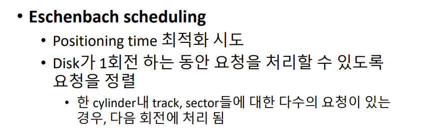

---

## RAID(Redundant Arrays of Inexpensive Disks)

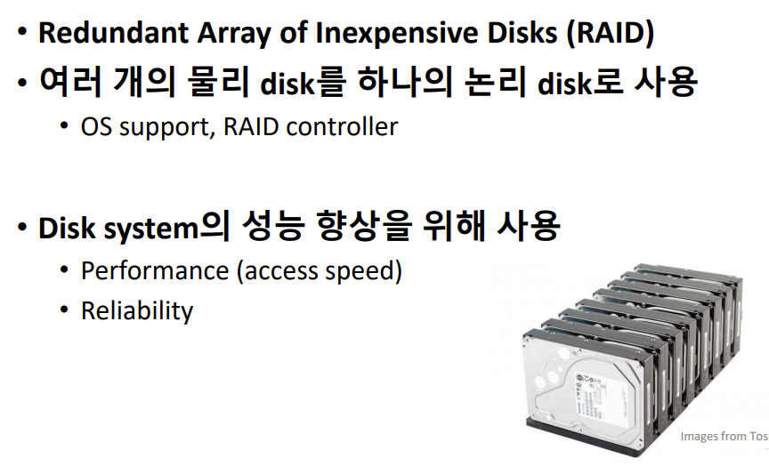

## RAID 0

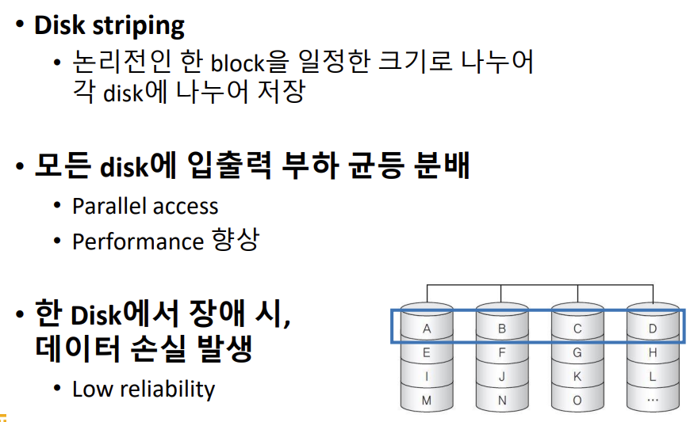

OS 입장에서 DISK는 연속된 하나의 블럭

이상적으로 4개의 디스크 쓰면 4배의 속도, 하나하나씩 안가져 와도 되니깐

디스크 하나만 고장나도 데이터 손실

## RAID 1

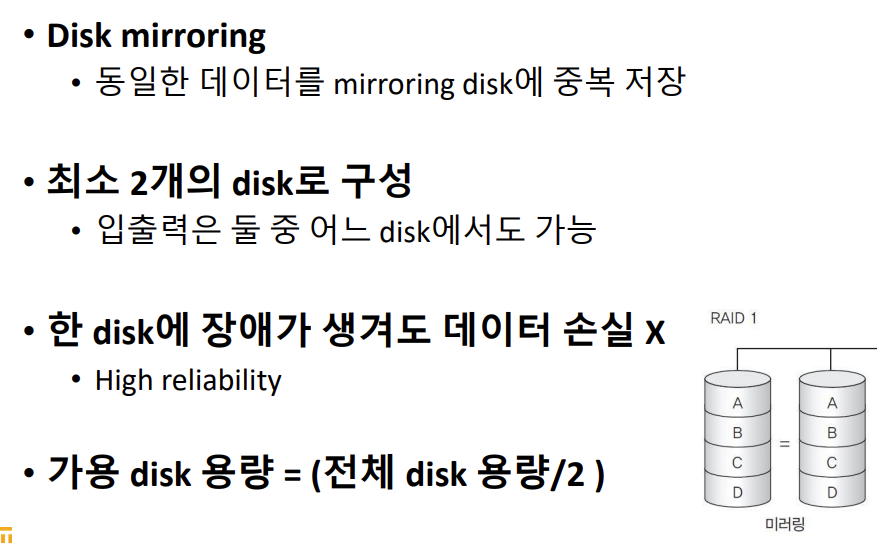

중요한 데이터 다룰 때 씀

## RAID 3

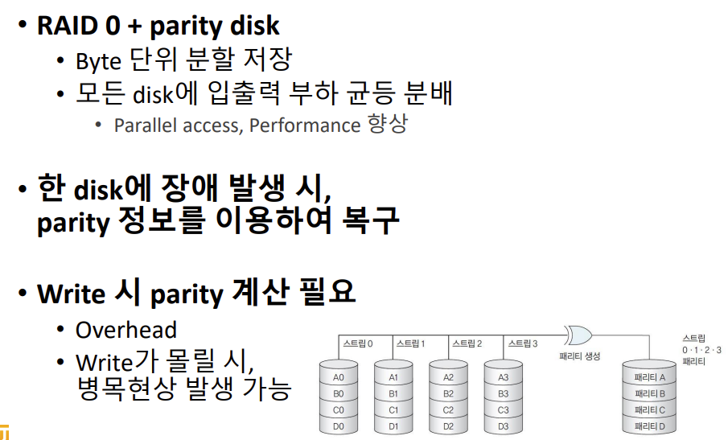

Raid 0 와 다르게 Byte 단위로 분할해서 저장

RAID 1 보단 효율적으로 쓸 수 있지만 신뢰성도 확보

## RAID 4

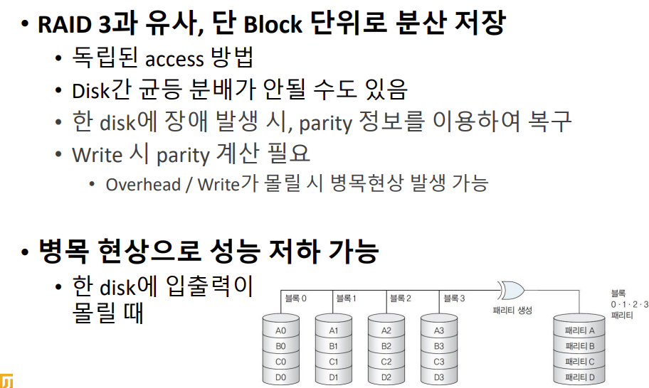

## RAID 5

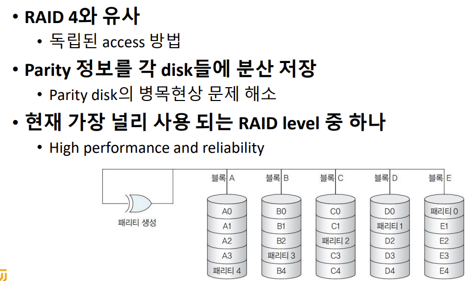

패리티도 나눠서 저장

