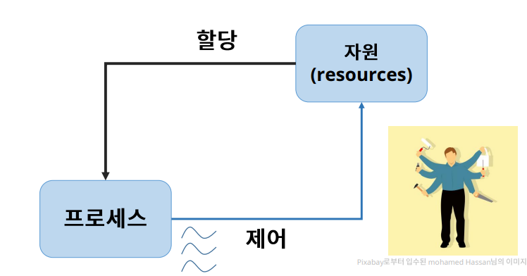
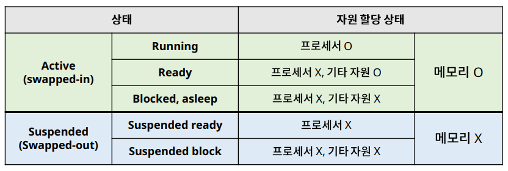
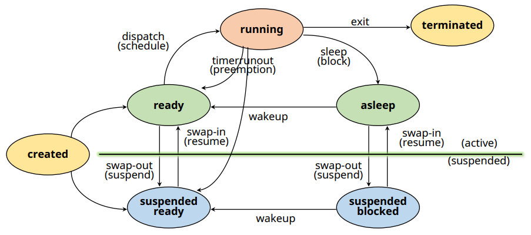
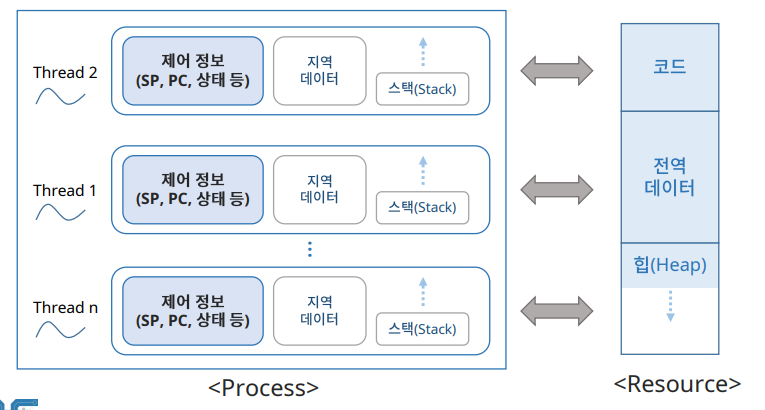
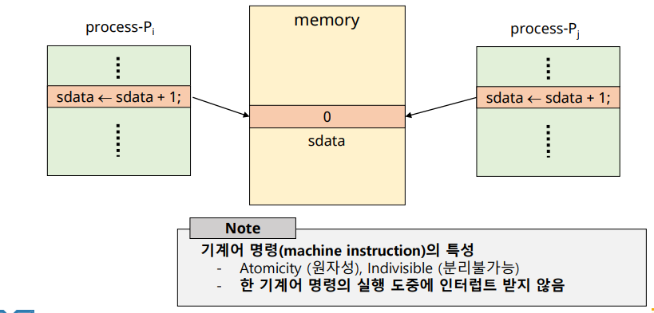
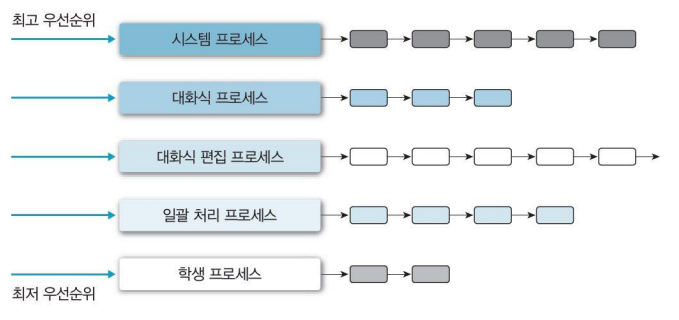
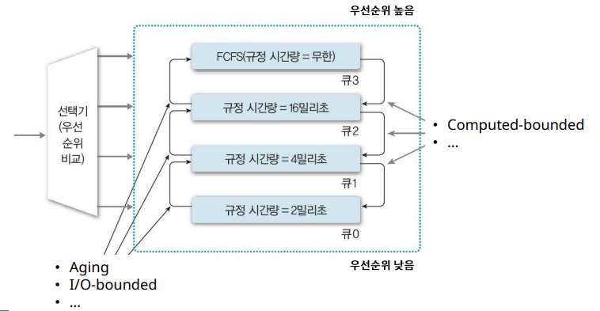

# 운영체제

>  [1. 프로세스와 스레드의 차이](#1-프로세스와-스레드의-차이)
>
>  [2. Deadlock (데드락)](#2-deadlock-데드락)
>
>
>  [3. 세마포어 \& 뮤텍스](#3-세마포어--뮤텍스)
>
>  [4. Context Switching](#4-context-switching)
>
>  [5. Proccess Scheduling](#5-proccess-scheduling)

## 1. 프로세스와 스레드의 차이

### 프로세스 (Process)

✔ **실행을 위해 시스템 커널에 등록된 작업**
- 커널에 등록되고 커널의 관리 하에 있는 작업
- 각종 자원들을 요청하고 할당 받을 수 있는 개체
- 프로세스 관리 블록 (PCB)을 할당 받은 개체
- 능동적인 개체(active entity): 실행 중에 각종 자원을 요구, 할당, 반납하며 진행

✔ **자원을 할당 받고, 목표를 이루기 위해 할당받은 자원을 제어 한다**

✔ PCB (Process Control Block)
- 커널 공간 내에 존재하는 프로세스 관리에 필요한 정보를 저장하기 위한 공간

#### 프로세스의 상태 (state)

### 스레드 (Thread)

✔ **프로세스의 실행 단위**
- 프로세스의 **제어 부분만 분리**해 프로세스가 할당 받은 자원을 제어한다

✔ 각 스레드마다 **자신의 작업 영역(Stack)**을 할당 받는다

✔ **자원(Resource) 공유**
 - 효율성 / 경제성 증가 (context switching x)

### 프로세스 vs 스레드

✔ 프로세스는 시스템 커널에 등록 돼 자원을 할당 받은 작업이며, 스레드는 프로세스의 실행단위로 할당 받은 자원은 제어한다.

✔ **각각 자원을 할당 받는 프로세스**와 달리 **스레드는 프로세스의 자원은 공유**하고, 자신만의 작업 영억인 stack을 할당 받아서 지역데이터를 저장한다

✔ 또한 프로세스는 교체 시 context switching이 발생해 overhead가 발생하는 반면, 스레드는 멀티스레딩 등을 통해 해당 overhead를 최소화 할 수 있다.(스레드 자체도 커널 스레드의 경우 context switching 존재) 

## 2. Deadlock (데드락)

### Deadlock의 개념

✔ **프로세스가 발생 가능성이 없는 이벤트를 기다리는 경우**

✔ P1은 P2가 가지고 있는 R1을, P2는 P1이 가지고 있는 R2를 요청하고 있다 -> 서로 발생 가능성이 없는 이벤트를 기다리고 있으므로 deadlock!

#### starvation vs deadlock

✔ starvation -> ready state

✔ deadlock -> asleep state

✔ **starvation은 '운이 없어서' 프로세서를 할당받지 못한 상태일 뿐 발생 가능성이 없는 것은 아니다!!**

### Deadlock 발생의 조건

✔ 자원의 특성
- Exclusive use of resources
- Non - preemptible resources

✔ 프로세스의 특성
- Hold and Wait(Partial allocation)
  - 자원을 하나 hold하고 다른 자원 요청
- Circular wait

### Deadlock Prevention

✔ 4가지 조건 중 하나 제거 -> 비현실적!

### Deadlock Avoidance

✔ 시스템을 항상 safe state(모든 프로세스가 정상적으로 종료가 가능한 상태)로 유지
- Dijkstra's Algorithm(Banker's algorithm)
  - 한 종류의 자원
- Habermann's Algorithm
  - 여러 종류의 자원

### Deadlock Detection & Recovery

✔ Deadlock 발생 방지 x

✔ 발생 확인 후 회복

✔ Detection: Graph Reduction
- RAG(Resource Allocation Graph)

✔ Recovery
- Process Tremination
- Resource Preemption

## 3. 세마포어 & 뮤텍스

### Critical Section

✔ shared data (공유 데이터) or Critical data
- 여러 프로세스들이 공유하는 데이터

✔ Critical section (임계 영역)
- 공유 데이터를 접근하는 코드 영역 (code segment)

✔ 멀티 프로그래밍에서 공유 데이터에 한 번에 하나의 프로세스/스레드만 접근할 수 있도록 해야 에러가 발생하지 않는다 -> 이를 해결하기 위해 나온 게 Mutex(뮤텍스) / Semaphore(세마포어)

### Mutex (Mutual Exclusion)

✔ 임계구역을 가진 스레드들의 실행시간이 서로 겹치지 않고 각각 단독으로 실행(상호배제 Mutual Exclution)되도록 하는 기술

✔ Dekker's Algorithm
- flag / turn 활용

✔ Petersen's Algorithm
- Dekker's algorithm의 간단한 버전

✔ Spinlock
- Busy waiting 상태로 대기하면서 임계영역 진입 가능 여부 검사

### Semaphore 

✔ 프로세스 n개의 상호배제 문제 (counting semaphore)

✔ Signaling 방식
- 프로세스가 임계영역을 빠져 나오면서 ready queue있는 프로세스를 wake up

### Mutex vs Semaphore

✔ 세마포어는 뮤텍스(상호배제)를 달성하기 위한 소프트웨어 단위의 기술 중 하나

✔ 세마포어가 뮤텍스가 구분되는 점은 **동기화 대상의 개수**, **lock/signaling 방식**의 차이 

## 4. Context Switching

✔ 인터럽트가 발생했을 때, 실행 중인 프로세스의 context를 저장하고, 앞으로 실행 할 프로세스의 context를 복구하는 일
- 커널의 개입 

✔ Context: 프로세스와 관련된 정보들의 집합

✔ Context saving: 현재 프로세스의 Register context를 memory에 저장하는 작업

✔ Context restoring: Register context를 프로세스로 복구하는 작업

### Context switching overhead

✔ Context switching에 소요되는 비용
- OS마다 다르다
- OS의 성능에 큰 영향을 준다

✔ 불필요한 context switching을 줄이는 것이 중요!

## 5. Proccess Scheduling

✔ 다중 프로그래밍(시스템 내에 여러 프로세스가 존재) 환경에서 어떤 프로세스에게 자원을 할당할 것인가!

✔ 응답시간, 작업 처리량, 작업 활용도 향상 목적

✔ **Preemptive Scheduling (선점형 스케줄링)**
- 타의에 의해 자원을 빼앗길 수 있음

✔ **Non - Preemptive Scheduling (비선점형 스케줄링)**
- 할당 받은 자원을 스스로 반납할 때까지 사용

### FCFS (First Come First Service)

✔ Non-preemptive scheduling

✔ 스케줄링 기준
- 도착시간 (ready queue 기준)
- **먼저 도착한 프로세스를 먼저 처리**

✔ 자원을 효율적으로 사용 가능 (high resource utilization): scheduling overhead가 적음

✔ 단점
- Convouy effect: 하나의 수행 시간이 긴 프로세스에 의해 다른 프로세스들이 긴 대기시간을 갖게 되는 현상(대기시간 >> 실행시간)
- 긴 평균 응답시간(response time)

### RR (Round -Robin)

✔ Preemptive scheduling

✔ 스케줄링 기준
- 도착시간 (ready queue 기준)
- 먼저 도착한 프로세스를 먼저 처리

✔ **자원 사용 제한 시간(time quantum)**
- 프로세스는 할당된 시간이 지나면 자원 반납 (time-runout)
- 특정 프로세스의 자원 독점 방지
- context switch overhead가 크다

✔ Time quantum이 시스템 성능을 결정하는 핵심 요소
- very large(infinite) -> FCFS
- very small -> process sharing
  - 체감 프로세서 속도 = 실제 프로세서 성능의 1/n
  - high context switch overhead

### SPN (Shortest-Process-Next)

✔ Non-preemptive scheduling

✔ 스케줄링 기준
- 실행시간 (burst time)
- busrt time이 가장 작은 프로세스 먼저 처리
- SJF(Shortest Job First) scheduling

✔ 장점
- 평균 대기시간(WT) 최소화
- 시스템 내 프로세스 수 최소화
- 스케줄링 부하 감소, 메모리 절약 -> 시스템 효율 향상
- 많은 프로세스들에게 빠른 응답 시간 제공

✔ 단점
- Starvation(무한 대기)
  - BT가 긴 프로세스는 자원을 할당 받지 못할 수 있음
  - Aging 등으로 해결 (HRRN)
- 실행시간 예측 불가

### SRTN (Shortest Remaining Time Next)

✔ Preemptive scheduling

✔ SPN의 변형
- 잔여 실행 시간이 더 적은 프로세스가 ready 상태가 되면 선점

✔ SPN의 장점 극대화

✔ 구현 및 사용이 비현실적 (실행 시간 예측 및 상태 추적)

### HRRN (High-Response-Ratio-Next)

✔ SPN의 변형
- SPN + Aging concepts, Non-preemptive

✔ Aging
- 프로세스 대기 시간(WT)를 고려하여 기회 제공

✔ 스케줄링 기준
- Response ratio가 높은 프로세스 우선

✔ Response ratio = (WT + BT) / BT
- SPN의 장점 + Starvation 방지
- 실행 시간 예측 기법 필요 (overhead)

### MLQ (Multi Level Queue)

✔ 작업(or 우선순위)별 별도의 ready queue를 가짐
- 최초 배정된 queue를 벗어나지 못한다
- 각각의 queue는 자신만의 스케줄링 기법 사용

✔ queue 사이에는 우선순위 기반의 스케줄링 사용

### MFQ (Multi-level Feedback Queue)

✔ 프로세스의 queue간 이동이 허용된 MLQ

✔ Feedback을 통해 우선순위 조정
- 현재까지의 프로세서 사용 정보(패턴)을 활용

✔ 변형
- 각 준비 큐마다 시간 할당량 다르게 배정

- 입출력 위주 프로세스들을 상위 단계 큐로 이동, 우선순위 높임

- 대기 시간이 지정된 시간을 초과한 프로세스들을 상위큐로 이동
  - 에이징(Aging) 기법