# 운영체제

>  [6. Virtual Memory (Paging / Segmentation)](#6-virtual-memory-paging--segmentation)
>
>  [7. Memory Fragmentation(단편화), Page Fault(페이지 부재), Thrashing(스레싱)](#7-memory-fragmentation단편화-page-fault페이지-부재-thrashing스레싱)
>
>  [8. Paging Algorithm (Fixed Allocation)](#8-paging-algorithm-fixed-allocation)
>
>  [9. Caching (캐싱)](#9-caching-캐싱)
>
>  [10. 메모리의 구조](#10-메모리의-구조)
>
>  [11. Disk Scheduling (디스크 스케줄링)](#11-disk-scheduling-디스크-스케줄링)
>
>  [12. RAID](#12-raid)

## 6. Virtual Memory (Paging / Segmentation)

### Virtual Memory

✔ 기존에는 프로세스 전체를 메모리에 적재해야 했음
- 비효율적
- 물리적 한계(비용 ↑)

✔ 기존 방식의 한계를 극복하기 위해 등장한 것이 가상 메모리!

✔ **프로세스 실행 시 전체가 아니라 필요한 block 적재 시키고 나머지는 swap device (디스크)에 저장**

✔ 프로세스 block을 어떻게 나눌 것인가 -> Paging / Segmentation

### Paging System

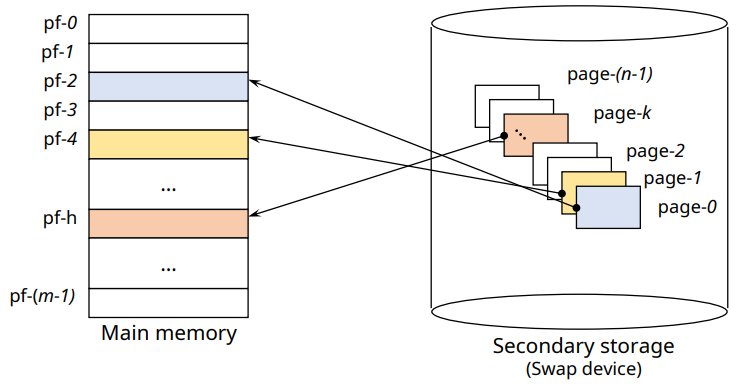

✔ 프로그램을 **고정된 크기**의 block으로 분할(page) / 메모리를 block size로 미리 분할(page frame)
- 외부 단편화 문제 없음 (내부 단편화는 발생 가능)
- 메모리 통합 / 압축 불필요
- 프로그램의 논리적 구조 고려 x (page sharing/protection 복잡)

✔ 필요한 page만 page frame에 적재하여 사용
- 메모리의 효율적 활용

✔ Page mapping overhead
- 메모리 공간 및 추가적인 메모리 접근 필요 -> TLB(캐시) / 전용 HW 활용

#### TLB (Translation Lookaside Buffer)

✔ 가상 메모리 주소를 물리적인 주소로 변환하는 속도를 높이기 위해 사용되는 캐시
- 최근에 일어난 가상 메모리 주소와 물리 주소의 변환 테이블을 저장

### Segmentation System

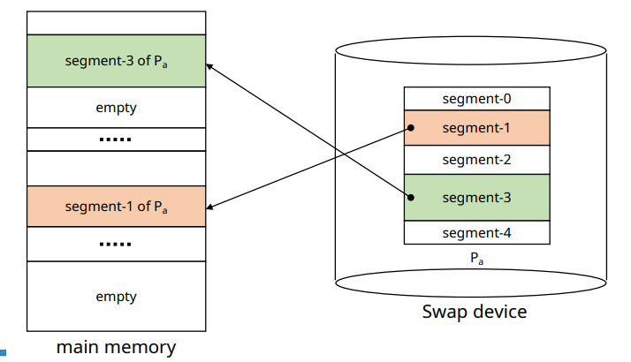

✔ 프로그램을 **논리 단위**로 분할(segment) / 메모리를 동적으로 분할
- 내부 단편화 x
- sharing/protection 용이
- paging system 대비 관리 overhead 큼

## 7. Memory Fragmentation(단편화), Page Fault(페이지 부재), Thrashing(스레싱)

✔ 완전히 연관된 개념들은 아니지만 메모리 / 가상 메모리 관련 내용에 등장하는 주요 개념들!

### Memory Fragmentation(단편화)

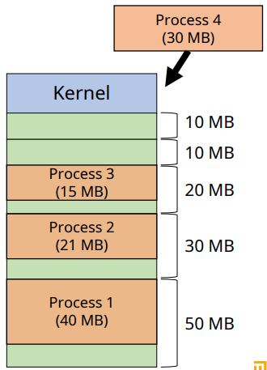

✔ **메모리의 공간이 작은 조각들로 분할되어 사용 가능한 메모리가 존재하지만 할당이 불가능하거나 낭비되는 현상**

✔ **Internal Fragmentation (내부 단편화): Partition 크기 > Process 크기**

✔ **External fragmentation (외부 단편화): (남은 메모리 크기 > Process 크기)지만, 연속된 공간이 아님**

### Page Fault (페이지 부재)

✔ **필요로 하는 페이지가 메모리에 적재되어 있지 않은 경우**

✔ Context switching (Disk I/O) 발생 -> Overhead

✔ 디스크로부터 페이지를 불러와 적재한다 (page replacement)

### Thrashing (스레싱)

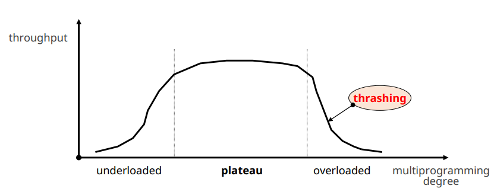

✔ **과도한 Page Fault로 인해 프로세스 수행시간보다 페이지 교체 시간이 많은 상태**

✔ 적절한 Multi Programming Degree 조절이 필요하다!

✔ Memory Allocation -> WS algorithm, PFF Algorithm

## 8. Paging Algorithm (Fixed Allocation)

### Min Algorithm (OPT algorithm)

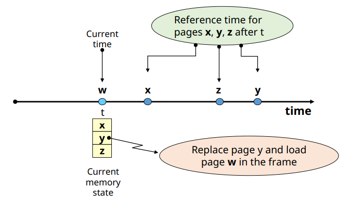

✔ **앞으로 가장 오랫동안 참조되지 않을 page 교체**

✔ 실현 불가능한 기법 (미래의 페이지 참조를 예상해야됨)
- 성능 평가의 지표로 활용

### FIFO (First In First Out) Algorithm

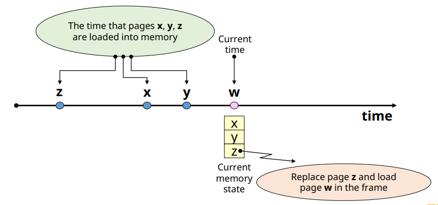

✔ 가장 오래된 page를 교체

✔ 자주 사용되는 page가 교체 된 가능성이 높음
- Locality에 대한 고려 x

### LRU (Least Recently Used) Algorithm

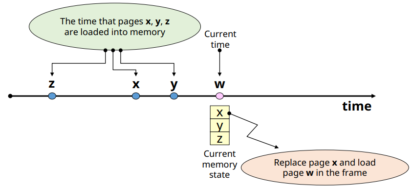

✔ **가장 오랫동안 참조되지 않은 page 교체**

✔ **Locality에** 기반을 둔 교체 기법

✔ Page 참조 시마다 시간을 기록해야 함 (Overhead 발생)

✔ 실제로 가장 많이 활용되는 기법

### LFU(Least Frequently Used) Algorithm

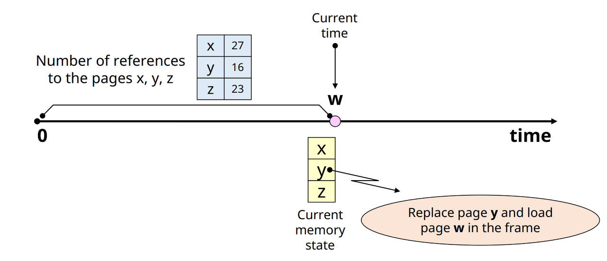

✔ 가장 참조 횟수가 적은 page 교체

✔ page 참조 시마다, **참조 횟수**를 누적 시켜야함

✔ Locality 활용
- LRU 대비 적은 overhead

✔ 최근 적재된 참조될 가능성이 높은 page가 교체될 가능성

### NUR(Not Used Recently) Algorithm

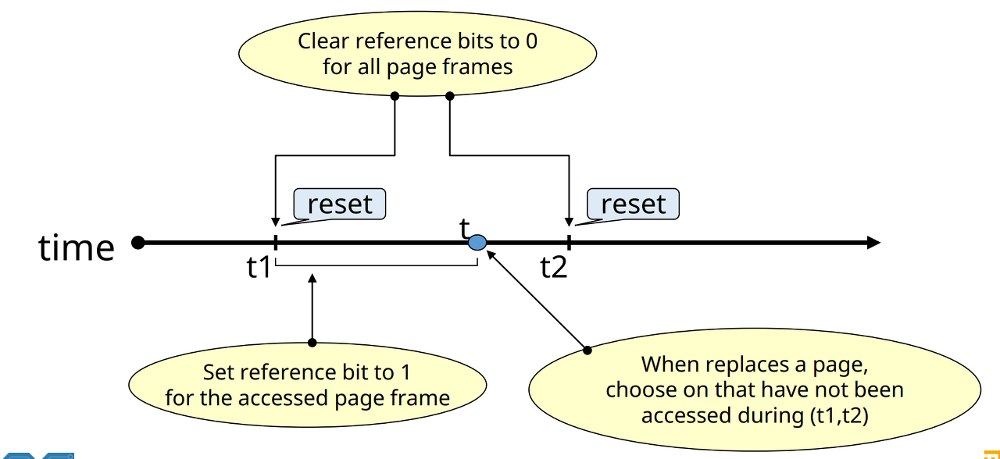

✔ LRU approximation shceme
- LRU보다 적은 overhead로 비슷한 성능 달성 목적

✔ **Bit vector** 사용
- Reference bit vector(r), Updated bit vector(m)
- reference bit가 주기적으로 초기화 되는 특성 이용

✔ 교체 순서
1. (r, m) = (0, 0)
2. (r, m) = (0, 1)
3. (r, m) = (1, 0)
4. (r, m) = (1, 1)

### Clock Algorithm

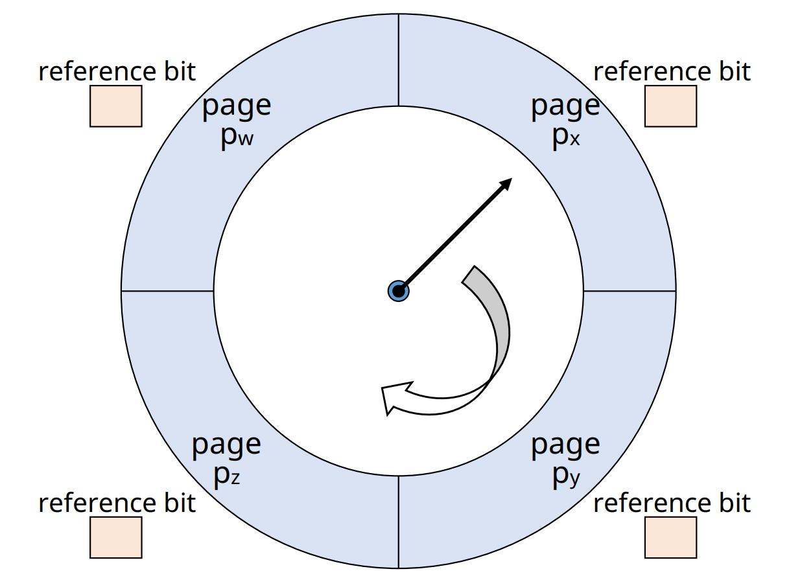

✔ referece bit 주기적 초기화 x

✔ Page frame들을 순차적으로 가리키는 pointer(시계바늘)을 사용하여 교체될 page 결정
- 현재 가리키고 있는 page의 reference bit(r) 확인
- r = 0 인 경우, 교체 page로 결정
- r = 1인 경우, reference bit 초기화 후 pointer 이동

### Second Chance Algorithm

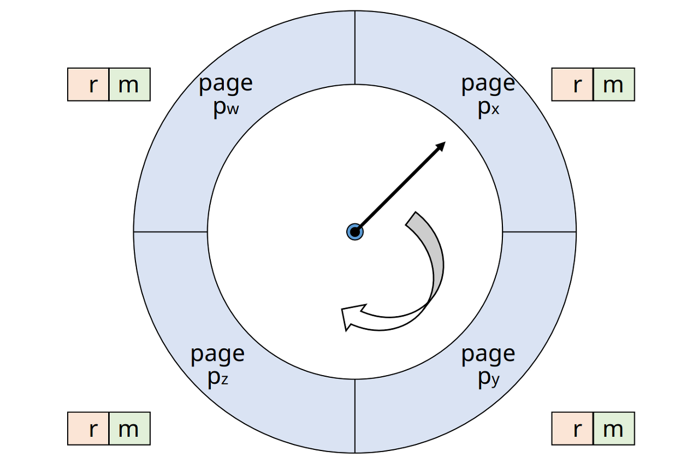

✔ Clock algorithm 과 유사

✔ Update bit(m)도 함께 고려함
- 현재 가리키고 있는 page의 (r, m) 확인
- (0, 0): 교체 page로 결정
- (0, 1): -> (0, 0), write-back (cleaning) list에 추가 후 이동
- (1, 0): -> (0, 0)후 이동
- (1, 1): -> (0, 1)후 이동

## 9. Caching (캐싱)

### Cache (저장 장치)

✔ 프로세서 내부에 있는 메모리(L1, L2 캐시 등)

✔ 메인 메모리의 입출력 병목 현상 해소 (프로세서 연산 속도 > 메인 메모리 입출력 속도)

✔ **지역성(Locality)을 활용해 자주 접근하는 데이터 캐시에 저장**
- 용량이 작고 가격이 비싸 모든 데이터를 저장할 수 없다

✔ **캐시 히트(Cache hit)**
- 필요한 데이터 블록이 캐시 존재

✔ **캐시 미스(Cache miss)**
- 필요한 데이터 블록이 없는 경우

### Locality 

✔ **공간적 지역성 (Spatial locality)**
참조한 주소와 인접한 주소를 참조하는 특성 (ex: 순차적 프로그램 수행)

✔ **시간적 지역성 (Temporal locality)**
- 한 번 참조한 주소를 곧 다시 참조하는 특성 (ex: for문 등의 순환문)

✔ 지역성은 캐시 적중률(cache hit ration)와 밀접!

### Caching (캐싱)

✔ 캐시 메모리의 원리를 활용해 자주 사용되는 데이터나 값을 미리 복사해 저장해두는 것

✔ TLB(VM), Redis...

## 10. 메모리의 구조

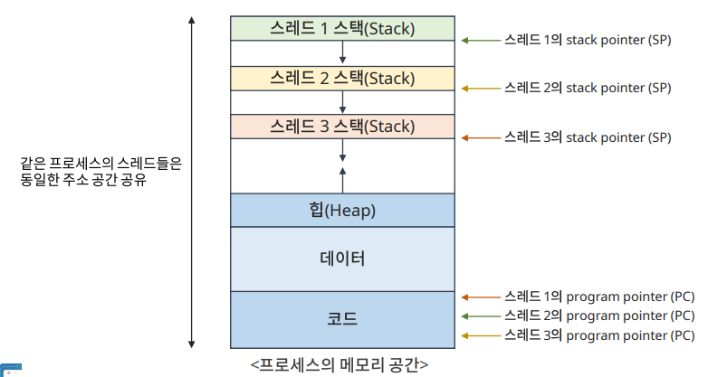

✔ 프로세스는 각각 메모리를 할당 받는다

### Code

✔ 실행할 프로그램의 코드가 저장되는 영역

### Data

✔ 프로그램의 전역 변수와 정적(Static)변수가 저장되는 영역

### Heap

✔ 사용자가 직접 메모리를 관리(할당 및 해제)하는 영역

✔ Java
- Object 타입의 데이터가 저장 (String, Integer, ArrayList...)
- new 연산을 통해 생성한 객체 저장
- GC를 통해 관리 (Unreachable object 삭제)

### Stack

✔ 지역 변수 및 매개 변수가 저장되는 영역

✔ 각각의 스레드마다 할당

✔ Java
- 원시(Primitive) 타입 데이터 저장
- 객체를 참조(reference)하는 변수 저장

## 11. Disk Scheduling (디스크 스케줄링)

✔ Disk Access 요청들의 처리 순서 결정

✔ Optimizing Seek Time (디스크 head를 필요한 cylinder로 이동하는 시간)
- Rotational Delay를 줄이는 알고리즘
  - SLTF (Shortest Latency Time First)
  - SPTF (Shortest Positioning TIme First)

### FCFS (First Come First Service)

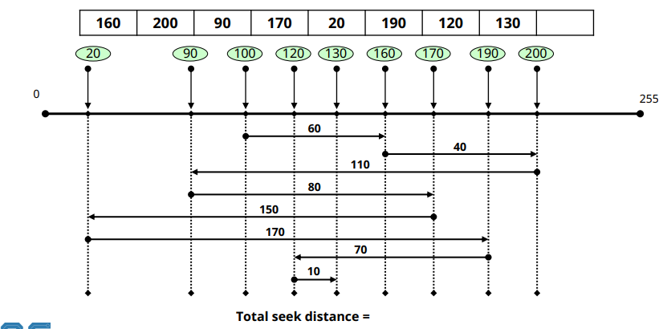

✔ 요청이 도착산 순서에 따라 처리

✔ Simple, but 최적 성능 달성에 대한 고려 x

✔ Disk access 부하가 적은 경우에 적합

### SSTF (Shortest Seek Time First)

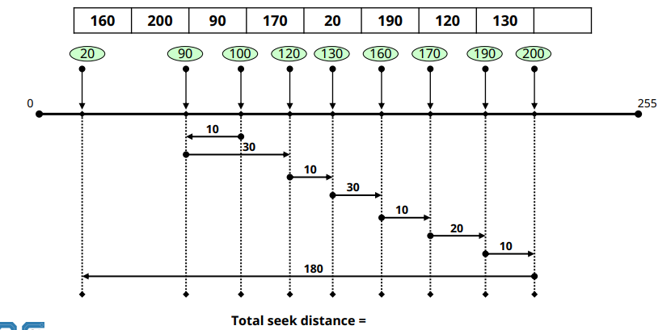

✔ 현재 head 위치에서 가장 가까운 요청 먼저 처리

✔ 평균 응답 시간 ↓

✔ 예측 불가, starvation 현상 발생

✔ 일괄처리 시스템에 적합 (처리 시간 > 순서)

### Scan Scheduling

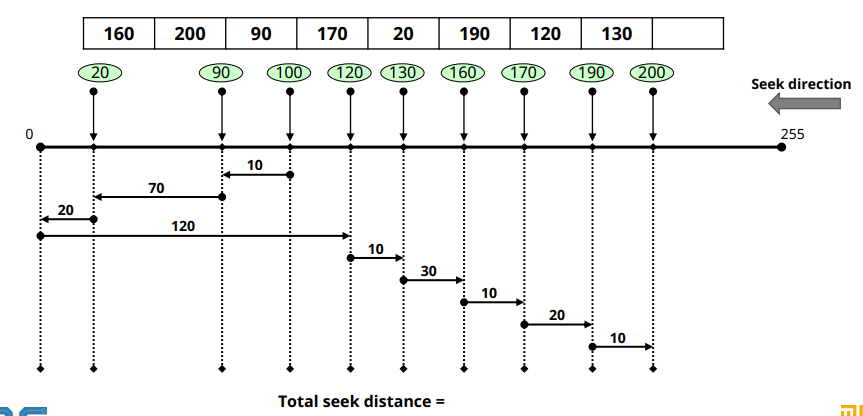

✔ 현재 head의 진행 방향에서, head와 가장 가까운 요청 먼저 처리

✔ (진행방향 기준)마지막 cylinder 도착 후, 반대 방향으로 진행

### C-Scan (Circular Scan) Scheduling

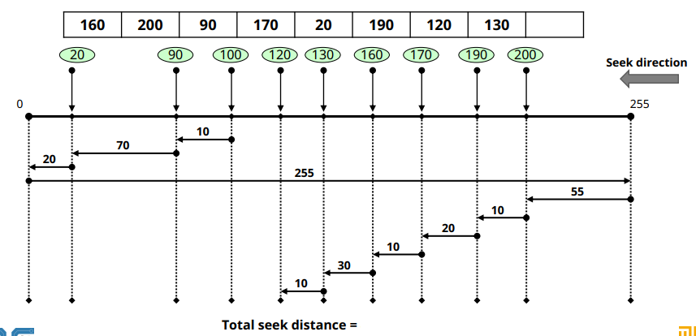

✔ Scan과 유사

✔ Head가 미리 정해진 방향으로만 이동
- 마지막 cylinder 도착 후, 시작 cylinder로 이동 후 재시작

✔ Scan 대비 균등한 기회 제공

### Look Scheduling

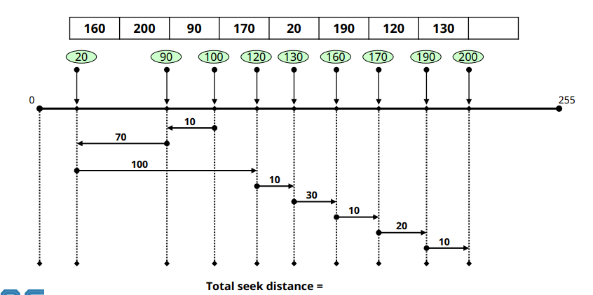

✔ Elevator Algorithm

✔ Scan(C-scan)에서 현재 진행 방향에 요청이 없으면 방향 전환

## 12. RAID

✔ Redundant Array of Inexpensive DIsks(RAID)

✔ 여러 개의 물리 disk를 하나의 논리 disk로 사용

### RAID 0 

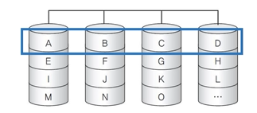

✔ Disk striping
- 논리적인 한 block을 일정한 크기로 나우어 각 disk에 나누어 저장

✔ 모든 disk에 입출력 부하 균등 분배

### RAID 1

✔ Disk mirroring
- 동일한 데이터를 mirroring disk에 중복 저장

✔ 한 disk에 장애가 생겨도 데이터 손실 x

### RAID 3

✔ RAID 0 + parity disk
- Byte 단위 분할 저장
- 모든 disk에 입출력 부하 균등 분배

✔ 한 disk에 장애 발생 시, parity 정보를 이용하여 복구

### RAID 4

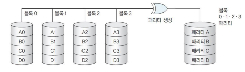

✔ RAID 3과 유사, 단 block 단위로 분산 저장
- 독립된 access 방법
- Disk간 균등 분배가 안될 수 있음

### RAID 5

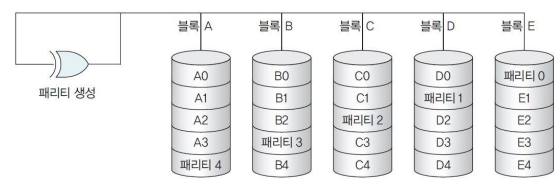

✔ RAID 4와 유사
- 독립된 access 방법

✔ Parity 정보를 각 disk들에 분산 저장
- 병목 현상 해소

✔ 현재 가장 널리 사용되는 RAID level 중 하나