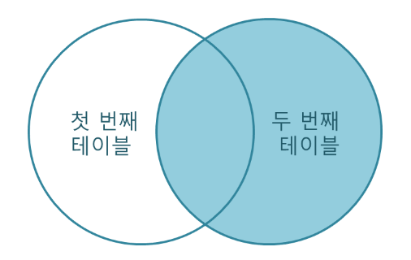

# 데이터베이스

## 데이터베이스 개념

여러 사람이 공유할 목적으로 체계화해 통합, 관리하는 데이터의 집합

스프레드 시트와 기능은 거의 유사하지만 컴퓨터 언어로 제어가 가능하며 앱이나 웹을 통해 공유가 가능하여 전세계 누구나 데이터 베이스에 접근하고 편집이 가능함

### 특징

* **실시간 접근성(Real-Time Accessibility)** : 실시간 처리에 의한 응답이 가능해야 함
* **계속적인 변화(Continuous Evolution)** : 새로운 데이터의 삽입(Insert), 삭제(Delete), 갱신(Update)로 항상 최신의 데이터 유지
* **동시 공용(Concurrent Sharing)** : 다수의 사용자가 동시에 같은 내용의 데이터를 이용할 수 있어야함
* **내용에 의한 참조(Content Reference)** : 데이터베이스에 있는 데이터를 참조할 때 사용자의 요구에 따른 데이터 내용으로 데이터를 찾음


### 데이터베이스 언어 종류


### DBMS(Database Management System)

* HDBMS(Hierachical DBMS) : 계층적인 형태의 DBMS. 초기 세팅이 변화하면 이에 대처하기 힘들어 잘 쓰지 않음. 초기 DBMS
* NDBMS(Network DBMS) : 구성과 설계가 복잡하고 데이터 종속성을 해결하지 못함
* ODBMS(Object-Oriented DBMS) : 정보를 객체의 형태로 표현하는 DBMS
* RDBMS(Relational DBMS
  * 관계형 데이터베이스 관리 시스템) : 테이블과 테이블의 관계를 기반으로 하는 가장 범용적인 데이터베이스 관리 시스템.
  * 데이터의 일관성(Consistency)를 보장함
  * ex) MySQL, Oracle, SQLite
* No-SQL(Not-Only SQL) : 데이터 간의 관계를 설정하지 않고 유연한 테이블 스키마를 가짐
  * 대용량 데이터/분산 처리에 적합하다는 장점이 있지만 데이터 일관성(Consistency)이 항상 보장되지 않는 단점이 있음
  * ex) MongoDB, HBase, Cassandra, Redis


[detail] https://inpa.tistory.com/entry/DB-%F0%9F%93%9A-%EB%8D%B0%EC%9D%B4%ED%84%B0%EB%B2%A0%EC%9D%B4%EC%8A%A4-%EA%B8%B0%EC%B4%88-%EA%B0%9C%EB%85%90


---


## 데이터베이스 언어

데이터베이스를 구축하고 이용하기 위한 데이터베이스 시스템과의 통신 수단

* 데이터 베이스 언어는 DBMS를 통해 사용
* 기능과 사용 목적에 따라 데이터 정의 언어(DDL), 데이터 조작 언어(DML), 데이터 제어 언어(DCL)로 나뉨


### 데이터 정의 언어(DDL : Data Definition Language)

DB 구조, 데이터 형식, 접근 방식 등 DB를 구축하거나 수정할 목적으로 사용하는 언어

외부 스키마를 명세함

DDL은 SCHEMA, DOMAIN, TABLE, VIEW, INDEX를 정의하거나 변경 또는 삭제할 때 사용하는 언어로써 논리적 데이터 구조와 물리적 데이터 구조의 사상을 정의하고, 데이터베이스 관리자나 데이터베이스 설계자가 사용하게 됨

* CREATE : SCHEMA, DOMAIN, TABLE, VIEW, INDEX를 생성
* ALTER : Table에 대한 정의를 변경하는 데 사용
* DROP : SCHEMA, DOMAIN, TABLE, VIEW, INDEX를 삭제


### 데이터 조작 언어(DML : Data Manipulation Language)

사용자로 하여금 데이터를 처리할 수 있게하는 도구로써 사용자(응용 프로그램)와 DBMS간의 인터페이스를 제공

대표적인 데이터 조작 언어에는 질의어가 있으며, 질의어는 터미널에서 주로 이용되는 비절차적 데이터 언어임

절차적 언어(어떤 데이터를 요청하면 그 절차에 맞게 기술하는 언어)와 비절차적 언어(배우기 쉽지만 코드의 효율성면에서 비효율적) 가 있음.

* SELECT : 테이블에서 조건에 맞는 튜플을 검색
* INSERT : 테이블에 새로운 튜플을 삽입
* DELETE : 테이블에서 조건에 맞는 튜플을 삭제
* UPDATE : 테이블에서 조건에 맞는 튜플의 내용을 변경


### 데이터 제어 언어(CDL : Data Control Language)

데이터의 무결성, 보안 및 권한 제어, 회복 등을 하기 위한 언어임

데이터를 보호하고 데이터를 관리하는 목적으로 사용됨

* COMMIT : 명령에 의해 수행된 결과를 실제 물리적 디스크로 저장하고, 데이터베이스 조작 작업이 정상적으로 완료되었음을 관리자에게 알려줌
* ROLLBACK : 데이터베이스 조작 작업이 비정상적으로 종료되었을 때 원래의 상태로 복구함
* GRANT : 데이터베이스 사용자에게 사용 권한을 부여함
* REVOKE : 데이터베이스 사용자의 사용 권한을 취소함


[detail] https://jwprogramming.tistory.com/73

---


## RDBMS와 NoSql


### RDBMS(Relational DBMS)

RDB를 관리하는 시스템이며 RDB는 관계형 데이터 모델을 기초로 두고 모든 데이터를 2차원 테이블 형태로 표현하는 데이터베이스임

RDBMS에서는 관계를 나타내기 위해 외래 키(Foreign Key)를 사용함

이러한 테이블간의 관계에서 외래 키를 이용한 테이블 간 Join이 가능하다는 게 RDBMS의 가장 큰 특징임


### NoSQL(Not Only SQL)

RDBMS와는 달리 테이블 간 관계를 정의하지 않음

데이터 테이블은 그냥 하나의 테이블이며 테이블 간의 관계를 정의하지 않아 일반적으로 테이블 간 Join도 불가능함


빅데이터의 등장으로 인해 데이터와 트래픽이 기하급수적으로 증가함

RDBMS는 성능 향상을 위해 장비가 좋아야 하는 Scale-Up의 특징으로 인해 비용이 기하급수적으로 증가

데이터 일관성은 포기하고 비용을 고려하여 여러 대의 데이터에 분산하여 저장하는 Scale-Out을 목표로 NoSQL 등장


> **Scale-Up**
>
> 기존 서버의 사양을 업그레이드해 시스템을 확장하는 것
>
> CPU나 RAM 등을 추가하거나 고성능의 부품, 서버로 교환하는 방법
>
> 수직 스케일
>
> **Scale-Out**
>
> 서버를 여러 대 추가하여 시스템을 확장하는 것
>
> 서버가 여러 대로 나뉘기 때문에 각 서버에 걸리는 부하를 균등하게 해주는 '로드밸런싱'이 필수적으로 동반되어야함
>
> 수평 스케일


### RDBMS와 NoSQL의 장단점

### **RDBMS**

#### **장점**

- 정해진 스키마에 따라 데이터를 저장하여야 하므로 명확한 데이터 구조 보장
- 관계는 각 데이터를 중복없이 한 번만 저장할 수 있음

#### **단점**

- 테이블간테이블 간 관계를 맺고 있어 시스템이 커질 경우 JOIN문이 많은 복잡한 쿼리가 만들어질 수 있음
- 성능 향상을 위해서는 서버의 성능을 향상 시켜야하는 Scale-up만을 지원함. 이로 인해 비용이 기하급수적으로 늘어날 수 있습니다.
- 스키마로 인해 데이터가 유연하지 못함. 나중에 스키마가 변경 될 경우 번거롭고 어려움.

 

### **NoSQL**

#### **장점**

- NoSQL에서는 스키마가 없기 때문에 유연하며 자유로운 데이터 구조를 가질 수 있음. 언제든 저장된 데이터를 조정하고 새로운 필드를 추가할 수 있음.
- 데이터 분산이 용이하며 성능 향상을 위한 Saclue-up 뿐만이 아닌 Scale-out 또한 가능함.

#### **단점**

- 데이터 중복이 발생할 수 있으며 중복된 데이터가 변경 될 경우 수정을 모든 컬렉션에서 수행 해야함.
- 스키마가 존재하지 않기에 명확한 데이터 구조를 보장하지 않으며 데이터 구조 결정이 어려울 수 있음.


---


## 인덱싱(Indexing)

테이블에 대한 동작의 속도를 높여주는 자료 구조


### 데이터베이스 인덱싱

데이터베이스에 색인을 남기는 것

검색의 범위를 줄이는 것이 조회에 있어 훨씬 효과적임

큰 규모의 데이터를 다루고, 조회를 자주 할 경우가 많을 때 효과적임


[detail] https://maskkwon.tistory.com/218


data/index는 B-Tree 구조임

[B-Tree] https://maskkwon.tistory.com/219


---


## 정규화(Normalization)


[detail] https://code-lab1.tistory.com/48


관계형 데이터베이스의 설계에서 **중복을 최소화하게 데이터를 구조화하는 프로세스**를 정규화라 함

정규화의 기본 목표는 **관련이 없는 함수 종속성은 별개의 릴레이션으로** 표현하는 것임


정규화된 결과를 정규형이라 하며, 기본 정규형과 고급 정규형으로 나뉨

* 기본 정규형 : 제1정규형, 제2정규형, 제3정규형, BCNF(보이스/ 코드 정규형)
* 고급 정규형 : 제4정규형, 제5정규형


장점 : 이상 현상의 발생 가능성을 줄임

단점 : 연산 시간이 증가함


### 제 1 정규형

릴레이션에 속한 모든 속성의 도메인이 더 이상 분해되지 않는 원자값으로만 구성된 정규형


### 제  2 정규형

릴레이션이 제 1정규형에 속하고, 기본키가 아닌 모든 속성이 기본키에 완전 함수 종속되면 제 2 형 정규형임

제 1 정규형에 속하는 릴레이션이 제 2 정규형을 만조갛게 하려면, 부분 함수 종속을 제거하고 모든 속성이 기본키에 완전 함수 종속되도록 릴레이션을 분해하는 정규화 과정을 거쳐야 함

> 완전 함수 종속
>
> * 어떤 속성이 기본키에 대해 완전히 종속일 때
>
> 부분 함수 종속
>
> * 어떤 속성이 기본키가 아닌 다른 속성에 종속되거나, 기본키가 여러 속성으로 구성되어 있을 경우 기본키를 구성하는 속성 중 일부만 종속될 때


### 제 3 정규형

릴레이션이 제 2 정규형에 속하고, 기본키가 아닌 모든 속성이 기본키에 이행적 함수 종속이 되지 않으면 제 3 정규형에 속함

> 이행적 함수 종속
>
> * A -> B, B -> C 인 경우 A -> C가 성립될 때
> * A를 알면 B를 알고 그를 통해 C를 알 수 있을 때


### **BCNF** ???

릴레이션의 함수 종속 관계에서 **모든 결정자가 후보키**이면 BCNF에 속한다.

> 하나의 릴레이션에 여러개의 후보키가 존재할 수도 있는데, 이런 경우는 제3정규형까지 모두 만족하더라도 이상 현상이 발생할 수 있다. 이러한 이상현상을 해결하기 위해 제3정규형보다 좀 더 엄격한 제약조건을 제시한 것이 BCNF이다.


 

- 학생번호-교수 릴레이션은 함수 종속 관계가 성립하지 않는 동등한 학생번호, 교수 속성으로 구성하고 {학생번호, 교수}가 기본키의 역할을 담당한다. 즉, 후보키가 아닌 결정자가 존재하지 않기때문에 BCNF에 속한다.
- 교수-특강 릴레이션은 교수와 특강이 함수 종속 관계를 띄우며, 교수가 유일한 후보키이자 기본키이다. 즉, 후보키가 아닌 결정자가 존재하지 않기때문에 BCNF에 속한다.


### 고급 정규형 (제4정규형, 제5정규형)

- 제4정규형
  - 릴레이션이 BCNF를 만족하면서, 함수 종속이 아닌 **다치 종속**(MVD: Multi Valued Dependency) 를 제거해야 만족할 수 있다.
- 제5정규형
  - 릴레이션이 제4정규형을 만족하면서 후보키를 통하지 않는 **조인 종속**(JD: Join Dependency) 을 제거해야 만족할 수 있다.

실제로 데이터베이스를 설계할 때 모든 릴레이션이 무조건 제5정규형에 속하도록 분해해야 하는 것은 아니다.

오히려 그렇게 되면 비효율적인 경우가 많다.

일반적으로 **제3정규형**이나 **BCNF**에 속하도록 릴레이션을 분해하여 **데이터 중복을 줄이고 이상 현상이 발생하는 문제를 해결**한다고 한다.


## 반정규화

반정규화란 시스템의 성능 향상, 개발 및 운영의 편의성 등을 위해 정규화된 데이터 모델을 통합, 중복, 분리하는 과정으로, **의도적으로 정규화 원칙을 위배하는 행위**임

- 반정규화를 수행하면 시스템의 성능이 향상되고 관리 효율성을 증가하지만 데이터의 일관성 및 정합성이 저하될 수 있음
- 과도한 반정규화는 오히려 성능을 저하시킴
- 반정규화를 위해서는 사전에 데이터의 일관성과 무결성을 우선으로 할지, 데이터베이스의 성능과 단순화를 우선으로 할지를 결정해야 함
- 반정규화 방법에는 **테이블 통합, 테이블 분할, 중복 테이블 추가, 중복 속성 추가** 등이 있음


#### **테이블 통합**

테이블 통합은 두 개의 테이블이 조인되는 경우가 많아 하나의 테이블로 합쳐 사용하는 것이 성능 향상에 도움이 될 경우 수행함

 

- 두 개의 테이블에서 발생하는 프로세스가 동일하게 자주 처기되는 경우, 두 개의 테이블을 이용하여 항상 조회를 수행하는 경우 테이블 통합을 고려
- 테이블 통합의 종류에는 1:1 관계 테이블 통합, 1:N 관계 테이블 통합, 슈퍼타입/서브타입 테이블 통합이 있음
- 테이블 통합 시 고려 사항
  - 데이터 검색은 간편하지만 레코드 증가로 인해 처리량이 증가
  - 테이블 통합으로 인해 입력, 수정, 삭제 규칙이 복잡해질 수 있음
  - Not Null, Default, Check 등의 제약조건을 설계하기 어려움


#### **테이블 분할**

테이블 분할은 테이블을 수직 또는 수평으로 분할하는 것

 

- 수평 분할
  - 수평 분할은 레코드를 기준으로 테이블을 분할하는 것
  - 레코드별로 사용 빈도의 차이가 큰 경우 사용 빈도에 따라 테이블을 분할함
- 수직 분할
  - 수직 분할은 하나의 테이블에 속성이 너무 많을 경우 속성을 기준으로 테이블을 분할하는 것
  - 갱신 위주의 속성 분할 : 데이터 갱신 시 레코드 잠금으로 인해 다른 작업을 수행 할 수 없으므로 갱신이 자주 일어나는 속성들을 수직 분할하여 사용
  - 자주 조회되는 속성 분할 : 자주 조회되는 속성이 극히 일부일 경우 그 속성들을 수직 분할하여 사용
  - 크기가 큰 속성 분할 : 이미지나 2GB 이상 저장될 수 있는 텍스트 형식 등으로 된 속성들을 수직 분할하여 사용
  - 보안을 적용해야하는 속성 분할 : 특정 속성에 대해 보안을 적용할 수 없으므로 보안을 적용해야 하는 속성들을 수직 분할하여 사용
- 테이블 분할 시 고려 사항
  - 기본키의 유일성 관리가 어려워짐
  - 데이터 양이 적거나 사용 빈도가 낮은 경우 테이블 분할이 필요한지를 고려해야 함
  - 분할된 테이블로 인해 수행 속도가 느려질 수 있음
  - 데이터 검색에 중점을 두어 테이블 분할 여부를 결정


#### **중복 테이블 추가**

여러 테이블에서 데이터를 추출해서 사용해야 하거나 다른 서버에 저장된 테이블을 이용해야 하는 경우 중복 테이블을 추가하여 작업의 효율성을 향상시킬 수 있음

 

- 중복 테이블을 추가하는 경우
  - 정규화로 인해 수행 속도가 느려지는 경우
  - 많은 범위의 데이터를 자주 처리해야 하는 경우
  - 특정 범위의 데이터만 자주 처리해야 하는 경우
  - 처리 범위를 줄이지 않고는 수행 속도를 개선할 수 없는 경우
- 중복 테이블을 추가하는 방법
  - **집계 테이블**의 추가 : 집계 데이터를 위한 테이블을 생성하고, 각 원본 테이블에 트리거를 설정하여 사용하는 것으로, 트리거 오버헤드에 유의해야 함
  - **진행 테이블**의 추가 : 이력 관리 등의 목적으로 추가하는 테이블로, 적절한 데이터 양의 유지와 활용도를 높이기 위해 기본키를 적절히 설정
  - **특정 부분만을 포함하는 테이블**의 추가 : 데이터가 많은 테이블의 특정 부분만을 사용하는 경우 해당 부분만으로 새로운 테이블을 생성

#### **중복 속성 추가**

중복 속성 추가는 조인해서 데이터를 처리할 때 데이터를 조회하는 경로를 단축하기 위해 자주 사용하는 속성을 하나 더 추가하는 것

 

- 중복 속성을 추가하면 데이터의 무결성 확보가 어렵고, 디스크 공간이 추가로 필요
- 중복 속성을 추가하는 경우
  - 조인이 자주 발생하는 속성
  - 접근 경로가 복잡한 속성
  - 액세스의 조건으로 자주 사용되는 속성
  - 기본키의 형태가 적절하지 않거나 여러 개의 속성으로 구성된 경우
- 중복 속성 추가 시 고려 사항
  - 테이블 중복과 속성의 중복 고려
  - 데이터 일관성 및 무결성에 유의
  - SQL 그룹 함수를 이용하여 처리할 수 있어야 함
  - 저장 공간의 지나친 낭비 고려


---


## 트랜잭션(Transaction)

데이터베이스의 상태를 변화시키기 위해 수행하는 작업의 단위


간단하게 말해서 아래의 질의어(SQL)를 이용하여 데이터베이스를 접근 하는 것을 의미한다.


- SELECT
- INSERT
- DELETE
- UPDATE

작업단위는 많은 질의어 명령문들을 사람이 정하는 기준에 따라 정하는 것을 의미함

게시판 사용자는 게시글을 작성하고, 올리기 버튼을 누른다. 그 후에 다시 게시판에 돌아왔을때, 

게시판은 자신의 글이 포함된 업데이트된 게시판을 보게 된다.

이러한 상황을 데이터베이스 작업으로 옮기면, 사용자가 올리기 버튼을 눌렀을 시, Insert 문을 사용하여

사용자가 입력한 게시글의 데이터를 옮긴다. 그 후에, 게시판을 구성할 데이터를 다시 Select 하여 최신 정보로

유지한다. 여기서 작업의 단위는 insert문과 select문 둘다 를 합친것이다. 이러한 작업단위를 하나의 트랜잭션이라 한다.


관리자나 개발자가 하나의 트랜잭션 설계를 잘하는 것이 데이터를 다루는 것에 많은 이점이 있다.

### 트랜잭션의 특징

 트랜잭션의 특징은 크게 4가지로 구분된다. 


- 원자성 (Atomicity)
- 일관성 (Consistency)
- 독립성 (Isolation)
- 지속성 (Durability)

 첫번째로, 원자성은 트랜잭션이 데이터베이스에 모두 반영되던가, 아니면 전혀 반영되지 않아야 한다는 것이다.  트랜잭션은 사람이 설계한

논리적인 작업 단위로서, 일처리는 작업단위 별로 이루어 져야 사람이 다루는데 무리가 없다.

만약 트랜잭션 단위로 데이터가 처리되지 않는다면, 설계한 사람은 데이터 처리 시스템을 이해하기 힘들 뿐만 아니라, 오작동 했을시 원인을 찾기가 매우 힘들어질것이다.


 두번째로, 일관성은 트랜잭션의 작업 처리 결과가 항상 일관성이 있어야 한다는 것이다. 

트랜잭션이 진행되는 동안에 데이터베이스가 변경 되더라도 업데이트된 데이터베이스로 트랜잭션이 진행되는것이 아니라,

처음에 트랜잭션을 진행 하기 위해 참조한 데이터베이스로 진행된다. 이렇게 함으로써 각 사용자는 일관성 있는 데이터를 볼 수 있는 것이다.


 세번째로, 독립성은 둘 이상의 트랜잭션이 동시에 실행되고 있을 경우 어떤 하나의 트랜잭션이라도, 다른 트랜잭션의 연산에 끼어들 수 없다는 점을 가리킨다.

하나의 특정 트랜잭션이 완료될때까지, 다른 트랜잭션이 특정 트랜잭션의 결과를 참조할 수 없다.


 네번째로, 지속성은 트랜잭션이 성공적으로 완료됬을 경우, 결과는 영구적으로 반영되어야 한다는 점이다.


### Commit, Rollback 연산

알려주기위해 사용하는 연산이다. 이 연산을 사용하면 수행했던 트랜잭션이 로그에 저장되며, 후에 Rollback 연산을 수행했었던 트랜잭션단위로 하는것을 도와준다.

Rollback이란 하나의 트랜잭션 처리가 비정상적으로 종료되어 트랜잭션의 원자성이 깨진경우, 트랜잭션을 처음부터 다시 시작하거나, 트랜잭션의 부분적으로만 연산된 결과를 다시 취소시킨다.

후에 사용자가 트랜잭션 처리된 단위대로 Rollback을 진행할 수도 있다.


---

## JOIN

데이터베이스 내의 여러 테이블에서 가져온 레코드를 조합하여 하나의 테이블이나 결과 집합으로 표현해 줌


표준 SQL에서는 레코드를 조합하는 방식에 따라 JOIN을 다음과 같이 구분함

* INNER JOIN
* LEFT JOIN
* RIGHT JOIN


### INNER JOIN

INNER JOIN은 ON 절과 함께 사용되며, ON 절의 조건을 만족하는 데이터만을 가져옴

```sql
1. SELECT *

FROM Reservation

INNER JOIN Customer

ON Reservation.Name = Customer.Name;

2. SELECT *

FROM Reservation

JOIN Customer

ON Reservation.Name = Customer.Name;
```


### LEFT JOIN

LEFT JOIN은 첫 번째 테이블을 기준으로, 두 번째 테이블을 조합하는 JOIN

```sql
SELECT *

FROM Reservation

LEFT JOIN Customer

ON Reservation.Name = Customer.Name

WHERE ReserveDate > '2016-02-01';
```


### RIGHT JOIN

RIGHT JOIN은 LEFT조인과는 반대로 두 번째 테이블을 기준으로, 첫 번째 테이블을 조합하는 JOIN임

```sql
SELECT *

FROM Reservation

RIGHT JOIN Customer

ON Reservation.Name = Customer.Name;
```


