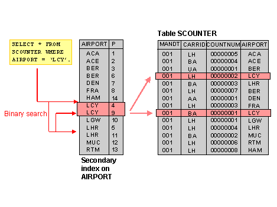
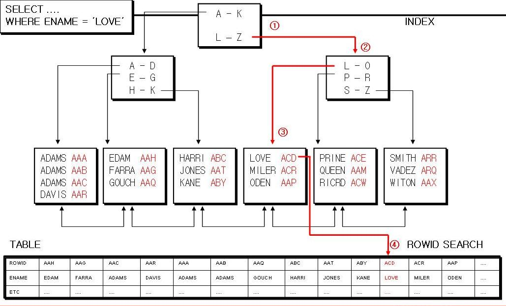
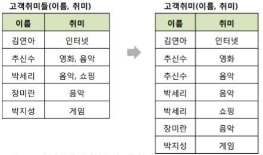
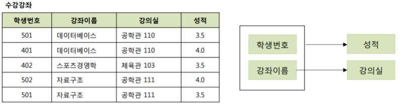
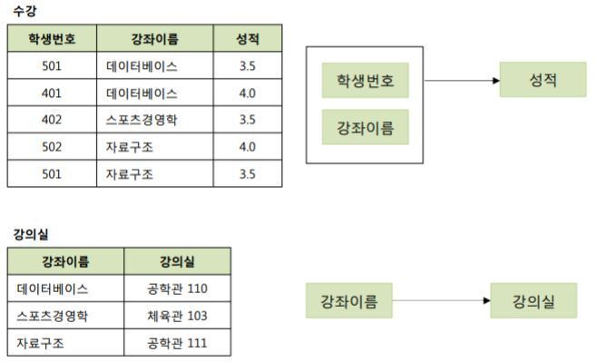
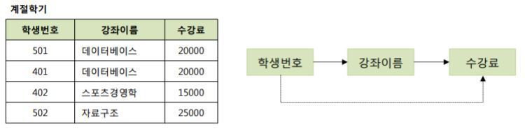
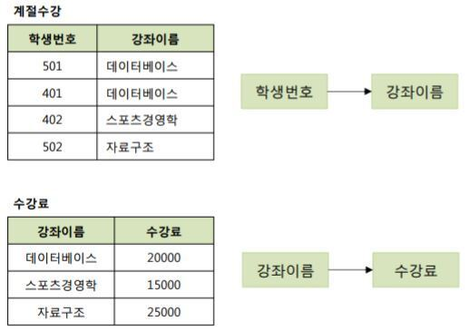
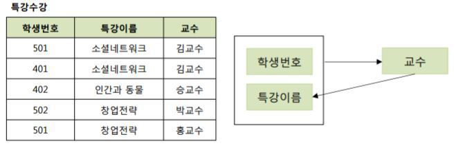
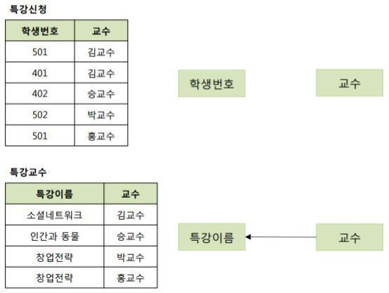

## 데이터베이스

    1. 데이터베이스 기본 개념
    2. 데이터베이스 언어 (sql: ddl dml dcl)
    3. RDBMS와 NoSql
    4. 인덱싱
    5. 정규화
    6. 반정규화
    7. 트랜젝션
    8. join

## 1. 데이터 베이스 기본 개념

### 데이터베이스의 특징 4가지

✔ **데이터베이스란?: 특정 조직의 여러 사용자들이 공유하여 사용할 수 있도록 통합해서 저장한 운영데이터의 집합**

1. **실시간 접근 가능**
   - 사용자가 요구하는 데이터를 빠른 시간 내에 제공
  
2. **계속 변화**
   - 데이터 베이스는
   - 데이터를 지속적으로 삽입, 삭제, 수정 하면서 최산 상태를 유지한다.

3. **동시 공유**
   - 다수의 사용자가 동시에 같은 내용의 데이터 이용 가능

4. **내용 기반 참조**
   - 데이터베이스의 데이터를 참조할 때 주소나 위치가 아닌 내용을 통한 참조 가능

### DBMS (DataBase Management System, 데이터베이스 관리 시스템)

✔ 데이터베이스를 조작하기 위한 시스템 (ex: MySql)

✔ 주요 기능
- 정의(Definition): DB 구조 정의 및 수정
- 조작(Manipulation): DB 내 데이터 조작
- 제어(Control): DB 접근 및 권한 설정

## 2. 데이터 베이스 언어

✔ SQL: 관계형 데이터베이스 (RDB)를 위한 표준 질의어

### DDL (Data Definition Language)

✔ 정의어

✔ 테이블 생성(CREATE), 변경(ALTER), 제거(DROP)

✔ Contraints
- **데이터 무결성**을 유지하기 위해 테이블의 컬럼에 설정하는 제약
- `NOT NULL`
- `UNIQUE`
- `PRIMARY KEY`
- `AUTOINCREMENT`

```sql
-- 테이블 생성

CREATE TABLE 테이블이름 (
   속성이름 데이터타입 [NOT NULL] [DEFAULT 기본값]
   [PRIMARY KEY (속성리스트)]
   [UNIQUE (속성리스트)]
   [FOREIGN KEY (속성리스트) REFERENCES 테이블이름(속성리스트)] [ON DELETE 옵션] [ON UPDATE 옵션]
   [CONSTRAINT 이름] [CHECK(조건)]
);

CREATE TABLE 고객(
	ID varchar(20) not null,
	name varchar(10) not null,
	age int,
	class varchar(10) not null,
	job varchar(20),
	point int default 0,
	primary key(ID)
);
```

```sql
-- 수정

-- 고객 테이블에 가입날짜 속성 추가
alter table 고객 add 가입날짜 date;

-- 가입날짜 속성 삭제
alter table 고객 drop column 가입날짜;

-- 제약 조건 추가
alter table 고객 add constraint chk_age check(나이 >= 20);

-- 제약 조건 삭제
alter table 고객 drop constraint chk_age;

```

```sql
-- 삭제

drop table 고객

```

### DML (Data Manipulation Language)

✔ 조작어

✔ 테이블에 데이터 삽입(INSERT), 수정(UPDATE), 삭제(DELETE), 검색(SELECT)


```sql

-- 검색 (이외에도 논리연산자를 통해 다양한 조건 검색을 할 수 있다)
SELECT 주문제품, 수량, 주문일자, 주문고객
FROM 주문
WHERE 주문고객 = 'apple' OR 수량 >= 15;

-- 삽입
INSERT INTO table_name (column1, column2)
VALUES (value1, value2...);

-- 수정
UPDATE table_name
SET column1=value1,
    column2=value2,
WHERE search_condition;

-- 삭제
DELETE FROM table_name
WHERE search_condition;

```

### DCL (Data Control Language)

✔ 데이터 무결성 유지, 병행 수행 제어, 보호 및 관리
- `COMMIT`, `ROLLBACK`, `GRANT`, `REVOKE`

✔ `COMMIT`: 트랜젝션의 결과를 저장하고 db에 반영

✔ `ROLLBACK`: db를 마지막 commit 시점의 상태로 복원

✔ `GRANT`: 특정 사용자에게 엑세스 권한 제공

✔ `REVOKE`: 특정 사용자에게 부여 되었던 엑세스 권한 철회

✔ 경우에 따라 `COMMIT`과 `ROLLBACK`은 트랜젝션 제어 언어(TCL)로 분류하기도 한다!


## 3. RDBMS와 NoSql

✔ 프로젝트에서 사용한 db의 특징과 왜 사용했는지를 잘 알아두자! (ex: 채팅/로그 - mongodb, jwt - redis)

### RDBMS

✔ 관계형 데이터 베이스

✔ 행과 열을 가지는 표(2차원 테이블) 형식으로 데이터를 저장하고 데이터 간의 관계를 관리하는 데이터 베이스

✔ 장점: schema에 맞춰 데이터를 관리 하기 떄문에 데이터 정합성 보장 유리

✔ 단점: 시스템이 커질 수록 쿼리가 복잡해지고 성능 저하, 수평적 확장 어려움


✔ MySQL
- 가장 많이 쓰이는 rdbms (호환성, 다양한 플랫폼)
- 오라클이 인수

✔ ORACLE DB
- 기업체에서 많이 사용
- 대규모 데이터 처리에 용이

✔ MARIA DB
- MySQl 기반 오픈소스 rdbms

✔ PostgreSQL
- SQL 표준 ↑
- 복잡한 쿼리에 강점

### NoSQL

✔ RDBMS가 비대해짐에 따라 관계가 복잡해져, 이를 극복하기 위해 등장하게 된 데이터베이스

✔ 특징
- 확장성, 유연성 ↑
  - 일관성 안정성 ↓ (Trade Off)
- 수평적 확장, 대규모 데이터의 분산 저장 및 처리에 용이!
- 명시적인 스키마 x

✔ 사용 사례: 채팅, 구매 내역, 로그
- 생성되는 데이터 양은 많지만, 저장하고 나서 굳이 수정하거나 일관성과 관계성을 엄밀히 보장해줘야할 일은 없다

✔ 저장 방식
- Key-Value(Redis)
- Document(MongoDB)
- graph

✔ MongoDB
- Document 형태로 데이터 저장

✔ Redis
- key-value 형태로 데이터 저장
- in-memory db
- 캐싱 지원

## 4. 인덱싱



✔ key(column의 값) - value(address) 형태로 별도의 공간에 정렬된 상태로 저장해 데이터베이스의 테이블에 대한 탐색 속도를 향상시켜주는 자료 구조 

✔ DBMS에서 인덱스는 정렬된 상태를 유지하기 떄문에 검색 속도는 빠르지만, 삽입 및 수정, 삭제는 쿼리문 실행 속도가 느려진다.

✔ 장점
- **테이블 검색 속도 및 성능 향상**

✔ 단점
- 인덱스 관리하기 위한 **추가 저장공간** 필요
- **삽입, 수정, 삭제의 경우 오히려 성능 저하 가능성**

✔ 인덱스를 사용하면 좋은 경우
- 규모가 큰 테이블
- 삽입, 수정, 삭제가 자주 발생하지 않는 테이블
- WHERE, ORDERBY,JOIN 등이 자주 사용되는 칼럼
- 데이터의 중복이 적은 칼럼

### 인덱스의 자료구조

✔ Hash Table
- key-value 쌍으로 데이터를 저장하는 자료구조
- O(1) 시간복잡도



✔ **B+ Tree**
- leaf node에만 데이터를 저장하고 leaf node가 아닌 node에는 자식의 포인터만 저장한다
- leaf node끼리는 Linked list로 연결
- O(logN) 시간복잡도
- 일반적으로 B+ Tree 사용해서 구현

✔ 왜 B+ Tree를 사용할까?
- hash table은 시간 복잡도는 빠르지만 =(동등연산자) 연산에만 최적화되어 있어서 >(비교연산자)를 사용하기에 부적합하다!

## 5. 정규화

### 정규화란?

✔ 관계형 데이터베이스에서 **중복을 최소화**하기 위해 데이터를 구조화하는 작업
- 함수 종속성을 이용해 릴레이션과 연관성이 있는 속성들로만 구성되도록 분해해서,
  이상 현상이 발생하지 않는 릴레이션을 만들어나가는 과정

✔ 단점: 여러 테이블이 생성되어야 하므로 SQL작성이 용이하지 않고 과다한 테이블 JOIN 발생하여 **성능이 저하될 가능성**이 높다.

✔ **함수 종속성(Functional Dependency)**
- X -> Y
- X 값에 대해 Y 값이 항상 하나인 경우, Y가 X에 함수적으로 종속되어 있다라고 표현)


### 정규형

#### 제 1 정규형



✔ 릴레이션의 모든 도메인(속성값)이 더 이상 분해 될 수 없는 원자성을 가진다

#### 제 2 정규형





✔ 릴레이션이 제 1정규형이며, **기본 키가 아닌 모든 속성이 기본 키에 완전 함수 종속적**(부분 함수의 종속성 제거)이다

✔ 완전 함수 종속성: A와 B가 릴레이션 R의 속성이고 A→B 종속성이 성립할 때, B가 A의 속성 전체에 함수 종속하고 부분 집합 속성에 함수 종속하지 않을 경우

#### 제 3 정규형





✔ 릴레이션이 제 2 정규형이며, **기본 키가 아닌 모든 속성이 이행적 함수 종속(transitive FD)를 만족하지 않는 상태**

✔ **이행적 함수 종속**: A→B, B→C가 성립할 때 A→C가 성립되는 함수 종속성

#### BCNF 정규형 (Boyce Codd Normal Form)





✔ 릴레이션 R에서 함수 종속성 A→B가 성립할 때 모든 결정자 A가 후보키인 경우

*※ 그림출처 : 한빛아카데미(주) , IT CookBook, SQL Server로 배우는 데이터베이스 개론과 실습*

## 6. 반정규화

### 반정규화란?

✔ 정규화된 엔티티, 속성, 관계를 시스템의 **성능 향상 및 개발과 운영의 단순화를 위해 중복 통합, 분리 등을 수행**하는 데이터 모델링 기법

✔ 여러 개의 테이블이 단순해지므로 SQL 작성이 용이하고 성능이 향상될 가능성이 있다.

✔ 반대로 같은 데이터가 여러 테이블에 걸쳐 존재하므로 무결성이 깨질 우려도 있다!

✔ 반정규화의 대상
- **자주 사용되는 테이블**에 액세스하는 프로세스의 수가 가장 많고, **항상 일정한 범위만을 조회**하는 경우
- 테이블에 **대량 데이터가 있고 대량의 범위**를 자주 처리하는 경우, 성능상 이슈가 있을 경우
- 테이블에 **지나치게 조인을 많이 사용**하게 되어 데이터를 조회하는 것이 기술적으로 어려울 경우

### 테이블의 반정규화

✔ 1:1 관계의 테이블 병합

✔ 1:N 관계의 테이블 병합

✔ 수퍼/서브 타입 테이블 병합

✔ 수직 분할(집중화된 일부 칼럼을 분리)
- 같은 테이블인데 양이 너무 많은 경우 등

✔ 수평 분할(행으로 구분하여 구간별 분리)

✔ 테이블 추가(중복테이블, 통계테이블, 이력테이블, 부분테이블)

### 칼럼의 반정규화

✔ 중복칼럼 추가(자주 조회하는 칼럼이 있는 경우)

✔ 파생 컬럼 추가(미리 계산한 값)

✔ PK에 의한 컬럼 추가

✔ 응용 시스템 오작동을 위한 컬럼 추가(이전 데이터 임시보관)

### 관계의 반정규화

✔ 중복 관계 추가(이미 A테이블에서 C테이블의 정보를 읽을 수 있는 관계가 임음에도 관계를 중복하여 조회(READ) 경로를 단축)

## 7. Transaction

✔ Transaction(트랜잭션): **데이터베이스에서 하나의 논리적 기능을 수행하기 위한 작업 단위**

### 트랜잭션의 연산

✔ **Commit** : 트랜잭션 수행 성공 (작업 완료), 결과를 DB에 반영  
✔ **Rollback** : 트랜잭션 수행 실패 (작업 취소), 트랜잭션 실행 전 상태로 돌아감

### 트랜잭션의 특성 (ACID)

✔ **Atomicity(원자성)**: 트랜잭션에 포함된 작업은 전부 수행되거나 전부 수행되지 않음을 보장한다

✔ **Consistency(일관성)**: 트랜잭션의 수행 전/후 데이터베이스가 일관된 상태여야 한다
- 허용된 방식으로만 데이터 변경

✔ **Isolation(격리성)**: 트랜잭션 중간 결과에 다른 트랜잭션이 접근할 수 없다

✔ **Durability(지속성)**: 트랜잭션 수행 결과는 손실되지 않고 영구적이다

## 8. Join


✔ Join: **두 개 이상의 테이블을 묶어서 하나의 결과물을 만드는 것**

### JOIN의 종류

✔ INNER JOIN
- 왼쪽 테이블과 오른쪽 테이블의 두 행이 모두 일치하는 행이 있는 부분만 표기

```sql
SELECT * FROM TableA A
INNER JOIN TableB B ON
A.key = B.key;
```

✔ LEFT JOIN
- JOIN문 기준 왼쪽 테이블(A)의 전체 데이터와, A테이블과 B테이블의 중복 데이터 표기
  - B에 값이 없으면 NULL

```sql
SELECT * FROM TableA A
LEFT JOIN TableB B ON
A.key = B.key;
```

✔ RIGHT JOIN
- JOIN문 기준 오른쪽 테이블(B)의 전체 데이터와, A테이블과 B테이블의 중복 데이터 표기
  - A에 값이 없으면 NULL

```sql
SELECT * FROM TableA A
RIGHT JOIN TableB B ON
A.key = B.key;
```

✔ FULL OUTER JOIN
- 양쪽 테이블의 모든 데이터 표기
  - 값이 없으면 NULL

```sql
SELECT * FROM TableA A
FULL OUTER JOIN TableB B ON
A.key = B.key;
```

### Join의 원리

✔ **중첩 루프 조인(Nested Loop Join)**: 테이블에서 row를 하나씩 읽어서 조건에 맞는 레코드를 찾는 방식
- 대용량 테이블에서는 사용 x(후행 테이블 랜덤 접근 비용)

✔ **정렬 병합 조인**: 각 테이블을 조인할 필드 기준으로 정렬하고 join 수행
- 대용량의 데이터를 join할 때 범위 비교 연산자 (<, > 등)이 많은 경우

✔ **해쉬 조인**: 두 테이블 중 하나를 Hash Table로 선정하여, 테이블의 key 값을 Hash 알고리즘으로 비교하여 조인을 수행
- 해쉬 테이블이 메모리에 온전히 올라갈 떄 성능 ↑
- 동등연산자가 많은 경우

